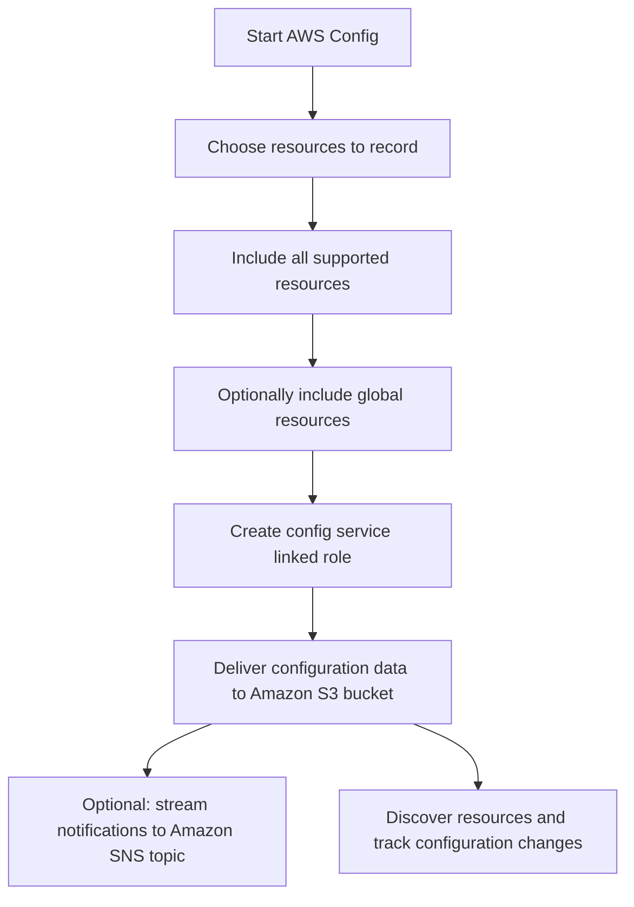

# 285. AWS Config - Hands On

## 🎯 Giới thiệu
- **AWS Config** được dùng để **record** và theo dõi **configuration** của các resources trong account.
- Trong hands-on này, AWS Config được cấu hình để:
  - Record **all supported resources** trong region
  - Có thể include **global resources** như:
    - `IAM users`
    - `IAM groups`
    - `IAM roles`
    - `customer managed policies`
- Dữ liệu cấu hình được lưu vào **Amazon S3 bucket**.
- Có thể tuỳ chọn stream thay đổi cấu hình sang **Amazon SNS topic**, nhưng trong bài này không bật.
- Lưu ý: càng record nhiều resources thì **chi phí càng tăng**.

## 1. Cấu hình AWS Config
- Vào AWS Config và chọn **Get started** để bắt đầu record.
- Chọn record:
  - **All resources supported in this region**
  - Hoặc chỉ một số resource types cụ thể
- Bật **Include global resources** nếu muốn theo dõi thêm các global resources.
- AWS Config cần tạo **config service linked role** để có quyền record configuration.
- Dữ liệu sẽ được gửi vào **Amazon S3 bucket** đã chỉ định.
- Có thể thêm `prefix` cho dữ liệu trong bucket nếu cần.
- Có thể bật **SNS notification** để nhận configuration changes, nhưng trong hands-on này không dùng.

## 2. Resources, Rules và Compliance
- Sau khi bật AWS Config, hệ thống sẽ bắt đầu **discover resources** trong account.
- Có thể xem trong mục **Resources**:
  - `route tables`
  - `subnets`
  - `VPC`
  - `EC2 security groups`
- Mỗi resource có thể xem:
  - **Configuration**
  - **Rules applied**
  - **Resource timeline**
- **Resource timeline** cho thấy:
  - `configuration changes`
  - các sự kiện liên quan từ **CloudTrail**
- Khi chưa có rule, resource sẽ chưa có **compliance status**.
- Trong mục **Rules**, có thể:
  - Add **AWS managed rule**
  - Hoặc tạo **custom rule** bằng `Lambda function`
- Ví dụ trong bài:
  - `approved-amis-by-id`
    - Kiểm tra EC2 instances có dùng AMI được phép hay không
    - Cần nhập danh sách `AMI IDs` approved
  - `restricted SSH`
    - Áp dụng cho **AWS EC2 security groups**
    - Kiểm tra không cho phép incoming `SSH` từ mọi nơi
    - Trigger khi **configuration changes**
- Sau khi thêm rule, AWS Config tự động **evaluate** và phân loại:
  - `compliant`
  - `non-compliant`

## 3. Remediation, Aggregators và Settings
- Khi một security group có `port 22` mở từ `anywhere`, resource sẽ bị đánh dấu là **non-compliant**.
- Nếu xoá inbound rule đó, AWS Config sẽ:
  - Ghi nhận **configuration change**
  - Ghi nhận `CloudTrail event`
  - Chạy lại rule `restricted SSH`
  - Chuyển resource về **compliant**
- Với mỗi rule, có thể cấu hình **remediation**:
  - `manual remediation`
  - `automatic remediation`
- Remediation dùng các **SSM automation documents**.
- Có thể cấu hình:
  - số lần retry
  - số giây giữa các lần retry
  - tham số cho remediation document
- **Aggregators** dùng để tích hợp và tổng hợp dữ liệu **across multiple accounts**.
- Trong **Settings**, có thể xem lại các cấu hình đã đặt, như:
  - gửi dữ liệu vào **SNS topic**
  - tạo **Amazon CloudWatch Event rules** để bắt các non-compliant events cụ thể

## 📊 Bảng tóm tắt
| Tiêu chí | Mô tả |
|----------|------|
| Mục đích của AWS Config | Record và theo dõi configuration của resources |
| Phạm vi record | All supported resources trong region, có thể include global resources |
| Lưu trữ dữ liệu | Amazon S3 bucket |
| Thông báo | Tuỳ chọn stream sang Amazon SNS topic |
| Rules | AWS managed rule hoặc custom rule bằng Lambda |
| Ví dụ rule | `approved-amis-by-id`, `restricted SSH` |
| Compliance | `compliant` hoặc `non-compliant` |
| Remediation | `manual` hoặc `automatic` bằng SSM automation documents |
| Tích hợp mở rộng | `Aggregators`, `CloudWatch Event rules` |

## 💡 Mẹo ghi nhớ cho kỳ thi AWS
- **AWS Config = ghi lại lịch sử cấu hình + đánh giá compliance**.
- Nhớ 3 mối liên hệ chính:
  - **Resource change**
  - **Rule evaluation**
  - **Compliance status**
- `restricted SSH` là ví dụ điển hình cho rule kiểm tra security group.
- `CloudTrail` xuất hiện trong `resource timeline` để giải thích vì sao resource thay đổi.
- Nếu đề bài nhắc đến:
  - theo dõi configuration
  - phát hiện non-compliant resources
  - lưu lịch sử thay đổi
  - remediation
  thì nghĩ ngay đến **AWS Config**.
- `Aggregators` gợi ý bài toán **multi-account**.
- `CloudWatch Event rules` có thể dùng để bắt các event không compliant cụ thể.

## ✅ Kết luận
- Hands-on này cho thấy AWS Config có thể:
  - record resources
  - lưu configuration vào `S3`
  - đánh giá compliance bằng `rules`
  - hiển thị lịch sử thay đổi qua `resource timeline`
  - hỗ trợ `remediation`
- Trọng tâm cần nhớ cho kỳ thi là: **AWS Config theo dõi cấu hình, đánh giá tuân thủ và hỗ trợ xử lý vi phạm**.
