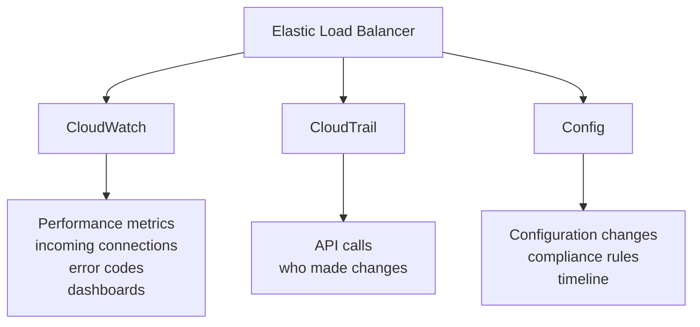

# 286. CloudTrail vs CloudWatch vs Config

## 🎯 Giới thiệu
Ba dịch vụ này rất hay bị hỏi trong AWS exam vì dễ nhầm lẫn:
- `CloudWatch` dùng để theo dõi **performance** và **metrics**
- `CloudTrail` dùng để ghi lại **API calls**
- `Config` dùng để ghi lại **configuration changes** và kiểm tra **compliance**

## 1. CloudWatch
- Tập trung vào **performance metrics**
- Theo dõi các chỉ số như:
  - `CPU`
  - `network`
- Dùng để:
  - tạo `dashboards`
  - nhận `events`
  - tạo `alerts`
  - log aggregation và analysis nếu cần
- Ví dụ với `Elastic Load Balancer`:
  - monitor số lượng `incoming connections`
  - hiển thị `error codes` theo thời gian
  - tạo dashboard để theo dõi hiệu năng
  - có thể làm `global dashboard` nếu có nhiều load balancer cho global application

## 2. CloudTrail
- Dùng để ghi lại **API calls** được thực hiện trong account
- Ghi nhận bởi:
  - mọi người
  - mọi thứ
- Có thể tạo `trails` cho resource cụ thể để xem chi tiết hơn, ví dụ chỉ riêng `EC2`
- Là `global service`
- Ví dụ với `ELB`:
  - theo dõi ai đã thay đổi `security group rules`
  - ai thay đổi hoặc xóa `SSL certificate`
  - từ đó biết **who made these changes**

## 3. Config
- Dùng để ghi lại **configuration changes**
- Dùng để đánh giá cấu hình resource so với các `compliance rules`
- Cung cấp:
  - `timeline` của các thay đổi
  - trạng thái `compliance`
  - giao diện UI để theo dõi dễ dàng
- Ví dụ với `ELB`:
  - theo dõi `security group rules`
  - theo dõi thay đổi cấu hình của load balancer
  - kiểm tra việc sửa `SSL certificate`
  - đặt rule rằng:
    - luôn phải có `SSL certificate`
    - không cho phép `non-encrypted traffic`

## 4. Luồng sử dụng với ELB

## 📊 Bảng tóm tắt
| Tiêu chí | Mô tả |
|----------|------|
| `CloudWatch` | Theo dõi `metrics`, `performance`, `dashboards`, `events`, `alerts` |
| `CloudTrail` | Ghi lại `API calls`, biết ai đã thực hiện thay đổi |
| `Config` | Ghi lại `configuration changes` và đánh giá `compliance` |
| Ví dụ với `ELB` | `CloudWatch` xem hiệu năng, `CloudTrail` xem ai đổi gì, `Config` kiểm tra cấu hình và compliance |
| Điểm dễ nhớ | `CloudWatch = performance`, `CloudTrail = API activity`, `Config = configuration & compliance` |

## 💡 Mẹo ghi nhớ cho kỳ thi AWS
- `Watch` = xem hiệu năng, metrics, dashboard
- `Trail` = dấu vết hành động, tức `API calls`
- `Config` = cấu hình và compliance
- Với một resource như `ELB`:
  - muốn biết **nó hoạt động thế nào** → `CloudWatch`
  - muốn biết **ai đã thay đổi gì** → `CloudTrail`
  - muốn biết **cấu hình có đúng rule không** → `Config`

## ✅ Kết luận
`CloudWatch`, `CloudTrail`, và `Config` là ba dịch vụ bổ trợ nhau:
- `CloudWatch` theo dõi hiệu năng
- `CloudTrail` ghi lại hoạt động API
- `Config` theo dõi thay đổi cấu hình và compliance

Hiểu đúng ba dịch vụ này sẽ giúp trả lời rất nhanh các câu hỏi AWS exam về monitoring, audit, và configuration tracking.
