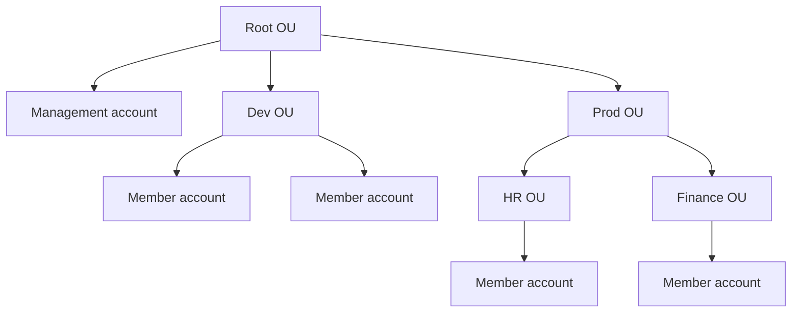
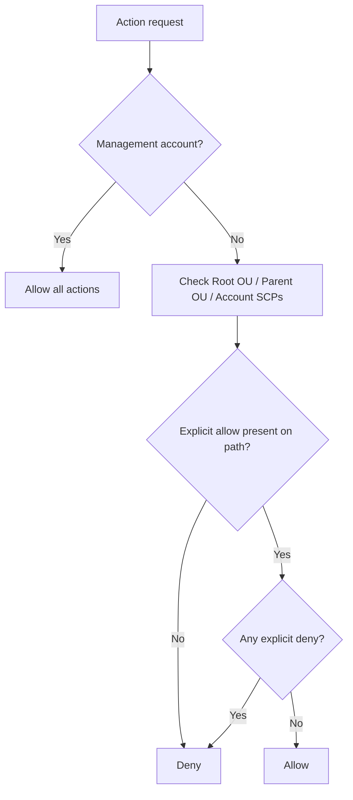

# 287. Organizations - Overview

## 🎯 Giới thiệu
AWS Organizations là một **global service** dùng để quản lý **multiple AWS accounts** cùng lúc.

- Tài khoản chính trong organization gọi là **management account**
- Các tài khoản còn lại là **member accounts**
- Một AWS account chỉ có thể thuộc **one organization**

Mục tiêu của Organizations trong transcript:
- Quản lý tập trung nhiều account
- Tối ưu **billing**
- Tăng **security**
- Tự động hóa quản trị và tạo account

## 1. 🧩 Cấu trúc tổ chức trong AWS Organizations
AWS Organizations dùng mô hình **Root OU -> sub-OUs -> accounts**.

- **Root OU** là OU ngoài cùng
- Bên trong root có **management account**
- Có thể tạo nhiều **sub-OUs** theo nhu cầu
- Mỗi OU có thể chứa các **member accounts** hoặc tiếp tục chia nhỏ thành OU khác

Transcript đưa ra các cách tổ chức phổ biến:
- Theo **business units**: sales, retail, finance
- Theo **environment**: prod, test, dev
- Theo **project-based**: mỗi project một OU

### Mermaid: Cấu trúc tổ chức

## 2. 💰 Lợi ích về billing và vận hành
Organizations giúp gom chi phí và quản lý tập trung:

- **Consolidated billing**: thanh toán tập trung qua **management account**
- Chỉ cần **one payment method** cho toàn organization
- **Aggregated usage** giúp nhận pricing benefits nhờ tổng usage của tất cả accounts
- Có thể chia sẻ **reserved instances** và **saving plans discounts** giữa các account
- Usage không dùng hết ở một account có thể được account khác tận dụng

Ngoài ra còn có:
- API để **automate account creation** trong organization
- Có thể bật **CloudTrail** cho tất cả accounts và gửi log về một **central S3 account**
- Có thể gửi **CloudWatch logs** về một **central logging account**
- Có thể tạo **cross account roles** cho mục đích admin

## 3. 🔐 Security và SCP
Một lợi thế lớn của Organizations là tăng bảo mật so với chỉ dùng một account với nhiều VPC.

- Accounts được tách biệt hơn VPCs
- Có thể enforce **tagging standards** cho billing
- Có thể quản trị nhiều account từ **management account**

### Service Control Policies - SCP
**SCP** là một loại **IAM policy** áp dụng cho **specific OUs hoặc accounts**.

Vai trò của SCP:
- Giới hạn những gì **users** và **roles** có thể làm trong account
- Áp dụng cho mọi thứ, **trừ management account**
- **Management account** luôn có full admin power
- Khi tính quyền, cần có **explicit allow** trên đường đi qua từng OU, bao gồm cả root
- Nếu có **explicit deny** ở bất kỳ cấp nào thì action đó bị chặn

### Mermaid: Luồng SCP

### Ví dụ trong transcript
- **Deny Athena** trên management account: không ảnh hưởng, vì management account luôn full admin
- **Sandbox OU**: full AWS access + deny S3
- **Account A**: full AWS access + deny EC2
  - Không vào được **Amazon S3** do deny từ Sandbox OU
  - Không vào được **Amazon EC2** do deny ở account
- **Accounts B và C**
  - Không có SCP riêng
  - Vẫn bị chặn **Amazon S3** vì deny từ Sandbox OU
- **Workloads OU**: full AWS access
- **Test OU**: allow EC2 SCP
  - **Account D** chỉ được access **EC2**
- **Prod OU**: full AWS access
  - **Accounts E và F** có thể làm mọi thứ

Transcript cũng nêu 2 kiểu SCP ví dụ:
- **Blocking a specific service**: allow all actions rồi deny một service như **DynamoDB**
- **Allow list**: chỉ cho phép một số service như **EC2** và **CloudWatch**

## 📊 Bảng tóm tắt
| Tiêu chí | Mô tả |
|----------|------|
| Loại service | **Global service** |
| Mục đích chính | Quản lý **multiple AWS accounts** |
| Vai trò chính | **Management account** và **member accounts** |
| Cấu trúc tổ chức | **Root OU** và các **sub-OUs** |
| Billing | **Consolidated billing** qua management account |
| Cost optimization | Chia sẻ **reserved instances** và **saving plans discounts** |
| Tự động hóa | API tạo account, bật CloudTrail, gửi logs tập trung |
| Security | Tách biệt account, enforce tagging, **cross account roles** |
| Chính sách kiểm soát | **SCP** áp dụng cho OU hoặc account |
| Ngoại lệ SCP | **Management account** không bị SCP áp dụng |

## 💡 Mẹo ghi nhớ cho kỳ thi AWS
- Nhớ câu: **management account = trung tâm quản trị và thanh toán**
- **Member accounts** thuộc organization, và mỗi account chỉ thuộc **one organization**
- **SCP không áp dụng lên management account**
- Muốn một action được phép, thường phải có **explicit allow** trên đường đi
- **Explicit deny** luôn chặn action ở bất kỳ cấp nào
- Organizations mạnh nhất ở 3 điểm: **billing**, **security**, **centralized management**

## ✅ Kết luận
AWS Organizations giúp quản lý nhiều AWS accounts theo mô hình tập trung, tối ưu chi phí, tăng bảo mật và chuẩn hóa vận hành.

- Dùng **management account** để điều phối toàn bộ organization
- Tổ chức accounts bằng **Root OU** và **sub-OUs**
- Tận dụng **consolidated billing**, chia sẻ discount và quản trị tập trung
- Dùng **SCP** để kiểm soát quyền ở cấp OU/account, nhưng không khóa được management account
