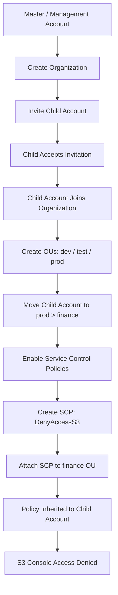

# 288. Organizations - Hands On

## 🎯 Giới thiệu
- Bài hands-on này thực hành **AWS Organizations** để quản lý nhiều AWS accounts trong cùng một organization.
- **Organizations** là **global service** vì liên quan đến accounts và việc gom nhóm chúng lại.
- Mô hình demo dùng:
  - **AWS course master account** = **management account**
  - **AWS course child account**
- Mục tiêu chính:
  - Tạo organization
  - Mời account khác vào organization
  - Tổ chức account bằng **Organizational Units (OUs)**
  - Bật và áp dụng **Service Control Policies (SCPs)** để giới hạn quyền

## 1. Tạo organization và mời account vào
- Từ **master/management account**, tạo một **organization**.
- Sau khi tạo, organization có **root** và account quản lý nằm ở đó.
- Có 2 cách thêm account:
  - **Create an account**
    - Nhập tên account
    - Email owner
    - Một **IAM role** sẽ được tạo trong target account để organization quản lý
  - **Invite an existing AWS account**
    - Dùng email hoặc **account ID**
- Sau khi gửi invitation:
  - Có thể xem **pending invitations**
  - Invitation sẽ hết hạn nếu không được chấp nhận sau khoảng **2 tuần**
- Ở **child account**, vào mục **Invitations** để chấp nhận.
- Khi đã tham gia organization:
  - Account bị quản lý bởi organization master
  - Có thể thấy **organization ID** và **feature set**
  - Account có thể có quyền **leave the organization**

## 2. Tổ chức bằng OUs
- Trong **AWS accounts**, organization ban đầu có:
  - **root**
  - **master account**
  - **child account**
- Có thể tạo nhiều **OU** dưới root, ví dụ:
  - `dev`
  - `test`
  - `prod`
- Có thể tạo **nested OUs** bên trong OU khác, ví dụ:
  - Trong `prod` có `HR` và `finance`
- Có thể **move** account vào OU phù hợp:
  - Ví dụ chuyển **child account** vào `finance` dưới `prod`
- Best practice được nhắc đến:
  - Giữ **management account** ở **root OU**

## 3. Service Control Policies (SCPs) và kiểm soát quyền
- Trong **Policies**, có nhiều loại policy nhưng đang disabled.
- Bật loại quan trọng nhất cho bài này:
  - **Service control policy**
- Transcript cũng nhắc tới:
  - **backup policy**: triển khai backup plans trên toàn organization
  - **tag policy**: chuẩn hóa cách dùng tags
- Trong hands-on, trọng tâm là **SCP**.

### Tạo SCP deny S3
- Policy mặc định ban đầu là **full AWS access**
- Tạo policy mới tên **DenyAccessS3**
- Nội dung policy:
  - Deny mọi action trên dịch vụ **S3**
  - Resource dùng `*`
  - SID có thể đặt là `deny S3`
- Khi attach policy này vào OU:
  - Mọi account bên trong OU đó sẽ bị **deny S3**

### Inheritance của policy
- Policy có tính **inheritance**:
  - Policy ở **root** được kế thừa xuống con
  - Policy ở **prod** được kế thừa xuống `finance`
  - Policy ở **finance** được kế thừa xuống account nằm trong đó
- Transcript cho thấy do bật SCP sau khi đã tạo OU nên **full AWS access** xuất hiện nhiều lần do inheritance.

### Kiểm tra thực tế
- Attach **DenyAccessS3** vào **finance OU**
- Child account nằm trong finance sẽ **inherit** policy này
- Khi mở **S3 console** từ child account:
  - Không list được buckets
  - Không dùng được **Amazon S3**
- Điểm quan trọng:
  - Dù đang đăng nhập bằng **root user** của child account, vẫn không có quyền vào S3
- Kết luận từ bài:
  - **SCP** rất mạnh vì có thể giới hạn toàn bộ account ở mức organization/OU

## 📊 Bảng tóm tắt
| Tiêu chí | Mô tả |
|----------|------|
| Dịch vụ chính | **AWS Organizations** |
| Tính chất | **Global service** |
| Tài khoản trung tâm | **Management account / master account** |
| Cách thêm account | **Create an account** hoặc **Invite an existing AWS account** |
| Cấu trúc tổ chức | **Root** → **OU** → **Account** |
| OU lồng nhau | Có, có thể tạo **nested OUs** |
| Policy quan trọng | **Service control policy (SCP)** |
| Mục đích SCP | Giới hạn account/OU được làm gì |
| Ví dụ policy | **DenyAccessS3** |
| Hiệu ứng thực tế | Child account không truy cập được **Amazon S3** |

## 💡 Mẹo ghi nhớ cho kỳ thi AWS
- Nhớ rằng **Organizations** dùng để quản lý nhiều account trong một cấu trúc **root / OU / account**.
- **Management account** là account điều phối, còn account khác có thể được **invite** vào organization.
- **SCP** dùng để **restrict** quyền ở mức account/OU, không phải để cấp thêm quyền.
- Nếu policy được attach ở OU cha, account con sẽ **inherit**.
- Một dấu hiệu quan trọng trong bài: dù là **root user** của child account, vẫn có thể bị chặn bởi **SCP**.
- Nếu đề thi nói về kiểm soát nhiều account, chuẩn hóa policy, hoặc chặn service như **S3**, hãy nghĩ ngay đến **AWS Organizations + SCP**.

## ✅ Kết luận
- Bài hands-on cho thấy quy trình đầy đủ của **AWS Organizations**:
  - tạo organization
  - mời account
  - sắp xếp bằng **OUs**
  - bật **SCP**
  - attach policy để kiểm soát hành vi account
- Kết quả cuối cùng: **DenyAccessS3** được kế thừa xuống child account và chặn truy cập **Amazon S3** thành công.
