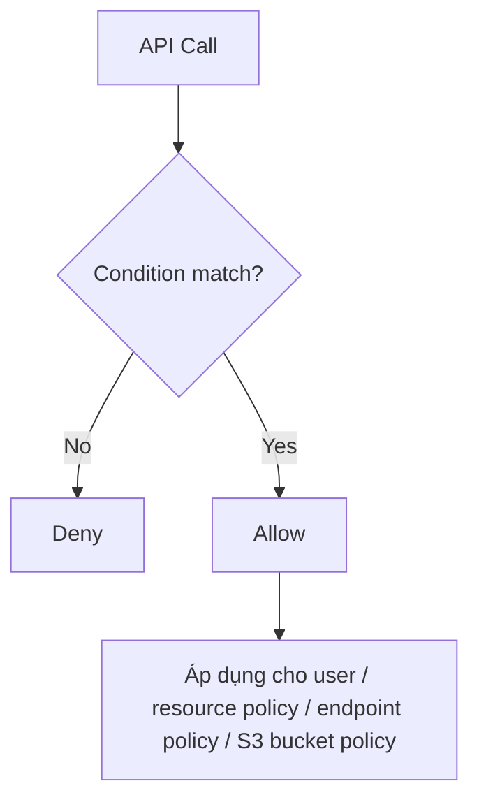

# 289. IAM - Advanced Policies

## 🎯 Giới thiệu
Bài này nói về **IAM conditions** trong IAM policies và cách chúng giúp siết chặt quyền truy cập theo nhiều tiêu chí khác nhau như:
- IP nguồn của client
- Region mà API call được thực hiện
- Tag của EC2 instance
- Tag của user
- Xác thực đa yếu tố `MultiFactorAuthenticationPresent`
- `aws:PrincipalOrgID` để giới hạn theo AWS Organization

## 1. IAM Conditions cơ bản trong policy
- `aws:SourceIP`
  - Dùng để giới hạn **client IP** được phép gọi API.
  - Nếu request không đến từ IP/CIDR được cho phép thì bị `Deny`.
  - Có thể dùng để chỉ cho phép truy cập từ **company network**.

- `aws:RequestedRegion`
  - Dùng để giới hạn **region** mà API call được thực hiện.
  - Transcript nêu ví dụ deny EC2, RDS, DynamoDB trong `eu-central-1` và `eu-west-1`.
  - Có thể áp dụng ở mức rộng hơn như **organization SCP** để chỉ cho phép một region cụ thể.

## 2. Điều kiện theo tag và MFA
- `ec2:ResourceTag`
  - Áp dụng cho **tag của EC2 instance**.
  - Cho phép `start` và `stop` instances nếu `ResourceTag/Project = DataAnalytics`.
  - Nghĩa là instance phải có tag đúng thì action mới được phép.

- `aws:PrincipalTag`
  - Áp dụng cho **tag của user**.
  - User cũng phải thuộc đúng department/tag thì mới được thực hiện action.

- `aws:MultiFactorAuthPresent`
  - Dùng để yêu cầu **MultiFactorAuthentication**.
  - Trong ví dụ, user có thể làm mọi thứ trên EC2, nhưng chỉ được `stop` và `terminate` instances khi MFA là `true`.
  - Nếu `MultiFactorAuthPresent = false` thì bị deny.

## 3. S3 Bucket Policy và giới hạn theo Organization
- Với **S3 bucket policy**, cần phân biệt rõ:
  - `ListBucket` là **bucket-level permission**
    - ARN dùng dạng bucket: `arn:aws:s3:::test`
  - `GetObject`, `PutObject`, `DeleteObject` là **object-level permission**
    - ARN phải có `/*` để chỉ tất cả object trong bucket

- `aws:PrincipalOrgID`
  - Dùng để giới hạn resource policy chỉ cho các account thuộc cùng **AWS Organization**.
  - Trong ví dụ, `PutObject` và `GetObject` chỉ được phép nếu request đến từ account có `PrincipalOrgID` phù hợp.
  - User ngoài organization sẽ bị từ chối bởi S3 bucket policy.

## 📊 Bảng tóm tắt
| Tiêu chí | Mô tả |
|----------|------|
| `aws:SourceIP` | Giới hạn API call theo IP/CIDR của client |
| `aws:RequestedRegion` | Giới hạn region được phép gọi API |
| `ec2:ResourceTag` | Kiểm soát quyền theo tag của EC2 instance |
| `aws:PrincipalTag` | Kiểm soát quyền theo tag của user |
| `aws:MultiFactorAuthPresent` | Bắt buộc MFA để thực hiện một số action |
| `ListBucket` | Bucket-level permission, dùng ARN của bucket |
| `GetObject` / `PutObject` / `DeleteObject` | Object-level permission, dùng ARN có `/*` |
| `aws:PrincipalOrgID` | Chỉ cho phép account thuộc AWS Organization truy cập resource |

## 💡 Mẹo ghi nhớ cho kỳ thi AWS
- `SourceIP` → nhớ ngay đến **IP của client**.
- `RequestedRegion` → nhớ đến **region của API call**.
- `ResourceTag` → tag trên **resource** như EC2 instance.
- `PrincipalTag` → tag trên **principal/user**.
- `MultiFactorAuthPresent` → hỏi thẳng: có MFA hay không.
- `ListBucket` dùng ARN của **bucket**; `GetObject`/`PutObject`/`DeleteObject` dùng ARN của **object**.
- `PrincipalOrgID` → chỉ cho phép tài nguyên trong cùng **AWS Organization**.

## ✅ Kết luận
IAM conditions giúp policy trở nên “advanced” hơn bằng cách kiểm soát truy cập theo IP, region, tag, MFA và organization. Đây là nhóm kiến thức rất dễ gặp trong AWS exam vì thường đi kèm các tình huống bảo mật thực tế và cách phân biệt bucket-level với object-level permission trong S3.
