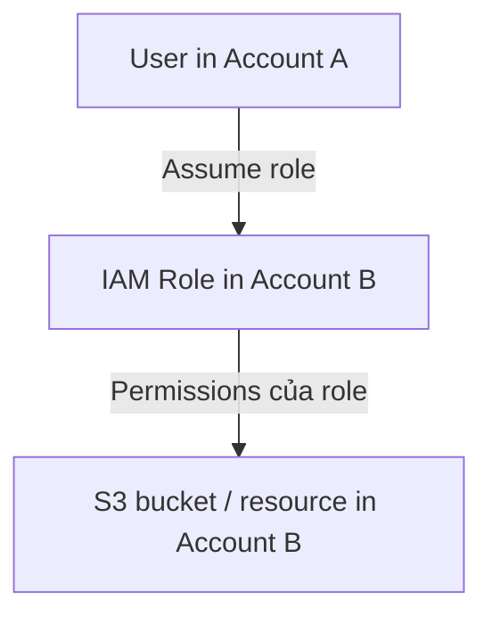
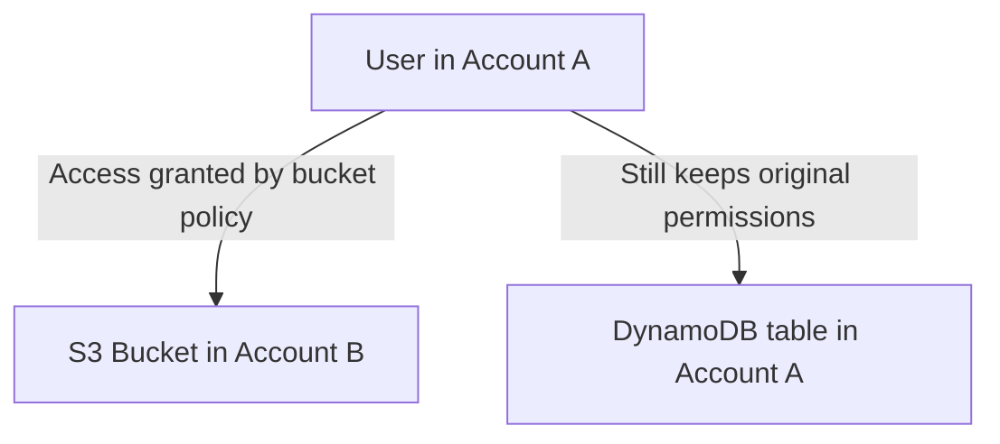
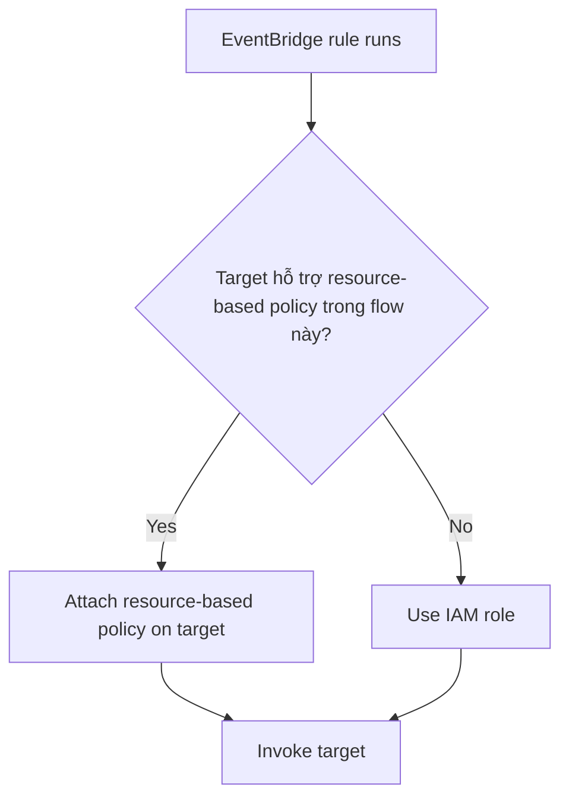

# 290. IAM - Resource-based Policies vs IAM Roles

## 🎯 Giới thiệu
Bài này so sánh 2 cách cấp quyền khi làm việc cross-account trên AWS:

- **IAM role**: principal phải **assume role** rồi dùng toàn bộ quyền của role.
- **Resource-based policy**: gắn quyền trực tiếp lên resource, principal **không cần assume role**.

Điểm quan trọng cho AWS exam là: chọn đúng cơ chế theo ngữ cảnh, đặc biệt trong các luồng **cross-account** và **EventBridge**.

## 1. IAM Role trong cross-account
Khi user ở **Account A** cần truy cập resource ở **Account B**, một cách là:

- User ở **Account A** **assume role** trong **Account B**
- Role đó có quyền truy cập **S3 bucket** hoặc resource mục tiêu

Đặc điểm chính:

- Khi đã assume role, user **bỏ quyền gốc**
- User chỉ còn dùng **permissions của role**
- Phù hợp khi cần chuyển sang một tập quyền khác hoàn toàn

## 2. Resource-based Policies trong cross-account
Cách thứ hai là dùng **resource-based policy** gắn trực tiếp lên resource, ví dụ:

- **S3 bucket policy**
- **SNS topic policy**
- **SQS queue policy**
- **Lambda function policy**

Đặc điểm chính:

- Principal **không assume role**
- Principal **không phải từ bỏ permissions gốc**
- Có thể vừa làm việc với resource cũ ở account của mình, vừa truy cập resource ở account khác

Ví dụ trong transcript:

- User ở **Account A** cần **scan DynamoDB table** ở Account A
- Đồng thời **write** sang **S3 bucket** ở Account B
- Trường hợp này nên dùng **resource-based policy** để không mất quyền ban đầu

## 3. EventBridge chọn IAM Role hay Resource-based Policy
Với **Amazon EventBridge**, cách cấp quyền phụ thuộc vào target:

### Khi target hỗ trợ resource-based policy
EventBridge có thể thêm policy trực tiếp lên target để cho phép invocation, ví dụ:

- **Lambda**
- **SNS**
- **SQS**
- **S3 bucket**
- **API Gateway**

### Khi target không dùng resource-based policy trong flow này
EventBridge sẽ dùng **IAM role** để invoke target, ví dụ:

- **Kinesis Stream**
- **EC2 Auto Scaling**
- **System Manager Run Command**
- **ECS task**

### Ghi chú quan trọng
- **Kinesis Data Streams** có hỗ trợ resource-based policy
- Nhưng theo transcript, **EventBridge vẫn dùng IAM role** cho Kinesis Data Streams

## 📊 Bảng tóm tắt
| Tiêu chí | Mô tả |
|----------|------|
| Cách hoạt động của IAM role | Principal phải **assume role**, sau đó chỉ dùng permissions của role |
| Cách hoạt động của resource-based policy | Gắn quyền trực tiếp lên resource, principal **không cần assume role** |
| Ảnh hưởng đến quyền hiện tại | Assume role thì **bỏ quyền gốc**; resource-based policy thì **giữ quyền gốc** |
| Tình huống phù hợp | IAM role: khi cần chuyển sang bộ quyền khác; resource-based policy: khi cần giữ quyền hiện tại và truy cập cross-account |
| Ví dụ resource-based policy | **S3 bucket**, **SNS topic**, **SQS queue**, **Lambda function**, **API Gateway** |
| EventBridge với target hỗ trợ policy | Có thể dùng **resource-based policy** để cho phép invoke |
| EventBridge với target không hỗ trợ policy trong flow này | Dùng **IAM role** |
| Ghi chú đặc biệt | **Kinesis Data Streams** có resource-based policy nhưng EventBridge vẫn dùng **IAM role** |

## 💡 Mẹo ghi nhớ cho kỳ thi AWS
- **Assume role = đổi danh tính quyền**  
  Hễ assume role là **mất quyền cũ**, chỉ còn quyền của role.
- **Resource-based policy = giữ quyền gốc**  
  Phù hợp khi cần làm nhiều việc cùng lúc ở nhiều account.
- **EventBridge**:
  - Target như **Lambda, SNS, SQS, S3, API Gateway** thường đi với **resource-based policy**
  - Target như **Kinesis Stream, EC2 Auto Scaling, ECS task** đi với **IAM role**
- Cần nhớ riêng: **Kinesis Data Streams** là ngoại lệ trong transcript, dù có policy nhưng EventBridge vẫn dùng **IAM role**.

## ✅ Kết luận
- **IAM role** phù hợp khi principal cần **assume role** và chấp nhận dùng toàn bộ quyền của role.
- **Resource-based policy** phù hợp khi muốn **giữ nguyên quyền hiện tại** và cấp quyền trực tiếp lên resource.
- Với **EventBridge**, hãy xác định target thuộc nhóm nào để biết sẽ dùng **resource-based policy** hay **IAM role**.
