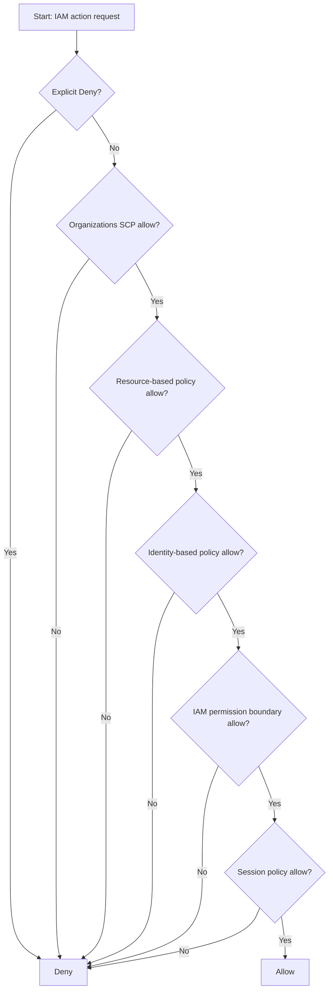

# 291. IAM - Policy Evaluation Logic

## 🎯 Giới thiệu
- Bài này nói về **IAM Permission Boundaries** và **IAM Policy Evaluation Logic**.
- Mục tiêu chính: hiểu cách AWS quyết định một hành động **Allow** hay **Deny** khi có nhiều lớp policy cùng tham gia.
- Điểm quan trọng để ôn thi:
  - **Permission boundaries** chỉ áp dụng cho **users** và **roles**, **không áp dụng cho groups**.
  - **Explicit Deny** luôn thắng.
  - Kết quả cuối cùng chỉ là **Allow** khi các bước đánh giá đều không chặn và có quyền phù hợp.

## 1. IAM Permission Boundaries 🧱
- Là một **advanced feature** dùng để xác định **mức quyền tối đa** mà một IAM entity có thể có.
- Hình thức của nó giống **IAM policy**.
- Có thể gắn vào:
  - **IAM user**
  - **IAM role**
- Không dùng cho **group**.

### Ý nghĩa
- Dù một user có policy rất mạnh, quyền thực tế vẫn bị giới hạn bởi **permission boundary**.
- Nếu action nằm ngoài boundary thì user **không được phép**, kể cả khi identity-based policy có Allow.

### Ví dụ trong transcript
- Boundary cho phép làm việc với:
  - `S3`
  - `CloudWatch`
  - `EC2`
- Nhưng policy gắn thêm cho user lại cho phép `iam:CreateUser`.
- Kết quả:
  - User **không được** `iam:CreateUser`
  - Vì `iam:CreateUser` **nằm ngoài** permission boundary

### Ý nghĩa thực tế
- Có thể dùng để:
  - Delegate trách nhiệm cho non-admin trong phạm vi boundary
  - Cho developer tự quản lý quyền nhưng **không được escalate privilege**
  - Giới hạn một user cụ thể thay vì áp `SCP` cho toàn account

## 2. IAM Policy Evaluation Logic 🔍
AWS đánh giá quyền theo nhiều lớp. Các lớp được nhắc trong transcript:

1. **Explicit Deny**
2. **Organizations SCP**
3. **Resource-based policy**
4. **Identity-based policy**
5. **IAM permission boundaries**
6. **Session policies**

### Quy tắc cốt lõi
- Chỉ cần có **explicit deny** ở bất kỳ bước nào thì action sẽ **bị Deny ngay**.
- Nếu không có explicit deny, AWS mới tiếp tục kiểm tra các policy khác.
- Nếu không có **Allow** phù hợp, kết quả sẽ là **implicit deny**.
- Chỉ khi các lớp policy đều không chặn và có Allow phù hợp thì action mới được **Allow**.

### Mermaid flow

### Ý nghĩa ôn thi
- Đây là logic để hiểu **vì sao một hành động bị từ chối**, dù bạn tưởng rằng mình đã có quyền.
- Cần nhớ: policy không chỉ là “có Allow hay không”, mà còn phải xét **Deny**, **boundary**, **SCP**, và các lớp khác.

## 3. Ví dụ kiểm tra quyền cụ thể 🧪
Transcript đưa ra một IAM policy:

- `sqs:*` với **Deny** trên `resource *`
- `sqs:DeleteQueue` với **Allow** trên `resource *`

### Trường hợp 1: `sqs:CreateQueue`
- Bị **Deny**
- Lý do: `sqs:*` đã bao gồm `CreateQueue`
- Có explicit deny nên chắc chắn bị chặn

### Trường hợp 2: `sqs:DeleteQueue`
- Dù có **Allow** riêng cho `sqs:DeleteQueue`
- Nhưng vẫn bị **Deny**
- Lý do: `sqs:DeleteQueue` nằm trong phạm vi `sqs:*` bị deny
- **Explicit Deny** luôn thắng

### Trường hợp 3: `ec2:DescribeInstances`
- Không có explicit deny
- Nhưng cũng không có explicit allow
- Kết quả: **implicit deny**

## 📊 Bảng tóm tắt
| Tiêu chí | Mô tả |
|----------|------|
| Permission boundary | Giới hạn tối đa quyền của IAM user/role |
| Đối tượng áp dụng | `users`, `roles` |
| Không áp dụng cho | `groups` |
| Explicit Deny | Luôn thắng mọi Allow |
| Implicit Deny | Không có Allow phù hợp thì bị từ chối |
| Thứ tự đánh giá | Deny -> SCP -> Resource-based policy -> Identity-based policy -> Permission boundary -> Session policy |
| Mục đích chính | Kiểm soát và giới hạn quyền trong AWS |
| Ví dụ quan trọng | `sqs:*` Deny làm `sqs:CreateQueue` và `sqs:DeleteQueue` đều bị chặn |

## 💡 Mẹo ghi nhớ cho kỳ thi AWS
- Nhớ câu: **“Explicit Deny luôn thắng”**.
- Nhớ rằng **permission boundary** là **trần quyền tối đa**, không phải quyền cấp thêm.
- Nhớ đối tượng dùng boundary là **user** và **role**, không phải **group**.
- Khi đọc đề thi:
  - Nếu có `Allow` nhưng vẫn bị chặn, hãy kiểm tra **Deny**, **boundary**, hoặc **SCP** trước.
- Nếu không thấy Allow rõ ràng, kết quả thường là **implicit deny**.

## ✅ Kết luận
- **IAM Permission Boundaries** dùng để giới hạn quyền tối đa mà một user hoặc role có thể có.
- **IAM Policy Evaluation Logic** là chuỗi đánh giá nhiều lớp, trong đó **explicit deny** là yếu tố quyết định mạnh nhất.
- Khi ôn thi AWS, hãy nhớ kiểm tra theo thứ tự: **Deny trước, rồi mới đến Allow** và luôn xét thêm **SCP**, **resource-based policy**, **identity-based policy**, **permission boundary**, và **session policy**.
