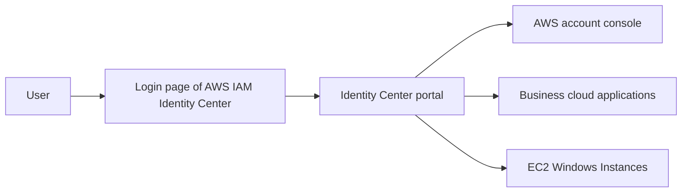

# 292. AWS IAM Identity Center

## 🎯 Giới thiệu
AWS IAM Identity Center là dịch vụ kế thừa của **AWS Single Sign-On (AWS SSO)**. Mục tiêu chính là cung cấp **one login** để truy cập:

- Nhiều **AWS accounts** trong **AWS Organizations**
- **Business cloud applications** như Salesforce, Box, Microsoft 365
- **EC2 Windows Instances**

Điểm quan trọng cho kỳ thi: dịch vụ này thường gắn với ý tưởng **single sign-on vào nhiều AWS accounts**.

## 1. 🌐 Tổng quan về AWS IAM Identity Center
AWS IAM Identity Center cho phép người dùng đăng nhập một lần rồi truy cập nhiều nơi khác nhau:

- Một portal đăng nhập trung tâm
- Từ portal đó có thể vào trực tiếp từng AWS account
- Có thể dùng cho business applications có **SAML 2.0 integration**
- Có thể dùng cho **Windows EC2 instances**

Nhấn mạnh:
- Đây là cách rất phù hợp khi bạn có **multiple AWS accounts**
- Người dùng không cần biết cách đăng nhập riêng vào từng console

## 2. 👤 Nguồn danh tính và luồng đăng nhập
Identity provider nơi lưu user có thể là:

- **Built-in identity store** của IAM Identity Center
- **Third-party identity provider**:
  - Active Directory
  - OneLogin
  - Okta
  - Và các hệ thống tương tự

Luồng đăng nhập trong transcript:

- Người dùng vào login page
- Nhập username và password
- Đăng nhập vào **AWS IAM Identity Center**
- Từ portal này chọn account hoặc application cần vào
- Hệ thống đưa người dùng đi thẳng vào console hoặc ứng dụng tương ứng

Điểm đáng nhớ:
- Người dùng chỉ cần login một lần
- Sau đó có **SSO access** đến accounts, applications, và Windows EC2 instances

## 3. 🔐 Permission sets, multi-account permissions và ABAC
Khi đăng nhập, người dùng không tự động có quyền vào mọi thứ. Quyền được kiểm soát bằng **permission sets**.

### Permission sets
- Là nơi định nghĩa quyền truy cập
- Có thể là một hoặc nhiều **IAM policies**
- Được assign cho:
  - users
  - groups

Khi user truy cập account, IAM Identity Center sẽ tạo hoặc dùng một **corresponding IAM role** trong account đó.

### Multi-account permissions
IAM Identity Center hỗ trợ quản lý quyền trên nhiều account trong organization:

- Ví dụ tạo permission set cho **database admins**
- Gán quyền truy cập **RDS** và **Aurora**
- Có thể áp dụng cho cả **dev account** và **prod account**
- User đăng nhập sẽ tự động assume IAM role phù hợp trong account đang truy cập

### Application assignments
- Xác định user hoặc group nào được truy cập application nào
- Hệ thống cung cấp các thông tin cần thiết như:
  - URLs
  - certificates
  - metadata

### ABAC
IAM Identity Center hỗ trợ **attribute-based access control (ABAC)**:

- Quyền chi tiết dựa trên **attributes** của user
- Attributes có thể là:
  - tags
  - cost center
  - title như junior/senior
  - locale
- Có thể dùng attributes để giới hạn truy cập theo region hoặc theo ngữ cảnh khác
- Ý tưởng chính: định nghĩa permission sets một lần, rồi thay đổi quyền bằng cách thay đổi attributes

## 📊 Bảng tóm tắt
| Tiêu chí | Mô tả |
|----------|------|
| Tên dịch vụ | AWS IAM Identity Center |
| Tên cũ | AWS Single Sign-On (AWS SSO) |
| Mục tiêu | One login cho nhiều AWS accounts và applications |
| Identity source | Built-in identity store hoặc third-party IdP như Active Directory, OneLogin, Okta |
| Ứng dụng | AWS accounts, business cloud applications, EC2 Windows Instances |
| Cơ chế quyền | permission sets dựa trên IAM policies |
| Multi-account | Quản lý truy cập trên nhiều account trong organization |
| ABAC | Dùng attributes của user để cấp quyền chi tiết |

## 💡 Mẹo ghi nhớ cho kỳ thi AWS
- **IAM Identity Center = AWS SSO cũ**.
- Khi thấy câu hỏi về **one login vào nhiều AWS accounts**, hãy nghĩ ngay đến **AWS IAM Identity Center**.
- **Permission sets** là từ khóa rất quan trọng: chúng quyết định user/group được làm gì.
- Nếu đề bài nói đến **multiple accounts + SSO + business apps**, đây gần như chắc chắn là IAM Identity Center.
- Nếu transcript nhắc đến **ABAC**, nhớ rằng quyền có thể dựa trên attributes như cost center, title, locale.

## ✅ Kết luận
AWS IAM Identity Center là dịch vụ trung tâm để quản lý **single sign-on** cho nhiều **AWS accounts**, **business applications**, và cả **EC2 Windows Instances**. Cốt lõi của nó là:

- một điểm đăng nhập duy nhất
- hỗ trợ built-in identity store hoặc third-party identity provider
- kiểm soát quyền bằng **permission sets**
- mở rộng cho **multi-account permissions** và **ABAC**

Nói ngắn gọn: đây là dịch vụ rất phù hợp khi bạn cần **one login cho toàn bộ AWS Organization** và các ứng dụng liên quan.
