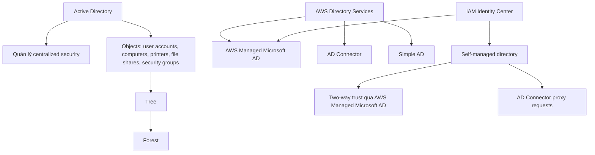

# 293. AWS Directory Services

## 🎯 Giới thiệu
AWS Directory Services là dịch vụ giúp tạo và kết nối Active Directory trên AWS. Nội dung bài giảng tập trung vào:
- Microsoft Active Directory và cách nó quản lý user, computer, printer, file shares, security groups
- 3 lựa chọn của AWS Directory Services: `AWS Managed Microsoft AD`, `AD Connector`, `Simple AD`
- Cách tích hợp `IAM Identity Center` với directory trong AWS hoặc self-managed directory

## 1. Microsoft Active Directory là gì? 🔐
- Là software có trên Windows Server với `AD Domain Services`
- Là database of objects
- Các object gồm:
  - `user accounts`
  - `computers`
  - `printers`
  - `file shares`
  - `security groups`
- Dùng để quản lý user trong toàn bộ Microsoft ecosystem on-premise
- Có `centralized security management`
  - tạo account
  - assign permissions
  - quản lý tập trung
- Các object được tổ chức theo `tree`
- Một nhóm tree được gọi là `forest`

### Cách hoạt động cơ bản
- Có một `domain controller`
- Tạo account, ví dụ `John / Password`
- Các Windows machines khác trong network sẽ kết nối đến domain controller
- Khi user đăng nhập trên máy khác:
  - máy sẽ lookup thông tin trên controller
  - nếu đúng thì cho phép login
- Mục tiêu: user có thể dùng chung trên nhiều máy trong network

## 2. 3 flavors của AWS Directory Services ☁️
### 2.1 `AWS Managed Microsoft AD`
- Dùng để tạo Active Directory riêng trên AWS
- Có thể manage users locally
- Hỗ trợ `multi-factor authentication`
- Có thể thiết lập trust connection với on-premise AD
- Ý nghĩa của trust:
  - AWS AD trust on-premise AD
  - on-premise AD trust AWS AD
- User có thể được lookup giữa hai môi trường nếu được trust

### 2.2 `AD Connector`
- Là `direct gateway proxy` để redirect request về on-premise AD
- Hỗ trợ `MFA`
- Users chỉ được manage trên on-premise AD
- AD Connector chỉ đóng vai trò proxy
- Khi user authenticate:
  - request được proxy về on-premise AD
  - rồi lookup ở đó

### 2.3 `Simple AD`
- Là `AD-compatible managed directory` trên AWS
- Không dùng Microsoft Directory
- Không thể join với on-premise Active Directory
- Dùng khi:
  - không có on-premise AD
  - cần một directory standalone cho AWS Cloud

### So sánh nhanh
| Dịch vụ | Quản lý user ở đâu | Kết nối với on-premise AD | MFA | Ghi chú |
|----------|--------------------|---------------------------|-----|--------|
| `AWS Managed Microsoft AD` | Trong AWS và có thể trust với on-premise | Có | Có | Dùng khi muốn AD trên cloud |
| `AD Connector` | Chỉ on-premise AD | Có, theo kiểu proxy | Có | Chỉ chuyển request về on-premise |
| `Simple AD` | Trong directory standalone | Không | Không đề cập | Dùng khi không có on-premise |

## 3. Tích hợp `IAM Identity Center` với Directory Services 🧩
### Trường hợp 1: Directory managed trên AWS
- Nếu Active Directory được manage bằng `AWS Directory Services`
- Việc tích hợp với `IAM Identity Center` là `out of the box`
- Chỉ cần chỉ định `IAM Identity Center` kết nối với `AWS Managed Microsoft AD`

### Trường hợp 2: Self-managed directory on-premise
Có 2 cách:

#### Cách 1: `AWS Managed Microsoft AD` + two-way trust
- Tạo `AWS Managed Microsoft AD`
- Thiết lập `two-way trust relationship` với on-premise Active Directory
- Dùng tích hợp sẵn của `IAM Identity Center` cho `single sign-up`

#### Cách 2: `AD Connector`
- `AD Connector` tích hợp với `IAM Identity Center`
- Sau đó proxy request đến self-managed directory
- Phù hợp khi chỉ muốn proxy API calls
- Có thể có thêm latency

### Chọn cách nào?
- Nếu muốn có thể manage user từ cloud trong Active Directory trên cloud:
  - chọn `AWS Managed Microsoft AD`
- Nếu chỉ muốn proxy request về directory tự quản lý:
  - chọn `AD Connector`

## 📊 Bảng tóm tắt
| Tiêu chí | Mô tả |
|----------|------|
| `Microsoft Active Directory` | Database of objects, quản lý tập trung user và tài nguyên trong môi trường Windows |
| `AWS Managed Microsoft AD` | Tạo AD trên AWS, manage user locally, hỗ trợ MFA, có trust với on-premise AD |
| `AD Connector` | Proxy request về on-premise AD, user chỉ được manage ở on-premise |
| `Simple AD` | AD-compatible managed directory trên AWS, standalone, không join với on-premise AD |
| `IAM Identity Center` | Tích hợp trực tiếp với AWS-managed directory hoặc qua proxy/trust với self-managed directory |
| Mục tiêu thi | Nhận diện đúng dịch vụ theo yêu cầu: trust, proxy, cloud-managed, hay standalone |

## 💡 Mẹo ghi nhớ cho kỳ thi AWS
- `Managed` → có AD trên AWS và có thể manage user trong cloud
- `Connector` → chỉ là connector/proxy, mọi thứ quay về on-premise
- `Simple` → đơn giản, standalone, không gắn với on-premise
- Khi đề bài nói:
  - “proxy users to on-premise” → nghĩ đến `AD Connector`
  - “manage users in the cloud and have MFA” → nghĩ đến `AWS Managed Microsoft AD`
  - “no on-premise stuff” → nghĩ đến `Simple AD`
- Với `IAM Identity Center`:
  - AWS-managed directory → tích hợp trực tiếp
  - self-managed directory → dùng `two-way trust` hoặc `AD Connector`

## ✅ Kết luận
- `Microsoft Active Directory` là nền tảng quản lý tập trung object và user trong môi trường Windows
- `AWS Directory Services` cung cấp 3 lựa chọn chính: `AWS Managed Microsoft AD`, `AD Connector`, `Simple AD`
- Điểm mấu chốt khi ôn thi là phân biệt:
  - `trust` vs `proxy`
  - `cloud-managed` vs `on-premise managed`
  - `standalone` vs `integrated`
- Nếu đọc đúng yêu cầu đề bài, bạn có thể chọn nhanh đúng dịch vụ AWS Directory Services phù hợp
