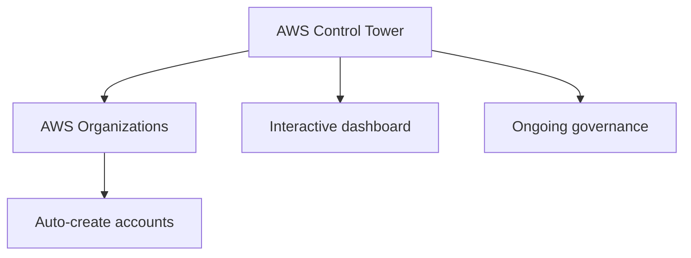
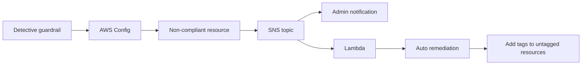

# 295. AWS Control Tower

## 🎯 Giới thiệu
AWS Control Tower là dịch vụ giúp bạn **thiết lập** và **quản trị** một môi trường AWS **multi-account** an toàn, tuân thủ chuẩn (**secure and compliant**) dựa trên **best practices**.

- Control Tower hoạt động trên nền **AWS Organizations**
- Các account được **tạo tự động**
- Giúp **tự động hóa** việc dựng môi trường chỉ với vài bước
- Hỗ trợ **ongoing policy management** bằng **guardrails**
- Có thể **detect policy violations**, **remediate** tự động, và theo dõi compliance qua **interactive dashboard**

## 1. Cách Control Tower tạo và quản trị môi trường
- Control Tower là một lớp quản trị phía trên **Organizations**
- Khi tạo môi trường, Control Tower dùng **AWS Organizations** để:
  - tạo các account member
  - áp dụng cấu hình quản trị sẵn
  - giữ cho môi trường nhất quán và compliant

## 2. Guardrails trong AWS Control Tower
Control Tower dùng **guardrails** để kiểm soát bảo mật và compliance cho nhiều account cùng lúc.

### 2.1 Preventive guardrail
- Dùng để **ngăn chặn** account làm một số việc nhất định
- Mang tính **restrictive**
- Được triển khai bằng **SCP (Service Control Policies)** từ **AWS Organizations**
- Ví dụ trong transcript:
  - giới hạn region chỉ được dùng `us-east-1` và `eu-west-2`

### 2.2 Detective guardrail
- Dùng để **phát hiện** non-compliance
- Dựa trên **AWS Config**
- Config được triển khai trên tất cả **member accounts**
- Ví dụ:
  - phát hiện **untagged resources**

## 3. Luồng phát hiện và khắc phục vi phạm
Khi một resource không compliant:
- **AWS Config** phát hiện vi phạm
- Config trigger một **SNS topic**
- Administrator có thể được thông báo
- SNS topic cũng có thể invoke **Lambda**
- **Lambda** có thể tự động remediate, ví dụ:
  - thêm tags cho **untagged resources**

## 📊 Bảng tóm tắt
| Tiêu chí | Mô tả |
|----------|------|
| Mục đích | Thiết lập và quản trị môi trường AWS multi-account secure, compliant |
| Nền tảng | Dựa trên **AWS Organizations** |
| Tự động hóa | Tạo account tự động, cấu hình sẵn, quản trị dễ dàng |
| Guardrails | Có 2 loại: **preventive** và **detective** |
| Preventive guardrail | Dùng **SCP** để ngăn hành vi không mong muốn |
| Detective guardrail | Dùng **AWS Config** để phát hiện non-compliance |
| Xử lý vi phạm | Có thể gửi **SNS topic** và invoke **Lambda** để remediate |
| Theo dõi | Có **interactive dashboard** để xem compliance tổng thể |

## 💡 Mẹo ghi nhớ cho kỳ thi AWS
- **Control Tower = Organizations + Guardrails + Compliance**
- **Preventive = SCP** để chặn từ đầu
- **Detective = AWS Config** để phát hiện vi phạm
- Nhớ chuỗi xử lý: **Config -> SNS -> Lambda**
- Control Tower phù hợp khi cần quản trị **nhiều account** theo **best practices**

## ✅ Kết luận
AWS Control Tower giúp bạn dựng và quản trị môi trường **multi-account** nhanh hơn, chuẩn hơn và dễ kiểm soát hơn. Điểm cần nhớ nhất là:
- nó dựa trên **AWS Organizations**
- có **preventive guardrails** dùng **SCP**
- có **detective guardrails** dùng **AWS Config**
- có thể kết hợp **SNS** và **Lambda** để tự động xử lý vi phạm
