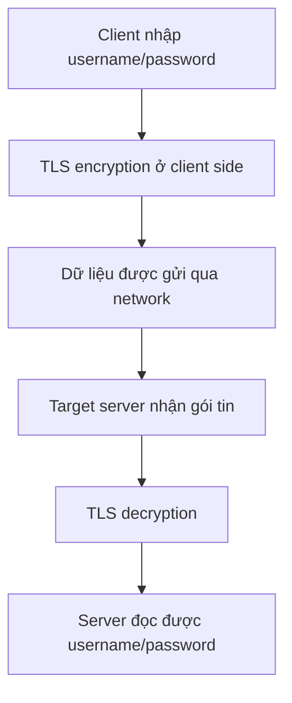

# 293. Encryption 101

## 🎯 Giới thiệu
Bài giảng này giải thích ở mức tổng quan 3 cơ chế **encryption** trong Cloud/AWS:

- **Encryption in flight**: dữ liệu được mã hóa khi đang truyền qua network.
- **Server-side encryption at rest**: dữ liệu được mã hóa sau khi server nhận và lưu trữ.
- **Client-side encryption**: dữ liệu được mã hóa ngay ở phía client trước khi gửi đi.

Mục tiêu chính là hiểu **dữ liệu được mã hóa ở đâu, giải mã ở đâu, và ai giữ key**.

## 1. 🔒 Encryption in flight
- Còn được gọi là **TLS** hoặc **SSL**.
- **TLS** là phiên bản mới hơn của **SSL**.
- Dữ liệu được **encrypt trước khi gửi** và **decrypt sau khi nhận**.
- Dùng cho giao tiếp giữa **client** và **server** qua network.
- **TLS certificates** được dùng để mã hóa kết nối.
- Khi thấy **HTTPS**, nghĩa là kết nối giữa client và server đang được mã hóa bằng **TLS certificates**.

### Vì sao cần?
- Dữ liệu đi qua network, đôi khi là **public network** và nhiều server trung gian.
- Mục tiêu là tránh **man in the middle attacks**.
- Chỉ **target server** mới có thể decrypt dữ liệu đã mã hóa.

### Flow minh họa

## 2. 🗄️ Server-side encryption at rest
- Dữ liệu được **encrypt sau khi server nhận**.
- Mục đích là **lưu trữ an toàn**.
- Khi cần gửi lại cho client, dữ liệu sẽ được **decrypt trước khi trả về**.
- Việc encrypt/decrypt diễn ra **trên server**.
- Thường dùng một **data key** để thực hiện quá trình này.

### Ví dụ với Amazon S3
- Client gửi object lên **Amazon S3**.
- S3 nhận object ở dạng đã được xử lý bởi request, sau đó dùng **data key** để encrypt object khi lưu.
- Khi client tải object về:
  - S3 dùng **encrypted objects** và **data key** để decrypt.
  - Sau đó object được gửi lại cho client qua **HTTPS**.

### Ý chính cần nhớ
- Server có quyền truy cập vào key.
- Dữ liệu được lưu ở dạng encrypted tại phía server.
- Đây là mô hình **server-side encryption** vì mọi thao tác mã hóa/giải mã nằm trên server.

## 3. 🧩 Client-side encryption
- Dữ liệu được **encrypt và decrypt ở phía client**.
- **Server không được phép decrypt** dữ liệu.
- Phù hợp khi không tin tưởng server trong việc xem nội dung dữ liệu.

### Flow cơ bản
- Client có object + **data key** ở phía client.
- Client encrypt object thành **encrypted object**.
- Encrypted object được gửi tới nơi lưu trữ như:
  - FTP server
  - Amazon S3
  - EBS volumes
  - các storage service khác
- Dữ liệu được lưu ở dạng encrypted.
- Khi lấy lại dữ liệu:
  - Client nhận lại **encrypted object**
  - Nếu vẫn có **data key** ở client side thì decrypt để lấy dữ liệu gốc

### Ý chính cần nhớ
- Server chỉ lưu và chuyển dữ liệu.
- Server **không thể đọc nội dung** nếu không có key.
- Key nằm ở **client side**.

## 📊 Bảng tóm tắt
| Tiêu chí | Mô tả |
|----------|------|
| Encryption in flight | Mã hóa dữ liệu khi truyền qua network, thường dùng **TLS/SSL** và **HTTPS** |
| Server-side encryption at rest | Mã hóa dữ liệu sau khi server nhận, quá trình encrypt/decrypt diễn ra trên server |
| Client-side encryption | Mã hóa dữ liệu ngay tại client, server không thể decrypt nội dung |
| Key location | In flight: dùng **TLS certificates**; at rest: server giữ và dùng **data key**; client-side: client giữ key |
| Mục tiêu bảo mật | Chống nghe lén, giảm rủi ro **man in the middle attacks**, và kiểm soát nơi decrypt dữ liệu |

## 💡 Mẹo ghi nhớ cho kỳ thi AWS
- **In flight = Network**: dữ liệu đang đi trên đường thì dùng **TLS/SSL**.
- **At rest = Storage**: dữ liệu đã nằm yên thì nghĩ đến **server-side encryption**.
- **Client-side = Client giữ key**: server không được phép đọc dữ liệu.
- Thấy **HTTPS** thì nhớ ngay đến **TLS certificates**.
- Với câu hỏi về **ai decrypt dữ liệu**, hãy xác định:
  - client
  - server
  - hay cả hai
- Gặp **man in the middle attacks** thì liên hệ ngay tới **encryption in flight**.

## ✅ Kết luận
Ba mô hình cần nhớ là:

- **Encryption in flight**: bảo vệ dữ liệu khi truyền qua network bằng **TLS/SSL**.
- **Server-side encryption at rest**: bảo vệ dữ liệu khi lưu trữ bằng cách mã hóa trên server.
- **Client-side encryption**: bảo vệ dữ liệu từ phía client, server không thể đọc nội dung.

Nếu ôn thi AWS, chỉ cần xác định đúng **dữ liệu đang ở đâu** và **key nằm ở đâu** là có thể phân biệt nhanh 3 cơ chế này.
