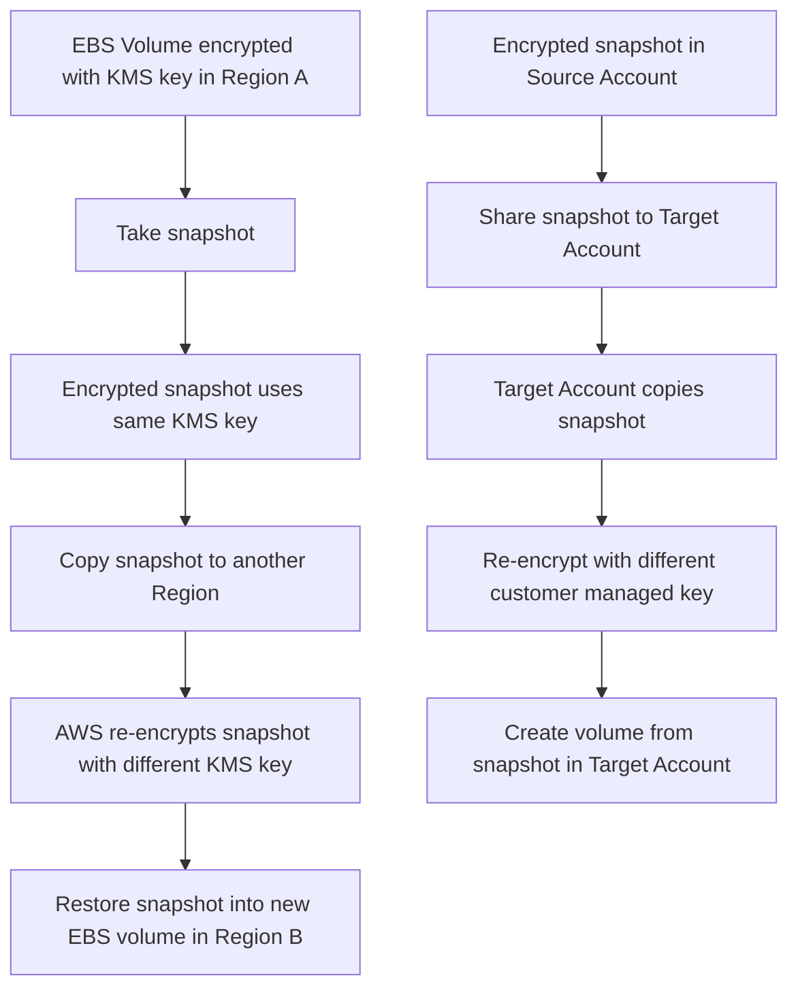

# 294. KMS Overview

## 🎯 Giới thiệu
- **AWS KMS (Key Management Service)** là dịch vụ quản lý encryption keys của AWS.
- Trong AWS, khi nghe đến **encryption**, khả năng cao đang nói tới **KMS encryption**.
- Mục tiêu của KMS:
  - AWS quản lý **encryption keys** cho bạn.
  - Giảm số việc phải tự vận hành.
- KMS tích hợp chặt với **IAM** để **authorization**.
- Có thể **audit mọi API call** dùng key qua **CloudTrail**.

## 1. KMS trong AWS Services
- KMS được tích hợp liền mạch với nhiều dịch vụ AWS.
- Ví dụ có thể bật KMS để encrypt data at rest cho:
  - **EBS**
  - **S3**
  - **RDS**
  - **SSM**
  - gần như mọi service cần encryption
- Bạn cũng có thể dùng KMS trực tiếp thông qua:
  - **API calls**
  - **AWS CLI**
  - **SDK**
- Best practice trong transcript:
  - Không lưu secret ở **plain text**
  - Có thể encrypt secret bằng **KMS key**
  - Lưu secret đã mã hóa trong **code** hoặc **environment variables**

## 2. Các Loại KMS Keys
- AWS dùng thuật ngữ **KMS key**.
- Có 2 loại chính:
  - **Symmetric KMS keys**
    - Chỉ có **1 key** dùng cho cả encrypt và decrypt
    - Tất cả AWS services tích hợp KMS đều dùng loại này
    - Khi dùng KMS symmetric key, bạn **không bao giờ lấy được key itself**
    - Chỉ dùng qua **KMS API calls**
  - **Asymmetric keys**
    - Có **public key** để encrypt
    - Có **private key** để decrypt
    - Dùng cho các thao tác kiểu **encrypt/decrypt** hoặc **sign/verify**
    - Có thể tải **public key** ra khỏi KMS
    - Không thể truy cập trực tiếp **private key**, chỉ dùng qua API
- Use case của asymmetric key:
  - Encryption xảy ra **ngoài AWS cloud**
  - User không có quyền truy cập KMS API
  - Họ dùng **public key** để encrypt, AWS account dùng **private key** để decrypt

## 3. KMS Key Types, Pricing, Rotation và Scope
- Transcript nêu các loại KMS key:
  - **AWS owned keys**
    - Free
    - Dùng trong các kiểu encryption như **SSE-S3** hoặc **SSC DynamoDB**
  - **AWS managed keys**
    - Free
    - Tên bắt đầu bằng `AWS/` và tên service, ví dụ:
      - `AWS/RDS`
      - `AWS/EBS`
      - `AWS/DynamoDB`
    - Chỉ dùng trong service được gắn với key đó
  - **Customer managed keys**
    - Custom keys
    - Chi phí **$1 / tháng**
  - **Imported keys**
    - Cũng **$1 / tháng**
- Pricing của KMS:
  - Trả tiền cho từng **API call**
  - Khoảng **3 cents / 10,000 API calls**
- Key rotation:
  - **AWS managed KMS key**: tự động mỗi **1 năm**
  - **Customer managed key**:
    - Có thể bật **automatic rotation**
    - Có thể set chu kỳ
    - Có thể **on-demand rotation**
  - **Imported KMS key**:
    - Chỉ **manual rotation**
    - Cần dùng **alias**
- KMS keys là **scoped per region**:
  - Một KMS key không thể tồn tại ở 2 region cùng lúc

## 4. KMS Key Policy và Flow Sao Chép Snapshot
- **KMS key policy** dùng để control access tới KMS key.
- Nó giống **S3 bucket policy**, nhưng có điểm khác:
  - Nếu không có **KMS key policy** trên key, thì **không ai access được**
- Có 2 kiểu key policy:
  - **Default policy**
    - Tạo ra nếu bạn không cung cấp custom policy
    - Cho phép **mọi người trong account** access key
    - Nếu IAM policy cho phép user/role truy cập, thì dùng được
  - **Custom policy**
    - Chỉ định rõ:
      - users nào được access
      - roles nào được access
      - ai được administer key
    - Hữu ích cho **cross account access**
- Use case được nêu: **copy encrypted snapshots across accounts**
  - Tạo snapshot được encrypt bằng **customer managed key**
  - Gắn **custom key policy** để cho phép cross account
  - Share encrypted snapshot sang target account
  - Trong target account:
    - copy snapshot
    - re-encrypt bằng **different customer managed key**
    - tạo volume từ snapshot

## 📊 Bảng tóm tắt
| Tiêu chí | Mô tả |
|----------|------|
| Mục đích | Quản lý encryption keys cho AWS |
| Tích hợp | IAM, CloudTrail, nhiều AWS services |
| Key types | Symmetric key, Asymmetric key |
| AWS key types | AWS owned keys, AWS managed keys, Customer managed keys, Imported keys |
| Pricing | `$1/month` cho customer managed/imported keys, khoảng `3 cents/10,000 API calls` |
| Rotation | AWS managed: tự động mỗi năm; customer managed: automatic/on-demand; imported: manual |
| Scope | KMS key scoped theo từng region |
| Access control | KMS key policy, giống S3 bucket policy nhưng không có policy thì không ai access được |
| Use case nổi bật | Encrypt EBS/S3/RDS/SSM, copy encrypted snapshot cross-region/cross-account |

## 💡 Mẹo ghi nhớ cho kỳ thi AWS
- **KMS = AWS quản lý key, bạn quản lý access**
- Nhớ từ khóa **CloudTrail**: mọi API call dùng key đều có thể audit
- **Symmetric**:
  - 1 key
  - dùng trong hầu hết AWS services tích hợp KMS
  - không lấy key ra ngoài, chỉ dùng API
- **Asymmetric**:
  - public key encrypt
  - private key decrypt
  - phù hợp khi encrypt bên ngoài AWS
- **AWS managed keys**:
  - free
  - tên dạng `AWS/service`
  - chỉ dùng trong service đó
- **Customer managed keys**:
  - có cost
  - hỗ trợ custom policy
  - quan trọng cho **cross account access**
- KMS key là **per region**, nên copy encrypted snapshot sang region khác phải qua bước **re-encrypt**
- Nếu hỏi về access key:
  - nhớ rằng **KMS key policy** là bắt buộc để kiểm soát quyền trên KMS key

## ✅ Kết luận
- KMS là dịch vụ trọng tâm của AWS cho **encryption key management**.
- Điểm cốt lõi cần nhớ:
  - tích hợp với **IAM**
  - audit qua **CloudTrail**
  - có **symmetric** và **asymmetric keys**
  - có nhiều loại key khác nhau với cơ chế giá và rotation riêng
  - **KMS key policy** rất quan trọng, đặc biệt trong bài toán **cross account** và **encrypted snapshot**
- Đây là chủ đề nền tảng cho việc học và thi AWS, nhất là các câu hỏi về **EBS, S3, RDS, snapshot encryption** và **key policy**.
