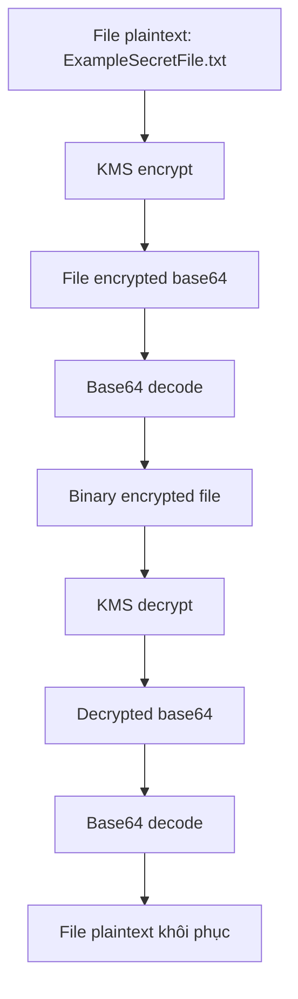

# 295. KMS Hands On w- CLI

## 🎯 Giới thiệu
- Bài học này demo **AWS KMS** theo hướng thực hành với **CLI**.
- Nội dung chính:
  - Phân biệt **AWS managed keys** và **customer managed keys**.
  - Xem cách **key policy** kiểm soát quyền truy cập.
  - Thực hiện luồng **encrypt/decrypt** một file bằng KMS và CLI.
- Trọng tâm ôn thi:
  - Hiểu **key policy**, **alias**, **key rotation**, và cách KMS gắn với các service như **EBS** và **SQS**.

## 1. AWS managed keys và key policy 🔐
- AWS managed key là key do AWS quản lý cho từng service.
- Ví dụ:
  - **EBS** dùng một AWS managed key thuộc về service EBS.
  - **SQS** cũng có AWS managed key riêng.
- Trong **key policy** của các key này:
  - Quyền có thể được phép từ nhiều nơi.
  - Nhưng điều kiện thường giới hạn:
    - **Caller account** phải là tài khoản của mình.
    - **ViaService** phải đúng service tương ứng, ví dụ:
      - EBS key dùng qua **EC2**
      - SQS key dùng qua **SQS**
- Phần **cryptographic configuration** cho thấy key là:
  - **symmetric**
  - do **KMS** tạo
  - dùng để **encrypt/decrypt** dữ liệu

## 2. Tạo customer managed key trong KMS 🛠️
- Ngoài AWS managed keys, còn có:
  - **customer managed keys**
  - **custom key store** với **CloudHSM**  
- Nội dung bài học chỉ tập trung vào **customer managed key**.
- Khi tạo key:
  - Chọn **symmetric key**
  - Chọn mục đích **encrypt/decrypt**
  - **Key origin** là **KMS**
  - Chọn **single region key**
  - Đặt **alias** là `tutorial`
- Khi tạo key, cần lưu ý:
  - Tạo key trong KMS sẽ tốn **$1/tháng**
- Các bước cấu hình liên quan đến quyền:
  - Có thể chỉ định **key administrators**
  - Có thể cấu hình **key users**
  - Có thể cho phép **other AWS accounts** truy cập key
- Nếu không cấu hình gì thêm:
  - KMS dùng **default key policy**
  - Mục đích là cho phép dùng IAM permissions để truy cập key nếu có quyền phù hợp
- Sau khi tạo xong, có thể:
  - Xem **key policy**
  - Xem **cryptographic configuration**
  - Bật **automatic key rotation**
  - Thực hiện **on-demand key rotation**
  - Xem **key rotation history**
  - Dùng **alias ARN** thay vì key ID đầy đủ
  - **Disable** key hoặc **schedule key deletion**

## 3. Encrypt/Decrypt file bằng KMS CLI 🔄
- File demo là `ExampleSecretFile.txt`
- Nội dung file có một secret, ví dụ:
  - `SuperSecretPassword`
- Luồng thao tác:
  1. Dùng lệnh **KMS encrypt**
     - Chỉ định `key ID` bằng `alias/tutorial`
     - Truyền vào file plaintext
     - Chọn output là **Cipher text blob**
     - Chỉ định region, ví dụ `eu-west-2`
  2. Kết quả tạo ra file **base64** chứa nội dung đã mã hóa
  3. Chuyển file base64 sang dạng **binary encrypted value**
  4. Dùng lệnh **KMS decrypt**
     - Truyền vào file đã được mã hóa
     - Lấy ra **plain text**
     - Ghi ra file base64 khác
  5. Base64 decode file đó để lấy lại nội dung gốc
- Điểm quan trọng:
  - KMS tự biết key nào được dùng để decrypt vì thông tin đó đã có trong **encrypted blob**
  - Đây là ví dụ mức thấp để thấy rõ cách **encrypt/decrypt** hoạt động
  - SDK sẽ trừu tượng hóa nhiều bước này cho bạn

## 📊 Bảng tóm tắt
| Tiêu chí | Mô tả |
|----------|------|
| AWS managed keys | Key do AWS quản lý cho service như **EBS**, **SQS** |
| Key policy | Quy định ai được truy cập key, có thể giới hạn bằng **ViaService** |
| Customer managed key | Key do người dùng tạo trong **KMS** |
| Key type | Trong bài học dùng **symmetric key** cho **encrypt/decrypt** |
| Key origin | Chọn **KMS** để KMS tự tạo key |
| Regionality | Dùng **single region key** |
| Alias | Key được đặt alias là `tutorial` |
| Rotation | Có thể bật **automatic key rotation** và **on-demand rotation** |
| CLI flow | `encrypt` -> base64 -> binary -> `decrypt` -> khôi phục plaintext |

## 💡 Mẹo ghi nhớ cho kỳ thi AWS
- **AWS managed key**: gắn với service, policy thường có điều kiện **ViaService**.
- **Customer managed key**: bạn tự tạo và quản lý trong KMS.
- **Key policy** là trọng tâm khi hỏi về quyền truy cập KMS.
- **Alias** giúp gọi key dễ hơn so với key ID/ARN đầy đủ.
- **Automatic key rotation** và **on-demand rotation** đều là tính năng có thể cấu hình cho key tạo trực tiếp trong KMS.
- Khi thấy bài hỏi về luồng mã hóa:
  - nhớ chuỗi: **plaintext file -> encrypt -> base64 -> binary -> decrypt -> plaintext file**
- Với KMS CLI, luôn chú ý:
  - **key ID / alias**
  - **region**
  - **plain text vs cipher text blob**

## ✅ Kết luận
- Bài học minh họa cách **KMS** hoạt động qua thực hành CLI.
- Bạn cần nhớ 3 phần chính:
  - **AWS managed keys** và điều kiện trong **key policy**
  - **customer managed key** với alias, administrators, users, rotation
  - Luồng **encrypt/decrypt** file bằng **KMS CLI**
- Đây là nền tảng tốt để ôn thi phần **KMS** trong AWS SAA-C03.
