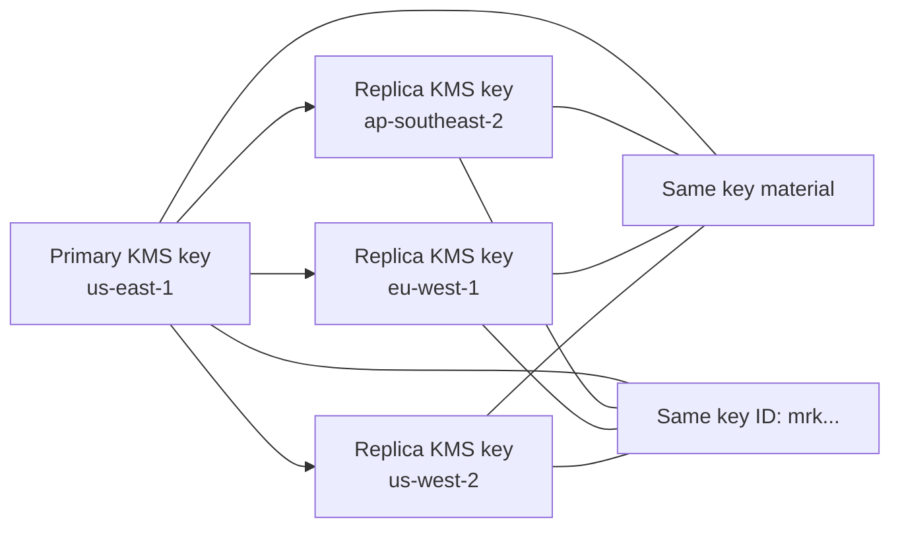
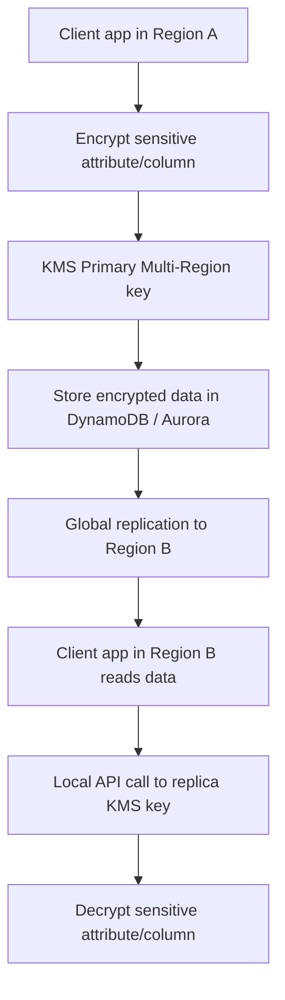

# 296. KMS - Multi-Region Keys

## 🎯 Giới thiệu
- **KMS Multi-Region keys** là bộ **KMS key** có:
  - 1 **Primary key** ở một Region được chọn, ví dụ `us-east-1`
  - Các **Replica keys** được sao chép sang các Region khác như `us-west-2`, `eu-west-1`, `ap-southeast-2`
- Điểm quan trọng:
  - **Key material** được replicate
  - **Key ID** giống hệt nhau giữa các Region, thường có dạng `mrk...`
  - Nếu bật **automatic rotation** cho Primary key, khi rotate thì bản mới cũng được replicate sang các Region khác
- Mục tiêu chính:
  - **Encrypt ở một Region, decrypt ở Region khác**
  - Không cần **re-encrypt data** khi di chuyển giữa các Region
  - Không cần thực hiện **cross-Region API calls** cho việc giải mã

## 1. Cơ chế hoạt động của Multi-Region keys
- Multi-Region keys **không phải global**
- Vẫn tồn tại rõ ràng:
  - **Primary**
  - **Replicas**
- Mỗi key được **manage independently**
  - Có **key policy** riêng
  - Không hoạt động như một key toàn cầu duy nhất
- Ý nghĩa thực tế:
  - Dù cùng key ID và key material, mỗi Region vẫn có bản key riêng để dùng local

## 2. Use cases chính
- Multi-Region keys phù hợp cho các trường hợp rất cụ thể:
  - **Global client-side encryption**
  - **Global DynamoDB tables**
  - **Global Aurora**
- Lợi ích nổi bật:
  - Client ở Region khác có thể gọi **local KMS API** để decrypt
  - Giảm độ trễ nhờ xử lý trong Region gần nhất
  - Hỗ trợ bảo vệ dữ liệu ngay cả với **database administrators**, nếu họ không có quyền truy cập KMS key

## 3. Flow với Global DynamoDB và Global Aurora
- Ý tưởng chung:
  - Client encrypt một số **attributes/columns** ở phía client
  - Chỉ những field cần bảo vệ mới được encrypt
  - Dữ liệu được replicate cùng với key sang Region khác
- Với **Global DynamoDB tables**:
  - Client application ở `us-east-1` encrypt một attribute, ví dụ **Social Security number**
  - Data được replicate sang `ap-southeast-2`
  - Client ở `ap-southeast-2` thấy field đó bị encrypt và gọi **local replica Multi-Region key** để decrypt
  - Database administrators vẫn không đọc được field đó nếu không có quyền với KMS key
- Với **Global Aurora**:
  - Dùng **AWS Encryption SDK**
  - Một cột, ví dụ **SSN**, được encrypt bằng Multi-Region key
  - Data replicate sang Region khác
  - Client ở Region đích thực hiện **local API call to KMS** để decrypt
  - Kết quả là **lower latency** và vẫn bảo vệ được dữ liệu khỏi DB admins

## 📊 Bảng tóm tắt
| Tiêu chí | Mô tả |
|----------|------|
| Primary / Replica | Có 1 Primary key và nhiều Replica keys ở các Region khác |
| Key material | Được replicate giữa các Region |
| Key ID | Giống nhau ở mọi Region, dạng `mrk...` |
| Tính global | **Không phải global**; vẫn là các key được quản lý độc lập |
| Rotation | Nếu Primary key rotate, bản rotation cũng được replicate |
| Use case | Global client-side encryption, Global DynamoDB tables, Global Aurora |
| Lợi ích | Encrypt ở 1 Region, decrypt ở Region khác; không cần re-encrypt data; giảm nhu cầu cross-Region API calls |
| Hạn chế | Không khuyến nghị dùng rộng rãi, chỉ cho các use case đặc biệt |

## 💡 Mẹo ghi nhớ cho kỳ thi AWS
- Nhớ cụm: **“same key material, same key ID, different Regions”**
- Multi-Region keys giúp:
  - **Encrypt one Region, decrypt another Region**
  - **Local KMS API call** ở Region đích
- Đây là lựa chọn tốt khi cần:
  - **Client-side encryption** cho dữ liệu nhạy cảm
  - Bảo vệ **specific attributes/columns**, không phải toàn bộ table
- Điểm dễ nhầm trong thi:
  - **Không phải global key**
  - Mỗi Region vẫn có **Primary/Replica** và được quản lý riêng
- Nếu đề bài nhắc:
  - **Global DynamoDB**
  - **Global Aurora**
  - **client-side encryption**
  - **lower latency**
  - **decrypt in another Region**
  -> nghĩ ngay đến **KMS Multi-Region keys**

## ✅ Kết luận
- **KMS Multi-Region keys** là cơ chế replicate **key material** và giữ **same key ID** giữa nhiều Region.
- Chúng cho phép **encrypt/decrypt xuyên Region** mà không cần re-encrypt dữ liệu hay gọi API sang Region xa.
- Use case chính là **client-side encryption** cho **Global DynamoDB tables** và **Global Aurora**, nhưng chỉ nên dùng trong các tình huống rất cụ thể.
