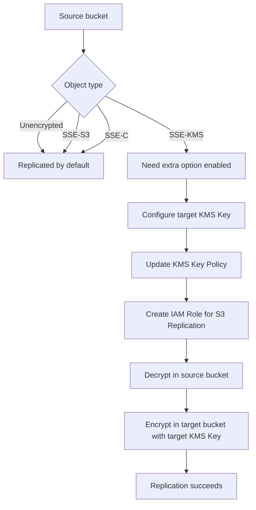

# 297. S3 Replication with Encryption

## 🎯 Giới thiệu
- Bài này nói về cách **S3 Replication** hoạt động khi object trong bucket nguồn được mã hóa.
- Trọng tâm là phân biệt loại mã hóa nào được replicate mặc định, loại nào cần cấu hình thêm, và vai trò của **KMS Key Policy** cùng **IAM Role**.

## 1. Các loại object và khả năng replication
- Khi bật **S3 Replication** từ bucket này sang bucket khác:
  - Object **không mã hóa** sẽ được replicate mặc định.
  - Object mã hóa bằng **SSE-S3** cũng được replicate mặc định.
  - Object mã hóa bằng **SSE-C** với customer provided key cũng có thể được replicate.
  - Object mã hóa bằng **SSE-KMS** thì **không được replicate theo mặc định**.

## 2. Replication với **SSE-KMS**
- Với **SSE-KMS**, cần bật thêm tùy chọn để replicate object.
- Phải xác định **KMS Key** dùng để mã hóa object ở **target bucket**.
- Cần cập nhật **KMS Key Policy** của target key.
- Cần tạo **IAM Role** để cho phép **S3 Replication service**:
  - giải mã dữ liệu ở source bucket,
  - sau đó mã hóa lại ở target bucket bằng target **KMS Key**.

## 3. Lưu ý về **KMS throttling** và **multi-region key**
- Vì quá trình này có nhiều bước **encryption/decryption**, có thể gặp **KMS throttling errors**.
- Nếu gặp lỗi này, cần **ask for a service quotas**.
- Về câu hỏi có nên dùng **multi-region key** cho **S3 Replication**:
  - Tài liệu nói là có thể dùng.
  - Nhưng hiện tại **Amazon S3** vẫn xem chúng như **independent keys**.
  - Vì vậy object vẫn sẽ bị **decrypt** rồi **encrypt** lại, dù key là **multi-region key**.

## 📊 Bảng tóm tắt
| Tiêu chí | Mô tả |
|----------|------|
| Object không mã hóa | Replicate mặc định |
| SSE-S3 | Replicate mặc định |
| SSE-C | Có thể replicate |
| SSE-KMS | Không replicate mặc định, cần bật thêm |
| Cấu hình cần có | Target **KMS Key**, **KMS Key Policy**, **IAM Role** |
| Luồng xử lý | Decrypt ở source, encrypt lại ở target |
| Rủi ro | Có thể gặp **KMS throttling errors** |
| Multi-region key | Có thể dùng, nhưng S3 vẫn xử lý như key độc lập |

## 💡 Mẹo ghi nhớ cho kỳ thi AWS
- Nhớ nhanh: **S3 Replication mặc định chạy tốt với unencrypted + SSE-S3 + SSE-C, nhưng SSE-KMS cần cấu hình thêm**.
- Khi thấy **SSE-KMS**, nghĩ ngay đến:
  - **KMS Key Policy**
  - **IAM Role**
  - **decrypt source / encrypt target**
- Nếu đề bài nhắc **throttling** trong replication với KMS, liên hệ đến **service quotas**.
- **multi-region key** không làm thay đổi việc S3 vẫn **decrypt rồi encrypt lại**.

## ✅ Kết luận
- **S3 Replication** hỗ trợ nhiều kiểu mã hóa, nhưng **SSE-KMS** là trường hợp cần cấu hình bổ sung.
- Muốn replicate object mã hóa bằng **SSE-KMS**, phải chuẩn bị đúng **KMS Key Policy** và **IAM Role** để cho phép S3 thực hiện giải mã và mã hóa lại.
- Dù dùng **multi-region key**, S3 vẫn xử lý key này như các key độc lập trong luồng replication.
