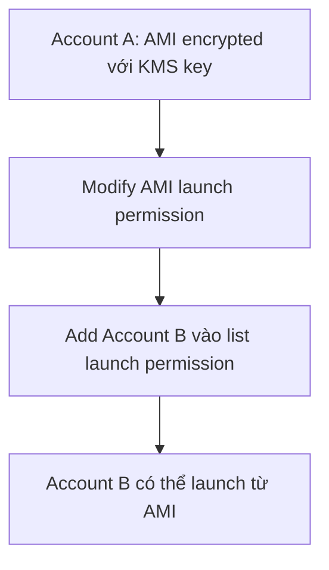

# 298. Encrypted AMI Sharing Process

## 🎯 Giới thiệu
- Bài này nói về **quy trình chia sẻ một AMI đã được encrypt bằng KMS key** sang **account khác**.
- Tình huống thi AWS thường gặp: **AMI nằm ở account A**, được mã hóa bằng **KMS key của account A**, và cần launch **EC2 instance ở account B** từ AMI đó.
- Điểm mấu chốt là phải xử lý đủ 2 phần:
  - **AMI launch permission**
  - **KMS key permission**

## 1. Chia sẻ AMI giữa các account
- Trong **source account**, cần sửa thuộc tính của AMI để thêm **launch permission**.
- Khi thêm **account B** vào danh sách launch permission, account B mới có quyền dùng AMI đó để launch instance.
- Đây là cách chia sẻ AMI ở mức **AMI property**, không chỉ đơn thuần là copy.

## 2. Chia sẻ KMS key và cấp quyền dùng
- Vì AMI được encrypt, chỉ share AMI thôi là chưa đủ.
- Cần **share KMS key** để account B có thể sử dụng key đó.
- Việc này thường thực hiện bằng **key policy**.
- Ở **account B**, cần tạo:
  - **IAM role** hoặc **IAM user**
  - Có đủ permissions để dùng cả **AMI** và **KMS key**

### Các quyền KMS được nhắc đến trong transcript
- `DescribeKey`
- `ReEncrypted` API call
- `CreateGrant`
- `Decrypt`

## 3. Launch EC2 instance và re-encrypt tùy chọn
- Sau khi:
  - AMI đã được cấp **launch permission**
  - KMS key đã được share
  - IAM role/user ở account B đã có đủ quyền
- Thì có thể **launch EC2 instance** từ AMI đó trong account B.
- Tùy chọn: account B có thể **re-encrypt** volumes bằng **KMS key do chính account B sở hữu**.

## 📊 Bảng tóm tắt
| Tiêu chí | Mô tả |
|----------|------|
| Bối cảnh | Share **encrypted AMI** từ account A sang account B |
| Điều kiện với AMI | Phải thêm **launch permission** cho account B |
| Điều kiện với KMS | Phải share **KMS key**, thường qua **key policy** |
| IAM ở account B | Cần **IAM role/user** có quyền dùng AMI và KMS |
| API/permission quan trọng | `DescribeKey`, `ReEncrypted`, `CreateGrant`, `Decrypt` |
| Kết quả | Account B có thể launch **EC2 instance** từ AMI |
| Tùy chọn sau launch | Có thể **re-encrypt** volumes bằng KMS key của account B |

## 💡 Mẹo ghi nhớ cho kỳ thi AWS
- Nhớ công thức: **AMI permission + KMS permission + IAM permission = launch được**.
- Nếu đề bài nhắc đến **encrypted AMI sharing**, đừng chỉ nghĩ đến AMI:
  - phải kiểm tra cả **KMS key**
- Từ khóa hay xuất hiện trong đáp án:
  - **launch permission**
  - **key policy**
  - **Decrypt**
  - **CreateGrant**
- Mẹo nhớ nhanh:
  - **AMI để launch**
  - **KMS để decrypt**
  - **IAM để authorize**

## ✅ Kết luận
- Chia sẻ **encrypted AMI** giữa các account không chỉ là share AMI.
- Phải đồng thời:
  - cấp **launch permission** cho AMI
  - share **KMS key**
  - cấp đủ **IAM permissions** ở account đích
- Khi 3 phần này đúng, account B có thể launch **EC2 instance** từ AMI ở account A.
