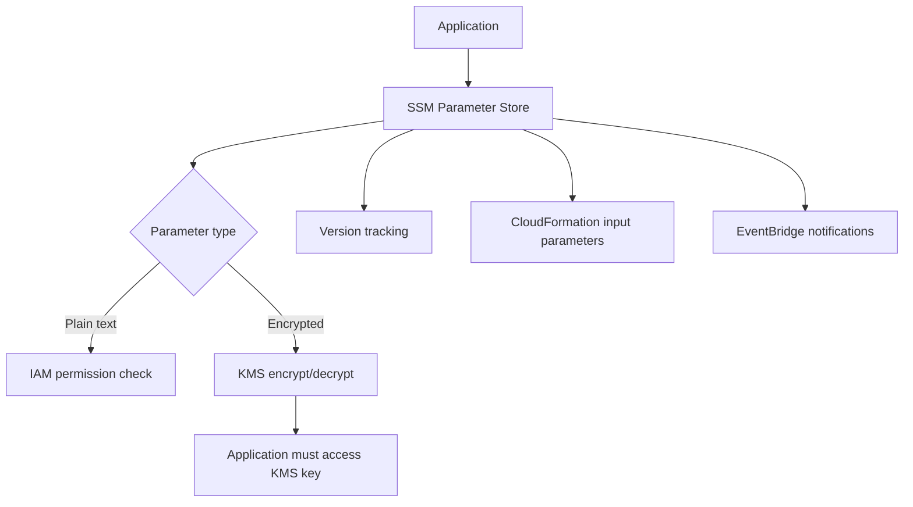

# 299. SSM Parameter Store Overview

## 🎯 Giới thiệu
- **SSM Parameter Store** là nơi lưu trữ an toàn cho **configuration** và **secrets**.
- Có thể **encrypt** dữ liệu bằng **KMS** để biến configuration thành secrets.
- Đặc điểm chính:
  - **serverless**
  - **scalable**
  - **durable**
  - SDK dễ sử dụng
- Có **version tracking** khi parameter được cập nhật.
- Bảo mật dựa trên **IAM**.
- Có tích hợp với **Amazon EventBridge** trong một số trường hợp.
- Tích hợp tốt với **CloudFormation**, cho phép dùng parameter làm input cho stack.

## 1. Cách hoạt động và bảo mật 🔐
- Ứng dụng đọc parameter từ SSM Parameter Store.
- Nếu là **plain text configuration**, quyền truy cập sẽ được kiểm tra bằng **IAM permissions** của ứng dụng, ví dụ:
  - **EC2 instance role**
  - **Lambda role**
- Nếu là **encrypted configuration**:
  - SSM Parameter Store sẽ dùng **KMS** để **encrypt/decrypt**
  - Ứng dụng phải có quyền truy cập vào **KMS key** tương ứng

## 2. Hierarchy, phân quyền và tích hợp đặc biệt 🗂️
- Parameter có thể được tổ chức theo **hierarchy/path**.
- Ví dụ cấu trúc:
  - `my-department/my-app/dev/Dev DB-URL`
  - `my-department/my-app/dev/DB-password`
  - `my-department/my-app/prod/Prod DB-URL`
  - `my-department/my-app/prod/Prod DB-password`
- Cách tổ chức này giúp:
  - quản lý parameter theo **department**
  - theo **app**
  - theo **environment** như `Dev` và `Prod`
- Đồng thời giúp đơn giản hóa **IAM policies** để cấp quyền theo:
  - toàn bộ department
  - toàn bộ app
  - hoặc path cụ thể theo app/environment
- Có thể truy cập **Secrets Manager secrets** thông qua Parameter Store bằng reference.
- Có **Public Parameters** do AWS cung cấp, ví dụ:
  - lấy **latest AMI** cho **Amazon Linux 2** theo region thông qua API call

## 3. Standard vs Advanced Tier ⚖️
- Có 2 loại parameter tier:
  - **standard**
  - **advanced**
- Khác biệt chính:
  - **size**: `4KB` vs `8KB`
  - **parameter policy**: standard **không có**, advanced **có**
  - **chi phí**: advanced tốn **$0.05 per month**, standard **free**
- **Parameter policy** chỉ có ở **advanced parameters**:
  - đặt **TTL / expiration date**
  - buộc người dùng cập nhật hoặc xóa dữ liệu nhạy cảm như password
  - hỗ trợ **multiple policies**
- Ví dụ policy:
  - **expiration policy**: đến timestamp chỉ định thì phải xóa parameter
  - **EventBridge** nhận notification
  - trước khi hết hạn `15 days`, có thể nhận cảnh báo để kịp cập nhật
  - có thể cấu hình cảnh báo **no change** nếu parameter không được cập nhật trong `20 days`

## 📊 Bảng tóm tắt
| Tiêu chí | Mô tả |
|----------|------|
| Mục đích | Lưu trữ an toàn cho configuration và secrets |
| Bảo mật | Dựa trên IAM, có thể kết hợp KMS để encrypt/decrypt |
| Đặc tính | serverless, scalable, durable, SDK dễ dùng |
| Quản lý | Có version tracking khi cập nhật parameter |
| Tích hợp | CloudFormation, EventBridge, Secrets Manager reference |
| Tổ chức dữ liệu | Hỗ trợ hierarchy theo department/app/environment |
| Public Parameters | AWS cung cấp sẵn, ví dụ lấy latest AMI |
| Tier | standard và advanced |
| Kích thước | 4KB cho standard, 8KB cho advanced |
| Parameter policy | Chỉ có ở advanced |
| Chi phí | standard miễn phí, advanced $0.05/tháng |

## 💡 Mẹo ghi nhớ cho kỳ thi AWS
- Nhớ rằng **SSM Parameter Store** dùng cho **configuration** và **secrets**.
- Nếu thấy **encrypted parameter**, nghĩ ngay đến **KMS**.
- Nếu thấy quyền truy cập, hãy nghĩ đến **IAM** và các role như **EC2 instance role** hoặc **Lambda role**.
- **CloudFormation** có thể lấy parameter làm input cho stack.
- **Hierarchy/path** giúp phân quyền theo phạm vi nhỏ hơn, dễ quản lý hơn.
- **Advanced tier** mới có **parameter policy** và **EventBridge notifications**.
- **Standard = free**, **Advanced = $0.05/month**.
- Nhớ mốc dung lượng: **4KB vs 8KB**.

## ✅ Kết luận
- **SSM Parameter Store** là dịch vụ lưu trữ an toàn cho configuration và secrets trong AWS.
- Nó hỗ trợ **IAM**, **KMS**, **CloudFormation**, **EventBridge**, version tracking và cấu trúc **hierarchy**.
- Khi ôn thi, cần đặc biệt phân biệt **standard vs advanced tier**, cũng như vai trò của **KMS** và **IAM** trong bảo mật.
