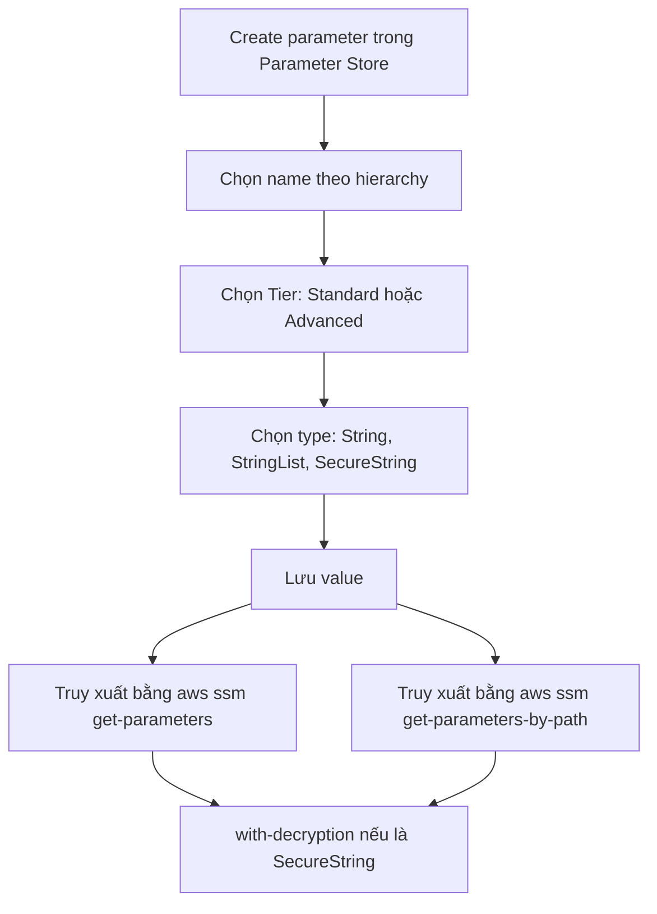

# 300. SSM Parameter Store Hands On (CLI)

## 🎯 Giới thiệu
SSM Parameter Store là một feature của **Systems Manager** dùng để:
- Tạo và lưu **parameters** theo **name / type / value**
- Tổ chức tham số theo **hierarchy**
- Tham chiếu parameters trong **comments** hoặc **code**
- Truy xuất dữ liệu bằng **AWS CLI**

## 1. Tạo parameter và tổ chức theo hierarchy
- Dùng tên theo dạng như:
  - `/my-app/dev/db-url`
  - `/my-app/dev/db-password`
  - `/my-app/prod/...`
- Cách đặt tên này giúp tổ chức parameter thành **hierarchy**:
  - `my-app`
  - `dev`
  - `prod`
- Video tạo 4 parameter:
  - `dev` db-url
  - `dev` db-password
  - `prod` db-url
  - `prod` db-password

## 2. Tier, type và mã hóa
### Tier
- Có 2 loại:
  - **Standard**
  - **Advanced**
- Theo transcript:
  - **Standard**: tối đa `10,000` parameters, mỗi value tối đa `4 KB`, không share với account khác
  - **Advanced**: tối đa `100,000` parameters, mỗi value tối đa `8 KB`, có thể share với account khác

### Type
- Có 3 type:
  - **String**
  - **StringList**
  - **SecureString**
- `String` được dùng cho text
- `StringList` dùng cho danh sách string
- `SecureString` dùng cho dữ liệu nhạy cảm như password

### Mã hóa với KMS
- `SecureString` được mã hóa bằng **KMS key**
- Có thể dùng:
  - **default KMS key** của SSM: `alias/aws/ssm`
  - hoặc một key tự tạo, ví dụ `Tutorial`
- Khi xem parameter dạng `SecureString`, value sẽ bị ẩn
- Chỉ khi có quyền KMS phù hợp và chọn **show decrypted value** thì mới giải mã được

## 3. Truy xuất parameter bằng AWS CLI
- Dùng **CloudShell** vì đã có AWS CLI và cấu hình sẵn
- Lệnh chính:
  - `aws ssm get-parameters`
- Khi truyền tên parameter:
  - `String` trả về value như bình thường
  - `SecureString` trả về dạng mã hóa nếu không dùng thêm flag

### Giải mã SecureString
- Thêm flag:
  - `with-decryption`
- Khi đó CLI sẽ kiểm tra quyền KMS và trả về value đã giải mã

### Lấy parameter theo path
- Dùng:
  - `aws ssm get-parameters-by-path`
- Ví dụ:
  - path `my-app/dev` trả về toàn bộ parameter trong namespace này
  - path `my-app` ban đầu chưa trả về gì nếu không bật recursive
- Thêm flag:
  - `Recursive`
- Khi bật `Recursive`, CLI sẽ lấy toàn bộ parameter bên dưới namespace đó, gồm cả `dev` và `prod`
- Cũng có thể dùng `with-decryption` để giải mã tất cả `SecureString`

## 📊 Bảng tóm tắt
| Tiêu chí | Mô tả |
|----------|------|
| Dịch vụ | **SSM Parameter Store** trong **Systems Manager** |
| Mục đích | Lưu và quản lý parameters để dùng trong code hoặc comment |
| Hierarchy | Đặt tên theo path như `/my-app/dev/db-url` |
| Tier | **Standard** và **Advanced** |
| Type | **String**, **StringList**, **SecureString** |
| Bảo mật | `SecureString` được mã hóa bằng **KMS** |
| CLI chính | `aws ssm get-parameters` |
| Lấy theo path | `aws ssm get-parameters-by-path` |
| Giải mã | Dùng `with-decryption` |
| Lấy đệ quy | Dùng `Recursive` |

## 💡 Mẹo ghi nhớ cho kỳ thi AWS
- **Parameter Store = Systems Manager feature** dùng để lưu configuration values
- **SecureString** là lựa chọn cho password hoặc dữ liệu nhạy cảm
- Nhớ sự khác nhau giữa:
  - `get-parameters` = lấy theo danh sách tên
  - `get-parameters-by-path` = lấy theo namespace/path
- `Recursive` giúp lấy tất cả parameter con dưới một path
- `with-decryption` chỉ dùng khi cần đọc nội dung của `SecureString`
- Đặt tên theo hierarchy giúp quản lý dễ hơn giữa `dev` và `prod`

## ✅ Kết luận
- Transcript cho thấy cách tạo parameter trong **Parameter Store**, tổ chức theo **hierarchy**, và truy xuất bằng **AWS CLI**
- Điểm quan trọng nhất là phân biệt **String** và **SecureString**, cũng như cách dùng **KMS**, `with-decryption`, và `Recursive`
- Đây là nền tảng rất hay gặp khi ôn thi AWS về **Systems Manager** và quản lý cấu hình an toàn
