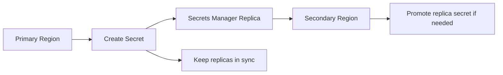

# 301. AWS Secrets Manager - Overview

## 🎯 Giới thiệu
- **AWS Secrets Manager** là một service mới hơn, dùng để **lưu trữ secrets**.
- Điểm khác với **SSM Parameter Store** là Secrets Manager hỗ trợ:
  - **force rotation** secrets theo số ngày định trước
  - **tự động tạo secret mới** khi rotation
- Trong kỳ thi AWS, khi thấy các dấu hiệu liên quan đến:
  - **Secrets**
  - tích hợp **RDS / Aurora**
  - quản lý username/password cho database  
  thì nên nghĩ ngay đến **Secrets Manager**.

## 1. Quản lý và rotation secrets 🔄
- Secrets Manager cho phép thiết lập lịch **rotation** secrets theo chu kỳ.
- Có thể **force** rotation để đảm bảo secret được cập nhật định kỳ.
- Việc tạo secret mới khi rotation cần một **Lambda function** để sinh ra secret mới.
- Mục tiêu là có một **secret management schedule** tốt hơn.

## 2. Tích hợp với AWS services và mã hóa 🔐
- Secrets Manager tích hợp tốt với nhiều service trên AWS.
- Transcript nhấn mạnh các ví dụ như:
  - **Amazon RDS**
  - **MySQL**
  - **PostgreSQL**
  - **SQL**
  - **Aurora**
- Username và password của database có thể được lưu trực tiếp trong **Secrets Manager**.
- Secrets có thể được mã hóa bằng **KMS**.

## 3. Multi-Region Secrets 🌍
- Secrets Manager hỗ trợ **multi-region Secrets**:
  - tạo secret ở **primary region**
  - secret được **replicate** sang **secondary region**
  - Secrets Manager giữ các bản sao **in sync** với primary secret
- Mục đích sử dụng:
  - khi có sự cố ở một region như **US East 1**, có thể **promote** replica secret thành secret độc lập
  - hỗ trợ xây dựng **multi-region applications**
  - hỗ trợ **disaster recovery**
  - dùng chung secret cho các database RDS được replicate giữa các region tương ứng

## 📊 Bảng tóm tắt
| Tiêu chí | Mô tả |
|----------|------|
| Mục đích | Lưu trữ secrets |
| Rotation | Có thể force rotation theo số ngày |
| Tự động tạo secret | Dùng **Lambda function** để sinh secret mới |
| Mã hóa | Secrets có thể được mã hóa bằng **KMS** |
| Tích hợp | Đặc biệt liên quan đến **RDS** và **Aurora** |
| Multi-Region | Replicate secret sang nhiều AWS regions |
| Tình huống thi | Khi thấy “Secrets”, “RDS”, “Aurora”, nghĩ đến **Secrets Manager** |

## 💡 Mẹo ghi nhớ cho kỳ thi AWS
- **Secrets + rotation + Lambda** = **AWS Secrets Manager**
- **RDS / Aurora credentials** thường gắn với **Secrets Manager**
- **KMS** là phần liên quan đến **encrypt secrets**
- **Multi-region Secrets** giúp:
  - replica giữa các region
  - hỗ trợ **disaster recovery**
  - có thể **promote replica** khi region chính gặp sự cố

## ✅ Kết luận
- **AWS Secrets Manager** là service để lưu và quản lý secrets một cách an toàn.
- Điểm nổi bật là **rotation tự động**, **Lambda-based secret generation**, **KMS encryption**, và **multi-region replication**.
- Trong AWS exam, các từ khóa như **Secrets**, **RDS**, **Aurora**, **rotation** là tín hiệu mạnh để chọn **Secrets Manager**.
