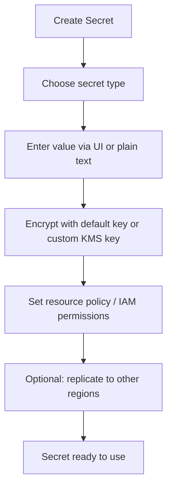

# 302. AWS Secrets Manager - Hands On

## 🎯 Giới thiệu
AWS Secrets Manager là service dùng để **rotate, manage, và retrieve secrets** trong suốt **lifecycle** của chúng.

- Tương tự **SSM Parameter Store** ở chỗ đều lưu secret.
- Khác biệt chính theo transcript:
  - Có **rotation**
  - Có quản lý secret tốt hơn
  - Tích hợp chặt với database như **MySQL, PostgreSQL, Amazon Aurora, RDS**, và các hệ thống khác
- Cách truy cập secret được kiểm soát bằng **IAM permissions**.

## 1. Tạo và lưu secret
Khi tạo secret, có thể chọn nhiều kiểu secret khác nhau:

- **Amazon RDS / DocumentDB / Redshift / other databases**
  - Nếu là RDS, hệ thống sẽ yêu cầu **username** và **password**
- **Other type of secrets**
  - Có thể lưu bất kỳ giá trị nào, ví dụ:
    - `MySecretKey` → `MyVerySecretValue`
    - `API_KEY` → một API key dạng text

Cách nhập secret:
- Nhập qua giao diện UI
- Hoặc nhập ở dạng **plain text** trong document kế bên

Điểm cần nhớ:
- Secret sẽ được giữ kín
- Chỉ người có **đúng IAM permissions** mới truy cập được

## 2. Mã hóa, policy và replication
Khi cấu hình secret, transcript đề cập các thành phần sau:

- **Encryption key**
  - Dùng key mặc định
  - Hoặc chọn **custom KMS key**
- **Resource permission**
  - Có thể gắn **resource policy** để giới hạn ai được phép truy cập secret
  - Có thể dùng theo kiểu **cross-account**
  - Transcript so sánh cơ chế này giống **S3 bucket policy**
- **Replication across regions**
  - Có thể replicate secret sang nhiều region
  - Hữu ích cho **multi-region setups**
  - Ví dụ:
    - `us-west-2`
    - `ap-southeast-1`

## 3. Rotation và tích hợp với RDS
Secrets Manager có tính năng **automatic rotation**:

- Có thể bật hoặc tắt rotation
- Nếu bật, cần chỉ định **rotation function**
- Rotation function này là một **Lambda function**

Một use case quan trọng là với **Amazon RDS**:

- Tạo `username` và `password`
- Chọn database
- Nhờ integration giữa **RDS** và **Secrets Manager**:
  - Username/password được dùng để đăng nhập database
  - Nếu rotate secret, database cũng được cập nhật theo

Điểm nhấn:
- Secrets Manager không chỉ lưu secret
- Nó còn hỗ trợ **rotation tự động** cho credential database

## 📊 Bảng tóm tắt
| Tiêu chí | Mô tả |
|----------|------|
| Mục đích | Rotate, manage, và retrieve secrets |
| So sánh | Giống **SSM Parameter Store** nhưng có rotation và tích hợp database mạnh hơn |
| Loại secret | RDS, DocumentDB, Redshift, hoặc secret tuỳ ý như API key |
| Bảo mật | Dựa vào **IAM permissions** và **resource policy** |
| Mã hóa | Dùng default key hoặc **KMS key** riêng |
| Replication | Có thể replicate secret sang nhiều region |
| Rotation | Dùng **Lambda function** để tự động rotate |
| Tích hợp nổi bật | **Amazon RDS**: tự cập nhật credential khi rotate |

## 💡 Mẹo ghi nhớ cho kỳ thi AWS
- **Secrets Manager = secret + rotation + database integration**
- Nếu thấy yêu cầu **rotate secret tự động**, nghĩ ngay đến **Secrets Manager**
- Nếu nhắc đến **cross-account access** cho secret, nhớ **resource policy**
- Nếu nhắc đến mã hóa secret, nhớ **KMS**
- Nếu nhắc đến rotate credential cho **RDS**, nhớ **Lambda rotation function**
- Nếu đề bài nói về **multi-region secret**, nhớ tính năng **replication**

## ✅ Kết luận
AWS Secrets Manager dùng để quản lý secret theo vòng đời, hỗ trợ **mã hóa bằng KMS**, **resource policy**, **replication đa vùng**, và đặc biệt là **rotation tự động bằng Lambda**. Với **RDS**, Secrets Manager có thể gắn trực tiếp credential vào database và cập nhật khi rotate.
