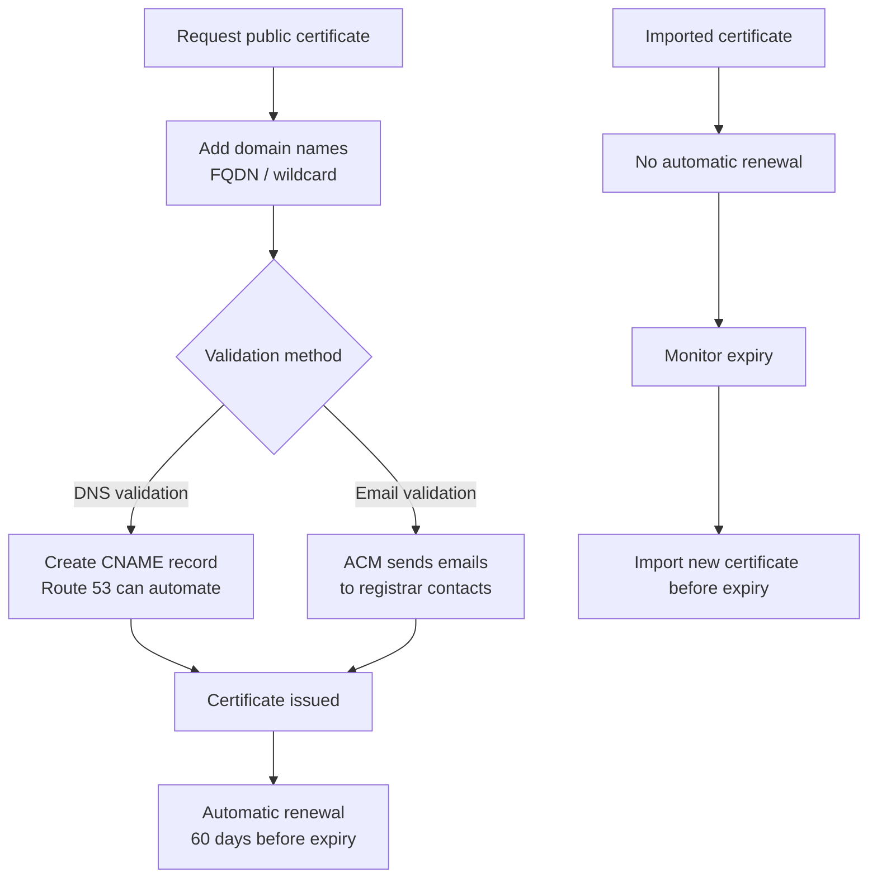

# 303. AWS Certificate Manager (ACM)

## 🎯 Giới thiệu
- **AWS Certificate Manager (ACM)** là dịch vụ dùng để **provision, manage, deploy TLS certificates** trên AWS.
- TLS certificates dùng cho **in-flight encryption** của website và API, thường đi cùng **HTTPS**.
- ACM hỗ trợ:
  - **Public TLS certificates**
  - **Private TLS certificates**
- **Public TLS certificates** trên ACM là **free of charge**.
- ACM có thể tích hợp với nhiều dịch vụ AWS như:
  - **Elastic Load Balancing**: `Classic Load Balancer`, `Application Load Balancer (ALB)`, `Network Load Balancer (NLB)`
  - **CloudFront**
  - **API Gateway**

## 1. Vòng đời certificate trong ACM
- Khi request **public certificate**, bạn cần khai báo:
  - **Domain names** trong certificate
  - Có thể là **FQDN** như `corp.example.com`
  - Hoặc **wildcard domain** như `*.example.com`
- Có 2 cách validation:
  - **DNS validation**
  - **Email validation**
- Với mục tiêu **automation** và **auto-renewal**, **DNS validation** là lựa chọn ưu tiên.
- Nếu dùng **email validation**:
  - ACM sẽ gửi email đến contact addresses trong domain registrar để xác minh.
- Nếu dùng **DNS validation**:
  - Bạn tạo **CNAME record** trong DNS để chứng minh quyền sở hữu domain.
  - Nếu dùng **Route 53**, việc này được tích hợp tự động với ACM.
- Sau khi verify xong:
  - Certificate được issue
  - Certificate public do ACM tạo ra sẽ được **automatic renewal**
  - ACM renew certificate **60 days before expiry**
- Nếu **import** certificate từ bên ngoài vào ACM:
  - **Không có automatic renewal**
  - Trước khi hết hạn, bạn phải import certificate mới

## 2. Theo dõi hết hạn certificate
- ACM có thể gửi **daily expiration events** vào **EventBridge**.
- Events này bắt đầu từ **45 days prior to expiration**.
- Số ngày cảnh báo có thể **configurable**.
- Từ **EventBridge**, có thể trigger:
  - **Lambda**
  - **SNS**
  - **SQS**
- Một cách khác là dùng **AWS Config**:
  - Managed rule: **ACM Certificate Expiration Check**
  - Rule này kiểm tra certificate sắp hết hạn
  - Nếu không compliant, event sẽ được gửi tới **EventBridge**
  - Sau đó vẫn có thể trigger **Lambda / SNS / SQS**
- Kết luận phần này:
  - Có **2 cách** để nhận alert tự động về certificate sắp hết hạn: qua **EventBridge** hoặc qua **AWS Config**

## 3. Tích hợp với ALB và API Gateway
- Với **ALB**:
  - ACM có thể provision và maintain TLS certificate trực tiếp trên ALB
  - ALB có thể cấu hình **redirect rule từ HTTP sang HTTPS**
  - Flow:
    - User vào ALB bằng **HTTP**
    - ALB redirect sang **HTTPS**
    - Sau đó dùng **TLS certificate** từ ACM
    - Request đi tiếp vào backend như **Auto Scaling group**
- Với **API Gateway**, cần nhớ các endpoint types:
  - **Edge-optimized endpoint**
    - Phù hợp khi client global
    - Request đi qua **CloudFront Edge locations**
    - TLS certificate gắn với **CloudFront distribution**
    - Certificate phải tạo ở **us-east-1**
  - **Regional endpoint**
    - Client cùng region với API Gateway
    - Certificate phải ở **same region as API Stage**
  - **Private API Gateway endpoint**
    - Chỉ truy cập từ trong **VPC** bằng **interface VPC endpoints**
    - Cần **resource policy** để kiểm soát access
- Với ACM và API Gateway:
  - Cần tạo **custom domain name** trong API Gateway
  - Sau đó cấu hình certificate phù hợp với loại endpoint
- Ví dụ region trong transcript:
  - Edge-optimized dùng ACM ở **us-east-1**
  - Regional endpoint có certificate ở **ap-southeast-2** nếu API Stage ở region đó
- Với route DNS:
  - Có thể dùng **CNAME** hoặc **alias record** trong **Route 53**

## 📊 Bảng tóm tắt
| Tiêu chí | Mô tả |
|----------|------|
| Mục đích | Provision, manage, deploy **TLS certificates** trên AWS |
| Use case chính | Bảo vệ **HTTPS** và **in-flight encryption** |
| Loại certificate | **Public TLS certificates**, **Private TLS certificates** |
| Public certificate | **Free of charge** trên ACM |
| Validation | **DNS validation** hoặc **Email validation** |
| Auto-renewal | Có với certificate do ACM tạo, renew **60 days before expiry** |
| Import certificate | Được, nhưng **không auto-renew** |
| Cảnh báo hết hạn | Qua **EventBridge** hoặc **AWS Config** |
| Tích hợp | **ALB**, **NLB**, **CloudFront**, **API Gateway** |
| API Gateway edge-optimized | Certificate nằm ở **us-east-1** |
| API Gateway regional | Certificate cùng region với **API Stage** |

## 💡 Mẹo ghi nhớ cho kỳ thi AWS
- **ACM = TLS/HTTPS certificate service** trên AWS.
- Nhớ điểm rất hay ra thi:
  - **Public certificate trên ACM là free**
  - **DNS validation** phù hợp cho **automation** và **auto-renewal**
  - Certificate do ACM tạo sẽ **renew 60 days before expiry**
  - Certificate **imported** thì **không auto-renew**
- Với **CloudFront / edge-optimized API Gateway**:
  - Nhớ **us-east-1**
- Với **ALB**:
  - Hay đi với **HTTP -> HTTPS redirect**
- Với cảnh báo hết hạn:
  - Nhớ **EventBridge** và **AWS Config ACM Certificate Expiration Check**

## ✅ Kết luận
- ACM là dịch vụ trung tâm để quản lý **TLS certificates** trên AWS.
- Điểm cần nhớ nhất là **validation method**, **auto-renewal**, và **region requirement** khi tích hợp với **CloudFront** hoặc **API Gateway**.
- Đây là chủ đề rất quan trọng cho phần **security** và **application integration** trong kỳ thi AWS SAA-C03.
