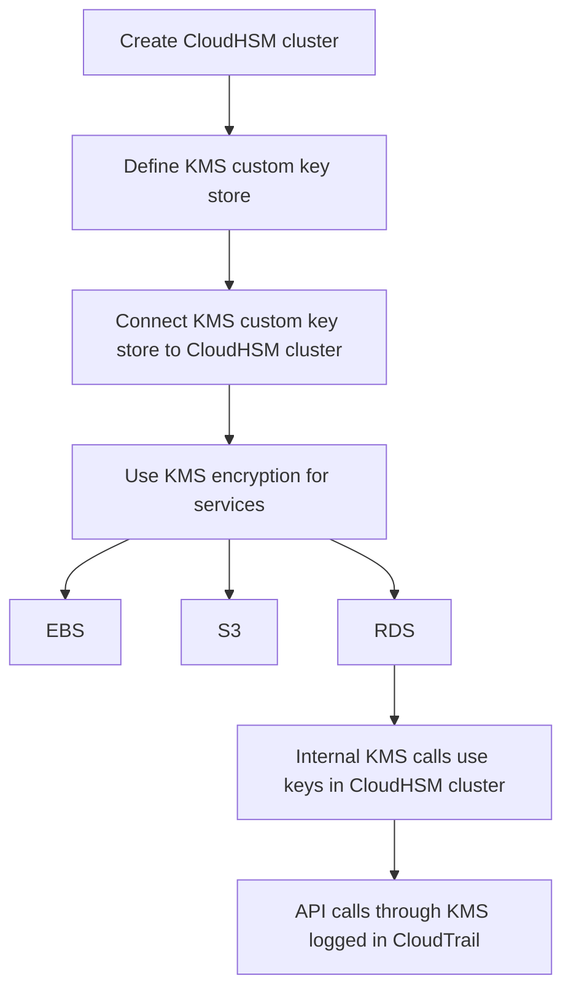

# 304. AWS CloudHSM

## 🎯 Giới thiệu
- **CloudHSM** là dịch vụ dùng **hardware security module (HSM)** chuyên dụng do AWS provision.
- Khác với **KMS**, trong CloudHSM:
  - AWS quản lý **hardware**
  - Bạn tự quản lý **encryption keys** بالكامل
- HSM được triển khai trong AWS cloud và có:
  - **tamper resistant**
  - **FIPS 140-2 Level 3 compliance**
- CloudHSM hỗ trợ:
  - **symmetric keys**
  - **asymmetric keys**
- Dịch vụ này:
  - **không có free tier**
  - cần dùng **CloudHSM client software** để kết nối

## 1. Cách CloudHSM hoạt động 🔐
- AWS cung cấp **HSM device** trong cloud.
- Người dùng:
  - kết nối bằng **CloudHSM client**
  - tự quản lý **keys**
  - tự quản lý **users** và **permissions** để truy cập keys
- Ở mức cao, **IAM permissions** được dùng để:
  - create
  - read
  - update
  - delete  
  **HSM cluster**
- Nhưng việc quản lý keys bên trong lại do **CloudHSM software** xử lý, khác với **KMS** nơi mọi thứ được quản lý bằng **IAM**.

## 2. High Availability và tích hợp với KMS ☁️
- **CloudHSM clusters** có thể triển khai **high availability (HA)**.
- Cluster được phân tán qua **multiple AZ**.
- Có thể có 2 AZ, một bản sao được replicate từ AZ còn lại, và client có thể connect vào bất kỳ bên nào.

### Mermaid: luồng tích hợp CloudHSM với KMS

- Khi tích hợp với **KMS**:
  - tạo **KMS custom key store**
  - store này chính là **CloudHSM**
- Nhờ đó, có thể dùng CloudHSM cho **EBS, S3, RDS** và các dịch vụ tương tự.
- Lợi ích:
  - thật sự dùng **CloudHSM cluster**
  - các API calls đi qua **KMS** tới CloudHSM sẽ được log trong **CloudTrail**

## 3. So sánh CloudHSM và KMS ⚖️
| Tiêu chí | KMS | CloudHSM |
|----------|-----|----------|
| Mô hình | **multi-tenant** | **single-tenant** |
| Quản lý key | AWS quản lý theo các loại key trong KMS | Bạn quản lý **own encryption keys** |
| Key type | symmetric, asymmetric, digital signing | symmetric, asymmetric, digital signing và hashing theo transcript |
| Truy cập / xác thực | **IAM** | Cơ chế bảo mật riêng của CloudHSM để quản lý users, permissions, keys |
| High Availability | Managed service, always available | Nhiều HSM device ở nhiều **AZ** |
| CloudTrail / CloudWatch | Có **CloudTrail** và **CloudWatch** | Có **MFS support** theo transcript |
| Free tier | Có | Không |

### Điểm nổi bật từ transcript
- CloudHSM phù hợp khi bạn muốn kiểm soát keys hoàn toàn.
- Có thể là lựa chọn tốt cho **SSE-C** trên **S3** vì bạn tự giữ và quản lý keys trong CloudHSM.
- Có hỗ trợ tích hợp với **Redshift** cho encryption và key management.

## 📊 Bảng tóm tắt
| Tiêu chí | Mô tả |
|----------|------|
| Bản chất dịch vụ | AWS cung cấp **HSM hardware**, bạn tự quản lý keys |
| Mức độ kiểm soát | **Full control** với encryption keys |
| Bảo mật phần cứng | **Tamper resistant**, **FIPS 140-2 Level 3** |
| Key support | **Symmetric** và **asymmetric** keys |
| Triển khai | **Multiple AZ**, hỗ trợ **HA** |
| Tích hợp | **KMS custom key store**, dùng cho **EBS, S3, RDS** |
| Quản trị | **IAM** cho cluster level, CloudHSM software cho keys/users/permissions |
| Chi phí | **No free tier** |

## 💡 Mẹo ghi nhớ cho kỳ thi AWS
- **KMS = AWS quản lý keys nhiều hơn, dùng IAM là chính**.
- **CloudHSM = bạn giữ keys, AWS chỉ lo hardware**.
- Ghi nhớ cụm:
  - **KMS: multi-tenant**
  - **CloudHSM: single-tenant**
- Nếu đề bài nhấn mạnh:
  - **full control over keys**
  - **tamper resistant**
  - **FIPS 140-2 Level 3**
  - **client software**
  - **custom key store**
  
  thì đó là dấu hiệu của **CloudHSM**.
- Nếu cần dùng CloudHSM “bên dưới” các dịch vụ AWS, hãy nhớ đến tích hợp qua **KMS custom key store**.

## ✅ Kết luận
- **CloudHSM** là lựa chọn cho bài toán cần kiểm soát tuyệt đối với **encryption keys**.
- AWS quản lý **HSM hardware**, còn bạn quản lý **keys, users, permissions**.
- Dịch vụ này có **HA across multiple AZ**, tích hợp với **KMS**, và phù hợp khi cần dùng CloudHSM cho các workload như **S3 SSE-C**, **EBS**, **RDS**, hoặc các tình huống cần mức kiểm soát cao hơn **KMS**.
