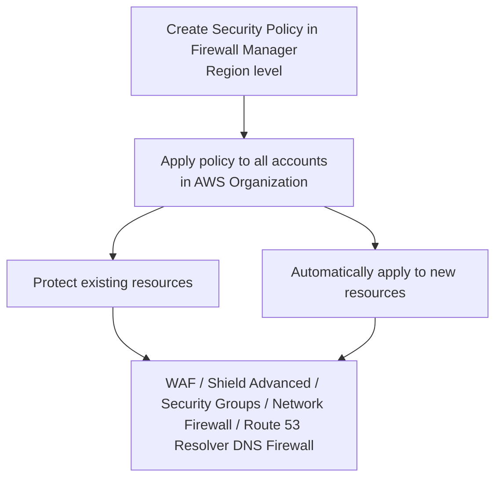

# 307. Firewall Manager

## 🎯 Giới thiệu
- **AWS Firewall Manager** là dịch vụ dùng để quản lý các firewall rules trên **nhiều accounts** trong một **AWS Organization**.
- Mục tiêu chính là **tập trung quản lý bảo mật** ở một nơi thay vì cấu hình rời rạc từng account.
- Policy được tạo ở **region level**, sau đó áp dụng cho toàn bộ accounts trong organization.

## 1. Firewall Manager dùng để làm gì? 🛡️
- Quản lý **all firewall rules in all accounts** của AWS Organization.
- Cho phép đặt một **security policy** là một bộ **security rules** dùng chung.
- Các loại policy/rules được nhắc tới:
  - **WAF rules** cho:
    - **ALB**
    - **API Gateway**
    - **CloudFront**
  - **Shield Advanced rules** cho:
    - **ALB**
    - **CLB**
    - **NLB**
    - **Elastic IP**
    - **CloudFront**
  - Chuẩn hóa **security groups** cho:
    - **EC2**
    - **Application Load Balancer**
    - **ENI** resources trong VPC
  - **AWS Network Firewall** ở mức **VPC**
  - **Amazon Route 53 Resolver DNS Firewall**

## 2. Cách hoạt động của policy ⚙️
- Policy được tạo tại **region level**.
- Sau đó policy được **áp dụng cho tất cả accounts** trong organization.
- Nếu trong organization có resource mới được tạo, ví dụ:
  - một **new Application Load Balancer**
- thì **Firewall Manager tự động áp dụng** cùng rule/policy đó cho resource mới.

## 3. Phân biệt với WAF và Shield Advanced 📌
- **WAF**:
  - Dùng để tạo **Web ACL rules**.
  - Phù hợp khi cần **one-time protection**.
- **Firewall Manager**:
  - Dùng khi muốn quản lý **WAF across multiple accounts**.
  - Giúp **accelerate WAF configuration**.
  - Tự động bảo vệ **new resources**.
  - Đồng thời có thể quản lý và triển khai **Shield Advanced** across all accounts.
- **Shield Advanced**:
  - Bảo vệ trước **DDoS attacks**.
  - Có thêm:
    - **Dedicated support** từ **Shield Response Team (SRT)**
    - **Advanced reporting**
    - Có thể **tự động tạo WAF rules**
  - Phù hợp khi thường xuyên bị **DDoS attacks**.

## 📊 Bảng tóm tắt
| Tiêu chí | Mô tả |
|----------|------|
| Mục đích | Quản lý firewall rules tập trung cho nhiều accounts trong AWS Organization |
| Phạm vi | Áp dụng trên toàn organization, theo **region level** |
| Tự động hóa | Tự động áp dụng rules cho **new resources** như ALB mới |
| Thành phần liên quan | **WAF**, **Shield Advanced**, **Security Groups**, **AWS Network Firewall**, **Route 53 Resolver DNS Firewall** |
| Khi dùng WAF | Khi cần bảo vệ Web ACL, hoặc quản lý WAF trên nhiều accounts |
| Khi dùng Shield Advanced | Khi cần bảo vệ trước **DDoS** và cần hỗ trợ/reporting nâng cao |

## 💡 Mẹo ghi nhớ cho kỳ thi AWS
- Nhớ mốc chính: **Firewall Manager = centralized management** cho firewall rules trong **AWS Organization**.
- **WAF** là nơi định nghĩa rule, còn **Firewall Manager** là nơi **đẩy rule ra nhiều accounts** và **tự động áp dụng cho resource mới**.
- **Shield Advanced** đi cùng **WAF** và **Firewall Manager** khi cần bảo vệ mạnh hơn trước **DDoS**.
- Ghi nhớ các đối tượng thường được nhắc đến:
  - **ALB, API Gateway, CloudFront**
  - **EC2, ENI**
  - **VPC Network Firewall**
  - **Route 53 Resolver DNS Firewall**

## ✅ Kết luận
- **AWS Firewall Manager** là công cụ quản lý bảo mật tập trung cho nhiều accounts trong organization.
- Nó giúp triển khai và đồng bộ **WAF**, **Shield Advanced**, **security groups**, và các firewall liên quan một cách tự động.
- Điểm quan trọng nhất để nhớ khi ôn thi: **quản lý tập trung, áp dụng theo region, và tự động bảo vệ resource mới**.
