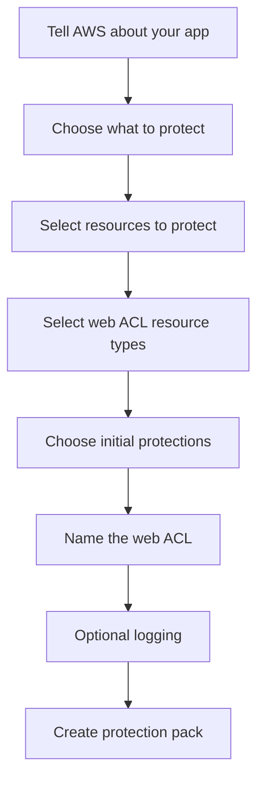

# 308. WAF & Shield - Hands On

## 🎯 Giới thiệu
- Bài học này giới thiệu cách dùng **WAF**, **Shield** và **Firewall Manager** ở mức thực hành.
- Trọng tâm:
  - **WAF**: bảo vệ web applications khỏi common web exploits.
  - **Shield**: bảo vệ khỏi **DDoS attacks**.
  - **Firewall Manager**: quản lý firewall rules tập trung across multiple accounts.

## 1. WAF: Web ACL và quy trình tạo bảo vệ 🛡️
- **WAF** có thể bảo vệ nhiều loại resources như:
  - **CloudFront distributions**
  - **API Gateway / APIs**
  - **Application Load Balancers**
  - Và một số dịch vụ khác được hiển thị trong UI
- Khi tạo bảo vệ, AWS yêu cầu bạn:
  - Khai báo app
  - Chọn phạm vi bảo vệ: **API**, **web version**, hoặc cả hai
  - Chọn **resources to protect**
  - Chọn **web ACL resource types**
  - Chọn **initial protections**
  - Đặt tên **web ACL**
  - Có thể cấu hình thêm **logging**
  - Tạo **protection pack**

- Các lựa chọn bảo vệ ban đầu gồm:
  - **Recommended rule**
    - rate limit cho **GET**
    - rate limit cho **POST / PUT / DELETE**
    - **Amazon IP reputation list**
    - **Anonymous IP protection**
    - **Managed IP DDoS protection**
    - **Bot control protection**
  - **Essentials pack** hoặc **build your own pack**
    - có thể thêm **IP allow list**
    - **IP block list**
    - **geographic restriction**
    - **custom rule**
- Với **custom rule**, có thể chọn:
  - **IP based rule**
  - **Geo-based rule**
  - **Rate based rules**
- Có thể dùng **AWS managed rules**:
  - rule miễn phí, ví dụ bảo vệ **PHP application**
  - rule trả phí, ví dụ **bot control**, **account takeover prevention**, **layer seven attacks**
- Điểm cần nhớ về chi phí:
  - **WAF web ACL**: khoảng **$5/month per web ACL**
  - Một số managed rules có phí theo request, ví dụ **$62-$63 per 10 million requests**

## 2. Shield: bảo vệ khỏi DDoS attacks 🌐
- **Shield** là dịch vụ **managed DDoS protection**
- Mục tiêu:
  - bảo vệ infrastructure
  - có **automatic mitigations**
- Có 2 tiers:
  - **Shield Standard**: đã bao gồm sẵn
  - **Shield Advanced**: có thể subscribe, chi phí khoảng **$3,000/month**
- Trong bài học, phần này chỉ được quan sát giao diện, không thực hiện subscribe

## 3. Firewall Manager: quản lý bảo mật tập trung 🔐
- **Firewall Manager** dùng để quản lý firewall rules across different accounts
- Đây là mô hình **centralized security management**
- Có thể dùng một **admin account** để áp dụng **firewall manager policy** cho:
  - nhiều accounts
  - nhiều applications
- Chi phí được nhắc đến trong bài:
  - khoảng **$100/month** cho policy kiểu này
- Mức độ hiểu cần thiết:
  - chỉ cần nắm high level, không đi sâu cấu hình

## 📊 Bảng tóm tắt
| Tiêu chí | Mô tả |
|----------|------|
| **WAF** | Bảo vệ web applications khỏi common web exploits |
| **Resources** | CloudFront, API Gateway / APIs, Application Load Balancer, và các dịch vụ khác |
| **Web ACL** | Thành phần chính để gắn rules và protection pack |
| **Rule types** | Recommended, custom rules, AWS managed rules |
| **Shield** | Bảo vệ khỏi **DDoS attacks** với automatic mitigations |
| **Shield tiers** | **Standard** và **Advanced** |
| **Firewall Manager** | Quản lý firewall rules tập trung across accounts |
| **Chi phí nhắc trong bài** | WAF web ACL: **$5/month**, Shield Advanced: khoảng **$3,000/month**, Firewall Manager policy: khoảng **$100/month** |

## 💡 Mẹo ghi nhớ cho kỳ thi AWS
- **WAF** = bảo vệ **application** khỏi **web exploits**.
- **Shield** = bảo vệ khỏi **DDoS**.
- **Firewall Manager** = quản lý **security policies** tập trung across accounts.
- Nhớ rằng:
  - **WAF** gắn với **web ACL**
  - **Shield Standard** đã có sẵn
  - **Shield Advanced** là mức trả phí cao
- Khi đề bài nói về:
  - lọc malicious traffic trước khi vào application server
  - IP allow/block list
  - geographic restriction
  - managed rules  
  thì đó là dấu hiệu của **WAF**
- Khi đề bài nói về **centralized management** cho nhiều account, nghĩ đến **Firewall Manager**.

## ✅ Kết luận
- Bài học cho thấy quy trình cơ bản để dùng **WAF** tạo **web ACL** và thêm rules.
- **Shield** bổ sung lớp bảo vệ chống **DDoS** với hai tier rõ ràng.
- **Firewall Manager** phù hợp khi cần quản lý chính sách bảo mật tập trung trên nhiều accounts.
- Với kỳ thi AWS, cần phân biệt rõ vai trò của từng dịch vụ và các chi phí/high-level features được nhắc trong transcript.
