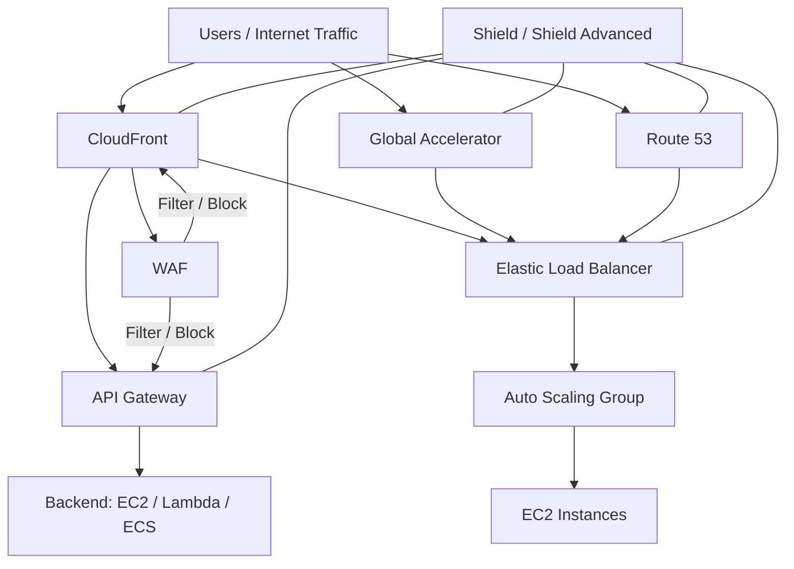

# 309. DDoS Protection Best Practices

## 🎯 Giới thiệu
Bài giảng này tập trung vào **solution architecture** cho **DDoS protection** và các **best practices** liên quan đến nhiều lớp bảo vệ trong AWS.

Ý chính:
- Càng đưa traffic lên **Edge** sớm thì càng tăng khả năng chống **DDoS**.
- Kết hợp nhiều dịch vụ như **CloudFront**, **Global Accelerator**, **Route 53**, **ELB**, **WAF**, **Shield**, **Auto Scaling** để giảm tải cho backend.
- Mục tiêu của kiến trúc là:
  - bảo vệ **EC2 instances**
  - lọc request độc hại
  - giảm **attack surface**
  - ẩn backend thật phía sau lớp dịch vụ trung gian

## 1. 🛡️ Bảo vệ tại Edge
Nhóm biện pháp này giúp DDoS được xử lý sớm ở **Edge location** trước khi traffic đến backend.

- **CloudFront**:
  - đưa web application delivery ra **Edge**
  - được bảo vệ bởi **Shield** để chống các common attacks như:
    - **SYN floods**
    - **UDP reflection**
  - có thể kết hợp với **WAF**
- **Global Accelerator**:
  - cho phép truy cập ứng dụng trên toàn cầu ở **Edge**
  - tích hợp chặt với **Shield** để bảo vệ DDoS
  - hữu ích khi backend không phù hợp với **CloudFront**
- **Route 53**:
  - domain name resolution là global, ở **Edge**
  - có cơ chế **DDoS protection** cho DNS

### Ý nghĩa thi exam
- Khi thấy yêu cầu **DDoS protection ở Edge**, nghĩ ngay đến:
  - **CloudFront**
  - **Global Accelerator**
  - **Route 53**
  - **Shield**

## 2. ⚙️ Bảo vệ tầng hạ tầng
Mục tiêu là bảo vệ **EC2 instances** khỏi lượng traffic cao bằng cách để nhiều dịch vụ xử lý traffic trước khi chạm tới backend.

- **CloudFront / Global Accelerator / Route 53 / ELB**:
  - traffic được xử lý bởi các dịch vụ này trước khi đến **EC2**
- **Auto Scaling**:
  - nếu traffic vẫn đến **Auto Scaling Group**, hệ thống có thể scale tự động
  - giúp đáp ứng tải lớn hơn
- **Elastic Load Balancing**:
  - tự động phân phối traffic qua nhiều **EC2 instances**
  - mỗi instance nhận lượng traffic có thể quản lý được, miễn là **Auto Scaling Group** đã scale phù hợp

### Ý nghĩa thi exam
- Nếu câu hỏi nói đến:
  - giảm tải cho **EC2**
  - phân phối traffic
  - mở rộng tự động khi có DDoS hoặc high traffic  
  thì liên hệ đến:
  - **ELB**
  - **Auto Scaling**
  - **CloudFront / Global Accelerator / Route 53**

## 3. 🔍 Bảo vệ tầng ứng dụng và giảm attack surface
Nhóm này tập trung vào việc phát hiện, lọc request độc hại và che giấu backend.

### Application layer defense
- **CloudFront**:
  - serve static content từ **Edge locations**
  - bảo vệ backend khỏi request trực tiếp
- **WAF**:
  - đặt trên **CloudFront** hoặc **Application Load Balancer**
  - có thể filter và block request dựa trên:
    - request signatures
    - specific IPs
    - specific request types
  - **rate based rules** có thể tự động block IP của bad actors
  - managed rules có thể block:
    - IP theo reputation
    - anonymous IPs
    - các mẫu request độc hại
- **Shield Advanced**:
  - khi enable, có thể tự động tạo **WAF rules**
  - giúp mitigate **layer 7 attacks**

### Giảm attack surface
- Dùng **CloudFront**, **API Gateway**, hoặc **ELB** để:
  - hide backend resources
  - attacker không biết phía sau là:
    - **Lambda**
    - **EC2**
    - **ECS tasks**
- **Security Groups** và **Network ACLs**:
  - filter traffic theo IP cụ thể
- **Elastic IPs**:
  - có thể được bảo vệ bởi **AWS Shield Advanced**
- **API Gateway**:
  - che giấu backend
  - nếu dùng **Edge optimized mode** thì đã global
  - có thể dùng **CloudFront + regional mode** để có thêm control cho DDoS protection
  - kết hợp **WAF** để filter HTTP request
  - có thể cấu hình:
    - burst limits
    - headers filtering
    - enforce API keys

### Ý nghĩa thi exam
- Khi đề bài hỏi cách:
  - lọc request độc hại
  - bảo vệ HTTP layer
  - ẩn backend
  - giới hạn request ở API  
  thì nghĩ đến:
  - **WAF**
  - **Shield Advanced**
  - **API Gateway**
  - **CloudFront**
  - **ELB**

## 📊 Bảng tóm tắt
| Tiêu chí | Mô tả |
|----------|------|
| Edge protection | Dùng **CloudFront**, **Global Accelerator**, **Route 53** để đưa bảo vệ lên **Edge** |
| Infrastructure layer | Dùng **ELB** và **Auto Scaling** để phân phối và hấp thụ traffic cao trước khi ảnh hưởng đến **EC2** |
| Application layer | Dùng **WAF** và **Shield Advanced** để lọc/block request độc hại, đặc biệt là **layer 7 attacks** |
| Reduce attack surface | Dùng **CloudFront / API Gateway / ELB** để che giấu backend thật như **Lambda**, **EC2**, **ECS** |
| API protection | Dùng **WAF**, **burst limits**, **headers filtering**, **API keys** trên **API Gateway** |
| Managed protection | **CloudFront**, **WAF**, **Shield Advanced** là các dịch vụ managed giúp giảm công sức vận hành |

## 💡 Mẹo ghi nhớ cho kỳ thi AWS
- **Edge first**: nếu có thể, đưa traffic lên **CloudFront**, **Global Accelerator**, hoặc **Route 53** càng sớm càng tốt.
- **ELB + Auto Scaling**: ELB chia tải, Auto Scaling tăng số lượng instance khi traffic tăng.
- **WAF = lọc request**: nhớ các khả năng như block IP, request types, rate based rules, managed rules.
- **Shield Advanced = tăng cường DDoS mitigation**: có thể tự tạo **WAF rules** cho **layer 7 attacks**.
- **Hide backend**: dùng **CloudFront**, **API Gateway**, hoặc **ELB** để che backend thật.
- **API Gateway**:
  - **Edge optimized mode** = global
  - **regional mode + CloudFront** = thêm control
  - có thể dùng **burst limits**, **headers filtering**, **API keys**
- Khi gặp câu hỏi về **DDoS resiliency**, hãy nghĩ theo 3 lớp:
  - **Edge**
  - **Infrastructure**
  - **Application**

## ✅ Kết luận
Best practices chống **DDoS** trong bài giảng xoay quanh việc:
- đẩy bảo vệ lên **Edge**
- dùng **ELB** và **Auto Scaling** để xử lý tải
- dùng **WAF** và **Shield Advanced** để lọc và block request độc hại
- giảm **attack surface** bằng cách che giấu backend qua **CloudFront**, **API Gateway**, và **ELB**

Cách làm này giúp bảo vệ tốt hơn cho **EC2 instances** và các backend resource phía sau trong kiến trúc AWS.
