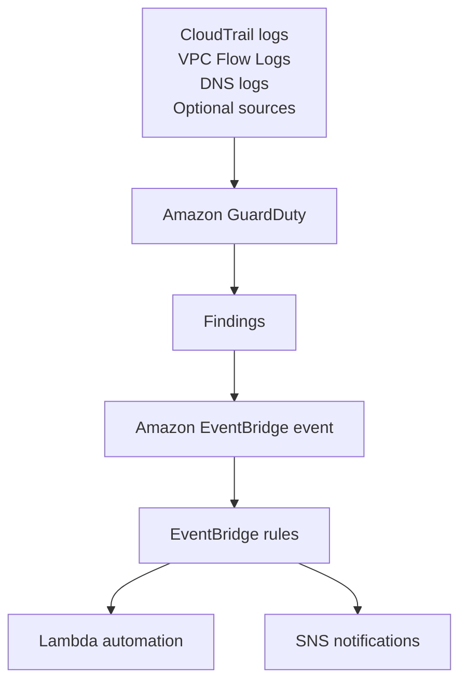

# 310. Amazon GuardDuty

## 🎯 Giới thiệu
- **GuardDuty** là dịch vụ giúp **intelligent threat discovery** để bảo vệ **AWS accounts**.
- Cách hoạt động:
  - Dùng **machine learning algorithm**
  - Thực hiện **anomaly detection**
  - Dùng **third party data** để phát hiện threat
- Bật dịch vụ rất đơn giản: **one click**
- Có **30 days trial**
- **Không cần cài đặt software**

## 1. 📥 Dữ liệu đầu vào mà GuardDuty phân tích
GuardDuty xem nhiều nguồn dữ liệu để tìm dấu hiệu bất thường:

- **CloudTrail event logs**
  - Phát hiện **unusual API calls**
  - Phát hiện **unauthorized deployments**
- **Management events**
  - Ví dụ: `create VPC Subnet`
- **Data events**
  - Ví dụ với S3: `get object`, `list objects`, `delete objects`
- **VPC Flow Logs**
  - Tìm **unusual internet traffic**
  - Tìm **unusual IP addresses**
- **DNS logs**
  - Phát hiện EC2 instance gửi **encoded data** trong DNS queries
  - Đây có thể là dấu hiệu instance đã bị **compromised**

## 2. 🔍 Các nguồn dữ liệu tùy chọn và finding
GuardDuty còn có thể bật thêm các **optional features** để phân tích:

- **EKS audit logs**
- **RDS and Aurora login events**
- **EBS**
- **Lambda**
- **S3 data events**
- **EKS logs and runtime monitoring**

Từ các dữ liệu này, GuardDuty sẽ tạo ra **findings** khi phát hiện vấn đề.

### Mermaid: luồng phát hiện và tự động hóa

## 3. 🚨 EventBridge và cảnh báo tự động
- Khi GuardDuty phát hiện finding, một **event** được tạo trong **Amazon EventBridge**
- Từ **EventBridge rules**, có thể kích hoạt:
  - **Lambda functions**
  - **SNS topics**
- Đây là cách tự động hóa phản ứng khi có cảnh báo bảo mật

## 📊 Bảng tóm tắt
| Tiêu chí | Mô tả |
|----------|------|
| Mục đích | Intelligent threat discovery để bảo vệ AWS accounts |
| Cách phát hiện | Machine learning, anomaly detection, third party data |
| Triển khai | One click, có 30 days trial, không cần cài software |
| Dữ liệu chính | CloudTrail logs, VPC Flow Logs, DNS logs |
| Dữ liệu tùy chọn | S3, EBS, Lambda, RDS, Aurora, EKS |
| Kết quả | Findings |
| Tích hợp tự động hóa | EventBridge rules, Lambda, SNS |
| Điểm hay gặp trong exam | Dedicated finding cho **cryptocurrency attacks** |

## 💡 Mẹo ghi nhớ cho kỳ thi AWS
- Nhớ 3 nguồn chính luôn có: **CloudTrail logs**, **VPC Flow Logs**, **DNS logs**
- Nhớ các nguồn tùy chọn: **S3**, **EBS**, **Lambda**, **RDS/Aurora**, **EKS**
- GuardDuty không cần cài agent hay software
- Khi có **findings**, có thể đẩy sang **EventBridge** để tự động hóa
- Một điểm hay thi: GuardDuty có **dedicated finding** cho **cryptocurrency attacks**

## ✅ Kết luận
- **GuardDuty** là dịch vụ phát hiện đe dọa thông minh cho AWS
- Nó phân tích nhiều loại log và dữ liệu hành vi để tìm bất thường
- Kết quả là **findings**, có thể nối với **EventBridge**, **Lambda**, và **SNS** để xử lý tự động
