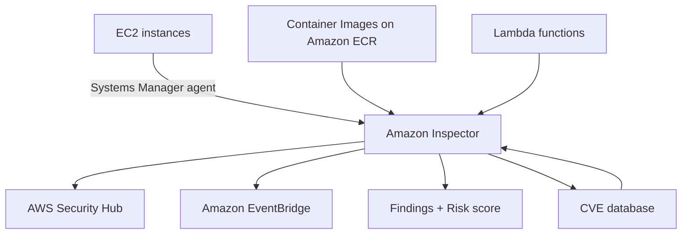

# 311. Amazon Inspector

## 🎯 Giới thiệu
Amazon Inspector là dịch vụ dùng để thực hiện **automated security assessments** trên một số tài nguyên trong AWS.

- Hỗ trợ kiểm tra:
  - **EC2 instances**
  - **Container Images** đẩy lên **Amazon ECR**
  - **Lambda functions**
- Mục tiêu là phát hiện:
  - **Unintended network accessibility**
  - **Known vulnerabilities**
  - **Software vulnerabilities** trong code và **package dependencies**
- Các đánh giá diễn ra theo kiểu **continuous** hoặc khi cần, tùy loại tài nguyên.

## 1. Amazon Inspector trên EC2
Khi dùng với **EC2 instances**:

- Cần **Systems Manager agent** trên EC2
- Inspector sẽ:
  - Phân tích mức độ **security** của instance
  - Kiểm tra **network accessibility** không mong muốn
  - Phân tích **running operating system** để tìm lỗ hổng đã biết
- Việc đánh giá diễn ra **continuously**

## 2. Amazon Inspector trên ECR và Lambda
### Container Images trên Amazon ECR
- Khi **Container Images** được push lên **Amazon ECR**
- Inspector sẽ tự động phân tích image
- Mục tiêu: phát hiện **known vulnerabilities**

### Lambda functions
- Khi **Lambda functions** được deploy
- Inspector sẽ phân tích:
  - **software vulnerabilities** trong function code
  - **package dependencies**
- Việc đánh giá diễn ra **as the functions are being deployed**

## 3. Findings, Eventing và Risk Score
Sau khi Inspector hoàn tất đánh giá:

- Có thể gửi **findings** vào **AWS Security Hub**
- Có thể gửi **findings** và **events** vào **Amazon EventBridge**
- Điều này giúp:
  - Xem tập trung các vulnerability trên infrastructure
  - Dùng **EventBridge** để chạy **automations**
- Mỗi lần quét sẽ gắn một **risk score** cho các vulnerabilities để **prioritization**
- Nếu **CVE database** được cập nhật, Inspector sẽ tự động chạy lại để kiểm tra toàn bộ infrastructure thêm một lần nữa

## 📊 Bảng tóm tắt
| Tiêu chí | Mô tả |
|----------|------|
| Mục đích | Automated security assessments |
| Đối tượng hỗ trợ | **EC2**, **Amazon ECR container images**, **Lambda functions** |
| EC2 kiểm tra gì | Unintended network accessibility, running OS vulnerabilities |
| ECR kiểm tra gì | Known vulnerabilities trong container images |
| Lambda kiểm tra gì | Software vulnerabilities trong code và package dependencies |
| Thời điểm quét | Continuous cho EC2, khi push image lên ECR, khi deploy Lambda |
| Kết quả đầu ra | Findings, risk score |
| Tích hợp | **AWS Security Hub**, **Amazon EventBridge** |
| Cập nhật lại quét | Khi **CVE database** thay đổi |

## 💡 Mẹo ghi nhớ cho kỳ thi AWS
- Nhớ 3 đối tượng chính của **Amazon Inspector**: **EC2, ECR, Lambda**
- **EC2** dùng **Systems Manager agent**
- **ECR** quét khi **push container images**
- **Lambda** quét khi **deploy**
- Inspector báo cáo sang:
  - **Security Hub** để xem tập trung
  - **EventBridge** để tự động hóa
- Từ khóa quan trọng cần nhớ: **CVE**, **risk score**, **findings**, **continuous scanning**

## ✅ Kết luận
Amazon Inspector là dịch vụ quét bảo mật tự động cho **EC2**, **ECR**, và **Lambda**, giúp phát hiện **vulnerabilities**, tạo **findings**, gán **risk score**, và đẩy kết quả sang **Security Hub** hoặc **EventBridge** để theo dõi và tự động hóa.
