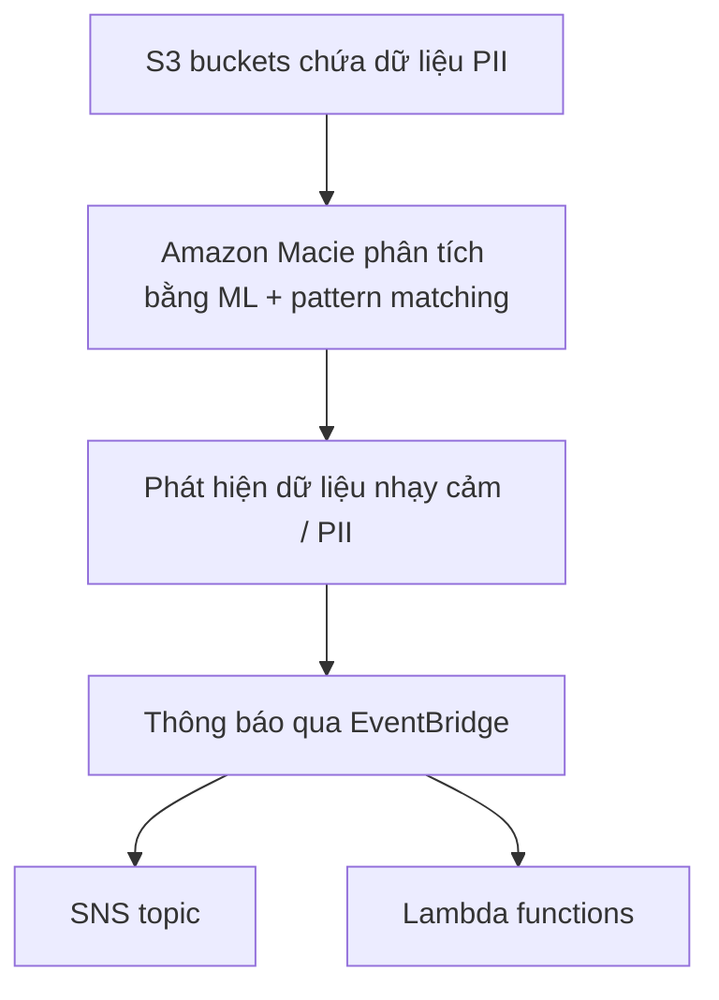

# 312. Amazon Macie

## 🎯 Giới thiệu
Amazon Macie là dịch vụ **fully managed** về **data security** và **data privacy** trong AWS, dùng **machine learning** và **pattern matching** để:
- Phát hiện dữ liệu nhạy cảm
- Bảo vệ dữ liệu nhạy cảm
- Cảnh báo khi tìm thấy dữ liệu như **PII** (*Personally Identifiable Information*)

Macie trong bài giảng này được nhấn mạnh là dùng để tìm dữ liệu nhạy cảm **trong S3 buckets**.

## 1. Macie làm gì? 🔍
- Phân tích dữ liệu trong **S3 buckets**
- Xác định dữ liệu có thể được phân loại là **PII**
- Gửi thông báo khi phát hiện dữ liệu nhạy cảm
- Kết nối với các dịch vụ như:
  - **EventBridge**
  - **SNS topic**
  - **Lambda functions**

## 2. Luồng hoạt động 📡

## 3. Điểm cần nhớ cho kỳ thi AWS 🧠
- Macie là dịch vụ **data security** và **data privacy**
- Dùng để phát hiện **PII**
- Chỉ tập trung vào **S3 buckets**
- Có thể bật rất nhanh, chỉ cần:
  - Chọn **S3 buckets** muốn theo dõi
  - Macie sẽ tự phân tích và cảnh báo
- Macie không được mô tả là làm nhiều việc khác ngoài việc tìm dữ liệu nhạy cảm trong S3

## 📊 Bảng tóm tắt
| Tiêu chí | Mô tả |
|----------|------|
| Dịch vụ | Amazon Macie |
| Loại dịch vụ | Fully managed data security và data privacy |
| Công nghệ chính | Machine learning, pattern matching |
| Dữ liệu mục tiêu | Sensitive data, đặc biệt là PII |
| Nơi phân tích | S3 buckets |
| Thông báo | EventBridge, SNS, Lambda |
| Mục đích chính | Discover và protect sensitive data trong AWS |

## 💡 Mẹo ghi nhớ cho kỳ thi AWS
- Nhớ theo công thức: **Macie = S3 + PII + discovery + alert**
- Nếu đề bài nhắc đến **tìm dữ liệu nhạy cảm trong S3**, hãy nghĩ ngay đến **Macie**
- Nếu nhắc đến cảnh báo qua **EventBridge**, **SNS**, hoặc **Lambda** sau khi phát hiện PII, đó là flow của Macie
- Macie trong transcript được mô tả là **chỉ dùng để tìm sensitive data trong S3 buckets**

## ✅ Kết luận
Amazon Macie là dịch vụ AWS giúp tự động phát hiện dữ liệu nhạy cảm như **PII** trong **S3 buckets** bằng **machine learning** và **pattern matching**, sau đó thông báo qua **EventBridge** và có thể tích hợp với **SNS** hoặc **Lambda**.
