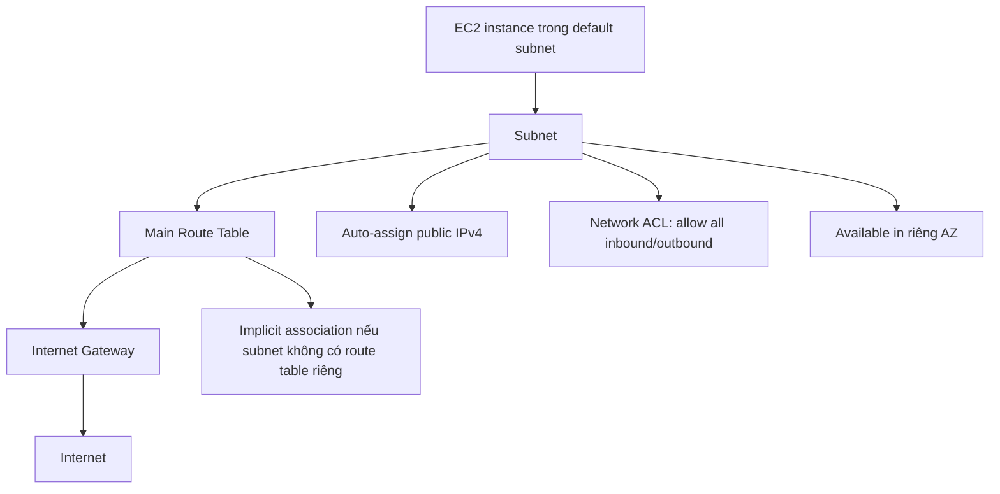

# 315. Default VPC Overview

## 🎯 Giới thiệu
- Bài này giải thích **default VPC** được tạo sẵn cho mỗi **new AWS account**.
- Mục tiêu của default VPC là giúp người mới có thể bắt đầu dùng AWS ngay, đặc biệt là triển khai **EC2 instances** mà không cần cấu hình quá nhiều.
- Tuy nhiên, trong **production accounts**, nếu đã hiểu về networking thì nên tự tạo **custom VPC** thay vì phụ thuộc vào default VPC.

## 1. Default VPC là gì? 🏗️
- Mỗi AWS account mới sẽ có sẵn một **default VPC**.
- Default VPC đã có sẵn:
  - **Internet connectivity**
  - **public IPv4 address** cho EC2 instances khi khởi chạy trong đó
  - **public và private IPv4 DNS name** cho EC2 instances
- Vì vậy, khi launch EC2 instance trong default VPC, bạn có thể kết nối gần như ngay lập tức nếu không chỉ định subnet riêng.

## 2. Cấu hình mặc định của default VPC và subnets 🌐
- Default VPC có:
  - một **IPv4 CIDR block**
  - không có **IPv6 CIDRs**
  - **flow logs** chưa được bật
  - không có **tags**
- Default VPC đi kèm **3 subnets**:
  - mỗi subnet có **IPv4 CIDR riêng**
  - mỗi subnet nằm ở một **Availability Zone (AZ)** khác nhau
- Lý do có 3 subnets ở 3 AZ là để hỗ trợ một kiến trúc có tính **high availability** nếu cần.
- Mỗi default subnet có:
  - **auto-assign public IPv4 enabled**
  - **route table**
  - **network ACL**
- Network ACL mặc định cho phép:
  - tất cả traffic
  - tất cả protocol
  - inbound và outbound
- Subnet trong bài có:
  - không bật **flow logs**
  - không có **CIDR reservations**
  - không được **shared**
  - không có tags

## 3. Route table, Internet Gateway và luồng traffic 🔁
- **Route table** giúp định tuyến traffic trong VPC.
- Default VPC có một **main route table**.
- Route table này có một route quan trọng:
  - mọi traffic đi ra ngoài CIDR nội bộ sẽ được gửi tới **internet gateway**
- **Internet gateway** được attach vào VPC và cung cấp **internet access** cho EC2 instances trong VPC.
- Route table này không được gán trực tiếp cho subnet nào, nhưng vẫn được dùng vì:
  - các subnet chưa có route table riêng sẽ nhận **main route table** theo cơ chế **implicit association**

## 📊 Bảng tóm tắt
| Tiêu chí | Mô tả |
|----------|------|
| Default VPC | VPC được tạo sẵn cho mỗi new AWS account |
| Mục đích | Giúp người mới dùng AWS nhanh chóng, đặc biệt với EC2 |
| Public connectivity | Có sẵn internet connectivity |
| EC2 trong default VPC | Nhận public IPv4 address và public/private IPv4 DNS name |
| Default subnets | Có 3 subnets trên 3 AZ khác nhau |
| Auto-assign public IPv4 | Enabled cho default subnets |
| Route table | Main route table điều hướng traffic ra Internet Gateway |
| Internet Gateway | Được attach vào VPC để cấp internet access |
| Network ACL | Allow all inbound và outbound traffic |
| Best practice | Production nên tạo custom VPC nếu đã hiểu networking |

## 💡 Mẹo ghi nhớ cho kỳ thi AWS
- **Default VPC = có sẵn để bắt đầu nhanh**, không phải lựa chọn tối ưu cho production.
- Nhớ rằng:
  - **EC2 trong default subnet** thường có **public IPv4**
  - **main route table** được dùng **implicit** khi subnet không có route table riêng
  - **Internet Gateway** là thứ giúp VPC ra Internet
- Khi thấy câu hỏi về môi trường mới tạo tài khoản AWS:
  - nghĩ ngay đến **default VPC**, **3 subnets**, **public connectivity**
- Khi câu hỏi nhắc đến khả năng truy cập Internet của EC2:
  - kiểm tra **public IPv4**, **route table**, và **Internet Gateway**

## ✅ Kết luận
- **Default VPC** là môi trường mạng mặc định giúp AWS account mới có thể dùng ngay.
- Nó gồm **3 subnets**, **main route table**, và **Internet Gateway**, nên EC2 instances có thể có **public access** ngay từ đầu.
- Tuy nhiên, trong thực tế triển khai **production**, nên ưu tiên thiết kế **custom VPC** để kiểm soát tốt hơn.
