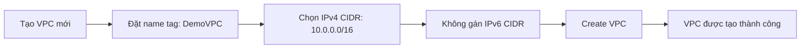

# 317. VPC Hands On

## 🎯 Giới thiệu
Bài học này hướng dẫn tạo **VPC** đầu tiên theo cách thủ công, không dùng **VPC Wizard**, để hiểu rõ các thành phần được tạo ra và cách cấu hình cơ bản của một **VPC**.

## 1. Tạo VPC đầu tiên 🛠️
- Tạo một VPC mới với tên tag là **DemoVPC**.
- Chọn **IPv4 CIDR block** là `10.0.0.0/16`.
- Không gán **IPv6 CIDR block** ở bước này.
- Sau khi tạo xong, VPC đã sẵn sàng để dùng trong demo tiếp theo.

## 2. CIDR block trong VPC 📌
- CIDR `10.0.0.0/16` là hợp lệ.
- Với CIDR này, phạm vi IP có khoảng **65.000 IP**.
- Có thể xác định **First IP** và **Last IP** trong dải CIDR.
- `/15` không dùng được trong ví dụ này vì mạng quá lớn.
- Giới hạn được nhắc đến trong bài là **/16** cho CIDR size.

## 3. Tenancy và thành phần mặc định ⚙️
- **Tenancy** quyết định cách **EC2 instances** được launch trong VPC:
  - **Default**: dùng shared hardware.
  - **Dedicated**: dùng dedicated hardware.
- Dedicated hardware rất đắt, nên bài chọn **Default**.
- Khi tạo VPC, AWS tự động tạo sẵn:
  - **Main route table**
  - **Main network ACL**
- Bạn có thể thêm thêm **IPv4 CIDRs** sau khi tạo VPC bằng:
  - `Action` → `Edit CIDRs`
- Có thể thêm nhiều CIDR khác nhau, ví dụ `10.1.0.0/16`.
- Bài học nêu rõ VPC có thể có tối đa **5 IPv4 CIDRs**.
- Ngoài ra còn có thể thêm **IPv6 CIDRs**.

## 📊 Bảng tóm tắt
| Tiêu chí | Mô tả |
|----------|------|
| Mục tiêu | Tạo VPC thủ công để hiểu cấu hình cơ bản |
| VPC name tag | `DemoVPC` |
| IPv4 CIDR ban đầu | `10.0.0.0/16` |
| IPv6 CIDR | Chưa gán |
| Tenancy | `Default` |
| Tài nguyên tự tạo | Main route table, main network ACL |
| CIDR mở rộng | Có thể thêm IPv4 CIDRs sau khi tạo |
| Giới hạn nêu trong bài | Tối đa 5 IPv4 CIDRs trong một VPC |

## 💡 Mẹo ghi nhớ cho kỳ thi AWS
- **VPC tạo xong không chỉ có “một cái mạng”**: AWS tự tạo sẵn **main route table** và **main network ACL**.
- **CIDR của VPC có thể mở rộng** sau khi tạo bằng `Edit CIDRs`.
- Nhớ rằng **Default tenancy** là lựa chọn mặc định vì **Dedicated** tốn kém hơn.
- Trong bài này, chỉ tạo **IPv4 CIDR**, chưa dùng **IPv6 CIDR**.
- Ghi nhớ con số quan trọng: **tối đa 5 IPv4 CIDRs** cho một VPC theo nội dung transcript.

## ✅ Kết luận
Bài hands-on này tập trung vào việc tạo **VPC** thủ công, hiểu cách chọn **IPv4 CIDR**, ý nghĩa của **tenancy**, và các tài nguyên mặc định được AWS tạo ra. Đây là nền tảng quan trọng trước khi đi sâu vào các thành phần mạng khác trong AWS như **subnet**, **route table**, và **network ACL**.
