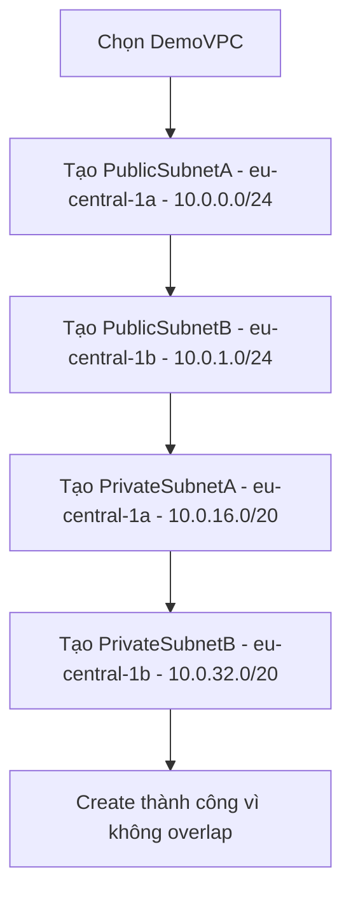

# 319. Subnet Hands On

## 🎯 Giới thiệu
Bài học này hướng dẫn tạo `Subnet` trong `DemoVPC`, gán `AZ`, chọn `IPv4 CIDR block`, và kiểm tra số IP khả dụng sau khi tạo. Điểm chính là cách chia `public subnet` và `private subnet` theo kích thước CIDR khác nhau, đồng thời phân bổ qua 2 `AZ` để hướng tới `high availability`.

## 1. Tạo Subnet trong `DemoVPC`
- Trước tiên, lọc danh sách `Subnets` theo đúng `VPC` là `DemoVPC` để tránh nhầm với `VPC` cũ.
- Sau khi lọc, ban đầu `DemoVPC` chưa có `Subnet` nào.
- Tạo 4 `Subnet`:
  - `PublicSubnetA`
    - `AZ`: `eu-central-1a`
    - `CIDR`: `10.0.0.0/24`
  - `PublicSubnetB`
    - `AZ`: `eu-central-1b`
    - `CIDR`: `10.0.1.0/24`
  - `PrivateSubnetA`
    - `AZ`: `eu-central-1a`
    - `CIDR`: `10.0.16.0/20`
  - `PrivateSubnetB`
    - `AZ`: `eu-central-1b`
    - `CIDR`: `10.0.32.0/20`
- Việc tạo thành công vì các dải IP không bị `overlapping`.

## 2. Ý nghĩa của CIDR và dung lượng IP
- `10.0.0.0/24`
  - Có tổng cộng `256 addresses`
  - IP chạy từ `.0` đến `.255`
  - Phù hợp cho `public subnet` vì thường chỉ cần ít IP hơn, ví dụ cho `load balancers` hoặc `front-facing infrastructure`
- `10.0.16.0/20`
  - Có `4,096 IP addresses`
  - IP chạy từ `10.0.16.0` đến `10.0.31.255`
  - Phù hợp hơn cho `private subnet` khi cần nhiều địa chỉ hơn
- `10.0.32.0/20`
  - Là dải kế tiếp hợp lý sau `10.0.16.0/20`

## 3. Kết quả sau khi tạo
- Hệ thống hiển thị số IP khả dụng khác nhau cho từng `Subnet`.
- Số IP khả dụng được tính theo công thức:
  - `CIDR size - 5`
- Lý do là mỗi `Subnet` có `5 reserved IP addresses`.
- Ví dụ trong bài:
  - `10.0.0.0/24` còn `251` IP khả dụng
  - `10.0.16.0/20` còn `4,091` IP khả dụng
- Các `Subnet` được chia trên 2 `AZ`:
  - `eu-central-1a`
  - `eu-central-1b`
- Mục đích là tăng `high availability` nếu triển khai tài nguyên vào đó.
- Ở thời điểm này, các `Subnet` vẫn trông giống nhau; chưa có cấu hình nào để biến một `Subnet` thành `public` hay `private`. Phần đó sẽ được giải thích ở các bài sau.

## 📊 Bảng tóm tắt
| Tiêu chí | Mô tả |
|----------|------|
| `VPC` sử dụng | `DemoVPC` |
| `Public Subnet` | `PublicSubnetA` `10.0.0.0/24`, `PublicSubnetB` `10.0.1.0/24` |
| `Private Subnet` | `PrivateSubnetA` `10.0.16.0/20`, `PrivateSubnetB` `10.0.32.0/20` |
| `AZ` | `eu-central-1a`, `eu-central-1b` |
| CIDR nhỏ | Hợp cho `public subnet`, ít IP hơn |
| CIDR lớn | Hợp cho `private subnet`, nhiều IP hơn |
| IP reserved | Mỗi `Subnet` có `5 reserved IP addresses` |
| Công thức IP dùng được | `CIDR size - 5` |
| Mục tiêu triển khai | Tăng `high availability` bằng cách trải trên nhiều `AZ` |

## 💡 Mẹo ghi nhớ cho kỳ thi AWS
- `Subnet` phải nằm trong một `VPC` cụ thể, nên cần lọc đúng `VPC` trước khi tạo.
- Nhớ quy tắc rất quan trọng: `CIDR size - 5` = số IP khả dụng.
- `public subnet` trong bài được chọn `CIDR` nhỏ hơn như `/24` vì chỉ cần ít IP.
- `private subnet` có thể dùng `CIDR` lớn hơn như `/20` để có nhiều địa chỉ hơn.
- Trải `Subnet` qua nhiều `AZ` là cách tăng `high availability`.
- Tên `public` và `private` ở bài này mới là cách đặt tên, chưa phải là cấu hình mạng thực sự.

## ✅ Kết luận
Bài học đã tạo thành công 4 `Subnet` trong `DemoVPC`, chia đều trên 2 `AZ`, dùng các dải `CIDR` khác nhau cho `public` và `private` mục đích minh họa. Điểm cần nhớ nhất cho kỳ thi là cách chọn `CIDR`, số `IP` khả dụng sau khi trừ `5` IP reserved, và vai trò của nhiều `AZ` trong `high availability`.
