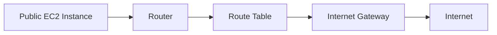

# 320. Internet Gateways & Route Tables

## 🎯 Giới thiệu
- Bài này giải thích cách đưa **internet access** vào các subnet trong **VPC**.
- Hiện tại, cả **Public Subnet** và **Private Subnet** đều chưa có internet access.
- Trọng tâm là vai trò của **Internet Gateway (IGW)** và việc chỉnh **Route Tables** để kết nối ra internet.

## 1. Internet Gateway là gì? 🌐
- **Internet Gateway** cho phép tài nguyên trong **VPC** kết nối với internet.
- Có thể áp dụng cho **EC2 instances** và các chức năng/tài nguyên khác trong VPC.
- Đây là một managed resource:
  - **Scale horizontally**
  - **Highly available**
  - **Redundant**
- **Internet Gateway** phải được tạo riêng, tách biệt với VPC.
- Một **VPC** chỉ gắn được với **1 Internet Gateway**, và ngược lại.

## 2. Vì sao chỉ tạo IGW là chưa đủ? 🔧
- Chỉ tạo **Internet Gateway** thôi thì **chưa có internet access** cho subnet.
- Muốn hoạt động, cần phải:
  - Tạo **Internet Gateway** trong VPC
  - Chỉnh **Route Tables**
- Nghĩa là **Route Tables** mới là phần quyết định traffic đi ra ngoài qua IGW.

## 3. Luồng truy cập internet từ Public Subnet 🚀
- Ví dụ trong bài:
  - Tạo một **Public EC2 Instance** trong **Public Subnet**
  - Sau đó sửa **Route Table**
- Luồng kết nối sẽ đi theo thứ tự:
  - **EC2 Instance**
  - **Router**
  - **Internet Gateway**
  - **Internet**
- Đây là điểm cốt lõi cần nhớ: **IGW + Route Table** mới tạo ra internet access cho subnet.

## 📊 Bảng tóm tắt
| Tiêu chí | Mô tả |
|----------|------|
| Internet Gateway | Cho phép tài nguyên trong VPC kết nối internet |
| Tính chất | Managed, highly available, redundant, scale horizontally |
| Quan hệ với VPC | Một VPC chỉ gắn với một IGW, và ngược lại |
| Điều kiện để có internet access | Không chỉ tạo IGW, còn phải chỉnh Route Tables |
| Luồng đi | EC2 Instance -> Router -> IGW -> Internet |

## 💡 Mẹo ghi nhớ cho kỳ thi AWS
- Nhớ rằng **IGW không tự động cấp internet access**.
- Muốn subnet đi ra internet thì phải có **Route Table** trỏ traffic phù hợp qua **Internet Gateway**.
- Từ khóa cần nhớ: **VPC**, **Internet Gateway**, **Route Tables**, **Public Subnet**, **EC2**.
- Khi gặp câu hỏi về public access trong VPC, hãy nghĩ ngay đến cặp đôi:
  - **Internet Gateway**
  - **Route Table**

## ✅ Kết luận
- **Internet Gateway** là thành phần giúp tài nguyên trong **VPC** ra được internet.
- Tuy nhiên, chỉ có IGW là chưa đủ, vì cần **Route Tables** để định tuyến traffic.
- Đây là nền tảng để hiểu cách **Public Subnet** có internet access trong AWS.
