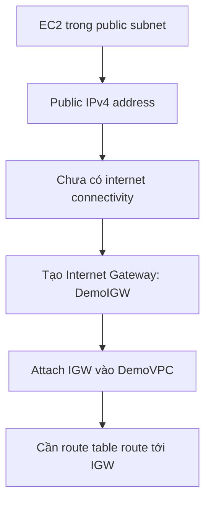

# 321. Internet Gateways & Route Tables Hands On

## 🎯 Giới thiệu
- Bài thực hành này kiểm tra cách cấp **internet access** cho EC2 trong **public subnet** của `DemoVPC`.
- Kết luận chính: có **public IPv4** thôi là chưa đủ, cần:
  - **Internet Gateway (IGW)** được **attach** vào VPC
  - **Route table** có route phù hợp tới IGW
  - **Subnet association** đúng cho public/private subnets

## 1. Kiểm tra EC2 trong public subnet 🖥️
- Launch EC2 `Amazon Linux 2`, `t2.micro` vào `DemoVPC`.
- Chọn `public subnet A`.
- Ban đầu, **auto assigned public IP** bị **disabled** trong subnet settings.
- Cần vào:
  - `Actions` → `Edit subnet settings`
  - bật **auto-assigned public IPv4 address** cho:
    - `public subnet A`
    - `public subnet B`
- Sau khi refresh, khi launch instance mới:
  - `auto-assigned public IP` sẽ **enabled** mặc định
- Tạo `Security Group` mới và mở:
  - `SSH` trên port `22`

## 2. Tạo và attach Internet Gateway 🌐
- Instance đã có **public IPv4 address** nhưng vẫn **không có internet connectivity**.
- Thử `EC2 Instance Connect` vẫn lỗi kết nối.
- Nguyên nhân: VPC chưa có **Internet Gateway** phù hợp.
- Tạo `Internet Gateway` mới:
  - tên `DemoIGW`
  - trạng thái ban đầu: **detached**
- Sau đó **attach** IGW vào `DemoVPC`.

## 3. Route tables và subnet association 🧭
- Dù đã attach IGW, EC2 vẫn chưa kết nối được ngay.
- Cần chỉnh **route table**.

### Thiết lập route tables
- Tạo 2 route table riêng:
  - `PublicRouteTable` cho các public subnets
  - `PrivateRouteTable` cho các private subnets
- Mục tiêu là tránh dùng **main/default route table** cho tất cả subnet.
- Gán subnet rõ ràng:
  - `PublicRouteTable` → các public subnets
  - `PrivateRouteTable` → các private subnets `A` và `B`

### Cấu hình route trong PublicRouteTable
- Route hiện có:
  - `10.0.0.0/16` → `local`
- Ý nghĩa:
  - traffic nằm trong **VPC CIDR** thì đi nội bộ qua `local`
- Thêm route thứ hai:
  - mọi traffic không khớp route nội bộ → đi tới **Internet Gateway**
- Sau khi lưu:
  - EC2 trong public subnet có thể truy cập internet
  - test bằng `ping google.com` và nhận phản hồi

## 📊 Bảng tóm tắt
| Tiêu chí | Mô tả |
|----------|------|
| Public IP | EC2 có `public IPv4 address` nhưng chưa chắc có internet |
| Subnet setting | Cần bật `auto-assigned public IPv4 address` cho public subnet |
| Internet Gateway | Phải tạo IGW và attach vào VPC |
| Route table | Public route table phải có route tới IGW |
| Subnet association | Public subnet gắn với `PublicRouteTable`, private subnet gắn với `PrivateRouteTable` |
| Kiểm tra kết quả | Dùng `EC2 Instance Connect` và `ping google.com` |

## 💡 Mẹo ghi nhớ cho kỳ thi AWS
- `Public IP` **không đủ** để ra internet nếu thiếu **IGW + route**.
- Public subnet thường cần:
  - bật **auto-assigned public IPv4**
  - route ra **Internet Gateway**
- `local` route luôn dùng cho lưu lượng nội bộ trong **VPC CIDR**.
- Tách rõ:
  - `PublicRouteTable` cho public subnet
  - `PrivateRouteTable` cho private subnet
- Nếu EC2 không connect được dù đã mở `SSH`, hãy kiểm tra theo thứ tự:
  - subnet setting
  - IGW
  - route table
  - subnet association

## ✅ Kết luận
- Bài thực hành cho thấy muốn EC2 trong public subnet truy cập internet thì phải có đủ chuỗi cấu hình:
  - **public subnet setting**
  - **Internet Gateway**
  - **route table đúng**
  - **subnet association đúng**
- Sau khi cấu hình `PublicRouteTable` trỏ traffic ngoài VPC tới IGW, EC2 đã kết nối internet thành công.
