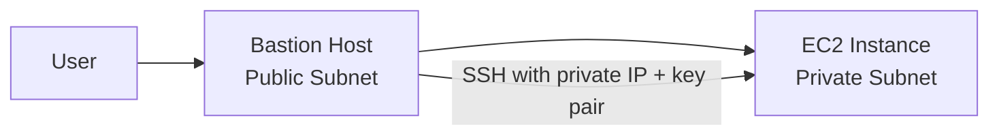

# 323. Bastion Hosts Hands On

## 🎯 Giới thiệu
- Bài thực hành này minh họa cách dùng **Bastion Host** để SSH vào một **EC2 instance** nằm trong **private subnet**.
- Ý chính:
  - **Bastion host** nằm ở **public subnet**.
  - Người dùng SSH vào bastion host trước.
  - Từ bastion host, tiếp tục SSH sang instance trong private subnet bằng **private IP**.
- Đây là cách truy cập an toàn hơn so với việc mở trực tiếp instance private ra Internet.

## 1. Tạo môi trường thực hành
- Tạo một **key pair** mới, ví dụ: `demo key pair`, để dùng cho SSH.
- Launch một **EC2 instance**:
  - AMI: **Amazon Linux 2**
  - Type: **t2.micro**
  - VPC: **demo VPC**
  - Subnet: **private subnet A**
- Tạo **Security Group** cho instance private, ví dụ: `private SG`.
- Rule SSH không mở cho mọi nơi, mà chỉ cho phép từ **security group của bastion host**.

## 2. Kết nối qua Bastion Host
- Đầu tiên, SSH vào **bastion host** bằng:
  - **EC2 Instance Connect**, hoặc
  - SSH từ terminal của bạn.
- Sau đó, từ bastion host SSH tiếp vào instance private:
  - Dùng lệnh `ssh ec2-user@<private-ip>`
  - Cần chỉ định key pair bằng `-i demo-key-pair.pem`
- Trong quá trình thực hành, có thể gặp lỗi do:
  - file `.pem` bị format sai,
  - thiếu xuống dòng,
  - quyền file chưa đúng.
- Sau khi sửa file key và set quyền phù hợp, SSH vào instance private sẽ thành công.

## 3. Kết quả và điểm cần nhớ
- Kết nối thành công từ bastion host sang **EC2 trong private subnet**.
- Instance private:
  - có **private IP**
  - không thể dùng **EC2 Instance Connect** trực tiếp như instance public
  - không có **outgoing internet access**
- Thử ping ra ngoài, ví dụ Google, sẽ không hoạt động từ private instance trong bài này.

## 📊 Bảng tóm tắt
| Tiêu chí | Mô tả |
|----------|------|
| Mục tiêu | SSH vào EC2 trong private subnet thông qua Bastion Host |
| Bastion Host | EC2 ở public subnet, làm điểm trung gian truy cập |
| Private Instance | EC2 trong private subnet, chỉ truy cập qua bastion host |
| Cách kết nối | SSH vào bastion host, rồi SSH sang private instance bằng private IP |
| Security Group | Cho phép SSH từ security group của bastion host, không mở rộng công khai |
| Hạn chế | Private instance không có internet outbound trong bài thực hành |

## 💡 Mẹo ghi nhớ cho kỳ thi AWS
- **Bastion Host = cầu nối SSH** vào tài nguyên ở private subnet.
- Nếu instance ở **private subnet**, đừng nghĩ đến việc truy cập trực tiếp như public instance.
- **SSH từ bastion host sang private instance** là mẫu kiến trúc rất hay gặp trong AWS.
- Khi thấy câu hỏi về truy cập admin vào tài nguyên private, hãy nghĩ ngay đến **Bastion Host**.
- Nhớ rằng **Security Group** của private instance nên chỉ cho phép truy cập từ bastion host, không phải từ `0.0.0.0/0`.

## ✅ Kết luận
- Bài học chính là cách dùng **Bastion Host** để SSH an toàn vào **EC2 instance** trong **private subnet**.
- Luồng truy cập gồm 2 bước: **User -> Bastion Host -> Private EC2**.
- Thực hành này cũng cho thấy private instance không có internet outbound và không thể truy cập trực tiếp như instance ở public subnet.
