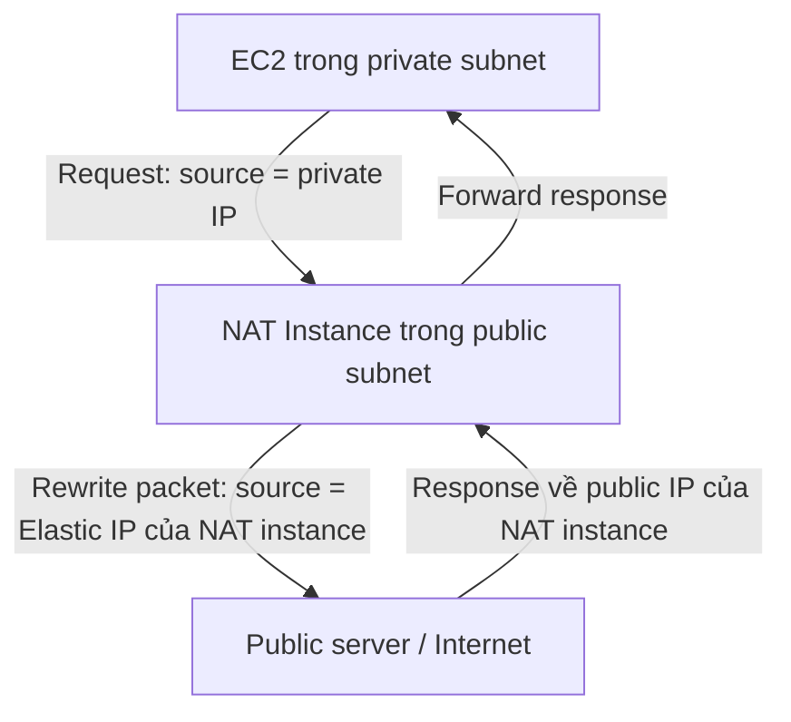

# 324. NAT Instances

## 🎯 Giới thiệu
- **NAT instances** là giải pháp **outdated** nhưng vẫn có thể xuất hiện trong **AWS exam**.
- **NAT** là viết tắt của **Network Address Translation**.
- Mục đích chính: cho **EC2 instances trong private subnets** truy cập ra **internet**.
- Lecture nhấn mạnh rằng **NAT gateway** là giải pháp tốt hơn và sẽ được học ở bài sau.

## 1. NAT Instances là gì
- Là một **EC2 instance** được dùng làm trung gian để chuyển traffic giữa:
  - **private subnets**
  - **public subnet**
  - **internet**
- NAT instance phải được:
  - launch trong **public subnet**
  - gắn **Elastic IP** cố định
  - dùng **security group** riêng
- Một setting bắt buộc phải tắt là **source/destination check**.

## 2. Cách hoạt động của NAT Instances
- Private EC2 gửi request ra ngoài nhưng **source IP ban đầu vẫn là private IP**.
- NAT instance nhận packet, rồi **rewrite network packet**:
  - **source IP** được đổi thành **public IP của NAT instance**
  - **destination IP** vẫn là server/public endpoint bên ngoài
- Server bên ngoài trả response về public IP của NAT instance.
- NAT instance tiếp tục chuyển response ngược lại cho EC2 trong private subnet.

## 3. Lưu ý quan trọng cho kỳ thi
- NAT instance **không phải lựa chọn khuyến nghị hiện nay**.
- NAT instances **không highly available** theo cấu hình mặc định.
- Nếu muốn resilient hơn, phải tự xây dựng:
  - nhiều NAT instances
  - nhiều AZs
  - có thể dùng **ASG**
  - user-data script resilient
- **Small instance** sẽ cho **bandwidth thấp hơn** instance lớn hơn.
- Bạn phải tự quản lý:
  - **Security Groups**
  - inbound rules
  - outbound rules
- Pre-configured **Amazon Linux AMI** có tồn tại, nhưng đã **end of standard support on December 31st, 2020**.
- Trong exam, thường cần phân biệt giữa:
  - **NAT instance**
  - **NAT gateway**

## 📊 Bảng tóm tắt
| Tiêu chí | Mô tả |
|----------|------|
| Mục đích | Cho EC2 trong private subnets truy cập internet |
| Vị trí triển khai | Phải đặt trong **public subnet** |
| IP | Cần gắn **Elastic IP** cố định |
| Cấu hình bắt buộc | Tắt **source/destination check** |
| Cơ chế | Rewrite packet, đổi **source IP** sang IP public của NAT instance |
| Độ sẵn sàng | Không highly available theo mặc định |
| Hiệu năng | Instance nhỏ thì bandwidth thấp hơn |
| Quản lý | Phải tự quản **Security Groups** và rules |
| Tình trạng | **Outdated**, nên dùng **NAT gateway** hơn |

## 💡 Mẹo ghi nhớ cho kỳ thi AWS
- Nhớ chuỗi sau: **Private subnet -> NAT instance (public subnet) -> Internet**
- 3 từ khóa hay bị hỏi:
  - **public subnet**
  - **Elastic IP**
  - **source/destination check disabled**
- Khi đề bài nhấn mạnh:
  - cần **outdated solution**
  - có **manual management**
  - không cần highly available ngay lập tức  
  thì hãy nghĩ đến **NAT instance**
- Nếu đề bài ưu tiên giải pháp tốt hơn, hiện đại hơn, hãy nhớ lecture nói rõ: **NAT gateway** là lựa chọn được khuyến nghị.

## ✅ Kết luận
- **NAT instances** là cách NAT dùng **EC2** để cho private subnet ra internet.
- Cơ chế chính là **rewrite source IP** và cần **disable source/destination check**.
- Dù vẫn có thể xuất hiện trong exam, đây là giải pháp **cũ, khó vận hành, không highly available mặc định**, và **NAT gateway** là lựa chọn tốt hơn.
