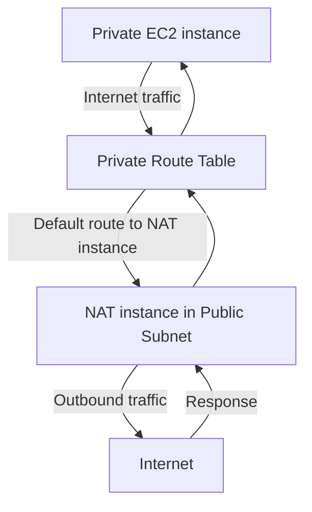

# 325. NAT Instances Hands On

## 🎯 Giới thiệu
Bài này hướng dẫn cách tạo một **NAT instance** để cung cấp Internet access cho **private subnets** mà vẫn không cấp **public IP** cho EC2 trong private subnet.

Mục tiêu chính:
- Dùng **community AMI** cho NAT instance
- Cấu hình **Security Group**
- Tắt **source destination check**
- Cập nhật **route table** của private subnet
- Kiểm tra bằng **ping** và **curl**

## 1. Tạo NAT Instance 🛠️
- Chọn **Launch instance**
- Tìm AMI bằng từ khóa `NAT` trong **community AMI**
- Ưu tiên AMI có:
  - **Architecture: X86_64**
  - Ngày publish mới hơn
  - Tên kiểu như **Amazon AMI VPC NAT 2018**
- Chọn loại máy **T2 micro**
- Dùng **Key pair** demo
- Đặt instance vào **public subnet** của VPC demo
- Đặt tên security group là **NAT instance SG**

### Security Group ban đầu
- **SSH**: cho phép từ anywhere
- **HTTP**: source là CIDR của VPC, ví dụ `10.0.0.0/16`
- **HTTPS**: source là cùng CIDR của VPC, ví dụ `10.0.0.0/16`

## 2. Cấu hình NAT cho traffic đi qua 🔁
- Sau khi tạo xong, cần **disable source destination check**
- Lý do: NAT instance phải nhận và gửi traffic dù **source/destination không phải chính nó**
- Đây là bước bắt buộc để NAT instance hoạt động đúng vai trò

### Luồng traffic

- Trong **private route table**, thêm route để mọi traffic đi Internet:
  - Destination: `0.0.0.0/0`
  - Target: **NAT instance**
- Kết quả:
  - Private instance dùng NAT instance để ra Internet
  - Private instance vẫn **không có public IP**

## 3. Kiểm tra hoạt động và hoàn tất ✅
- Đăng nhập vào private instance thông qua **Bastion Host**
- Dùng `SSH` từ Bastion vào private instance với **private IP**
- Ban đầu:
  - `ping google.com` không hoạt động
- Cần mở thêm trên **NAT instance security group**:
  - **ICMP** inbound từ CIDR của subnet
- Sau đó kiểm tra lại:
  - `ping google.com` hoạt động
  - `curl google.com` hoạt động
  - `curl example.com` cũng hoạt động

### Ý nghĩa thực tế
- Private instances có thể truy cập Internet
- Nhưng vẫn được giữ ở trạng thái **private**
- Không cần public IP
- Truy cập quản trị vẫn đi qua **Bastion Host**

## 📊 Bảng tóm tắt
| Tiêu chí | Mô tả |
|----------|------|
| Mục tiêu | Cho private subnet có Internet access qua NAT instance |
| AMI | Chọn community AMI có `NAT`, ưu tiên `X86_64` |
| Instance type | `T2 micro` |
| Vị trí triển khai | **Public subnet** |
| Security Group | Cho phép `SSH`, `HTTP`, `HTTPS`, và thêm `ICMP` cho ping |
| Bước quan trọng | Tắt **source destination check** |
| Route table | Thêm route để traffic Internet đi qua NAT instance |
| Kiểm tra | `ping` và `curl` từ private instance |
| Trạng thái private instance | Không có public IP |

## 💡 Mẹo ghi nhớ cho kỳ thi AWS
- **NAT instance** nằm trong **public subnet**, phục vụ cho **private subnet**
- Muốn NAT instance hoạt động:
  - phải **disable source destination check**
  - phải có **route `0.0.0.0/0`** trỏ về NAT instance
- Nếu `ping` không chạy, nghĩ ngay đến việc thiếu **ICMP inbound rule**
- Private instance vẫn **private**, không lộ public IP
- Dùng **Bastion Host** để vào private instance khi cần

## ✅ Kết luận
NAT instance là cách cho phép EC2 trong private subnet đi Internet mà không cần public IP. Trong bài này, điểm cốt lõi là tạo NAT instance trong public subnet, tắt **source destination check**, chỉnh **route table**, rồi mở đúng **Security Group rules** để `ping` và `curl` hoạt động.
