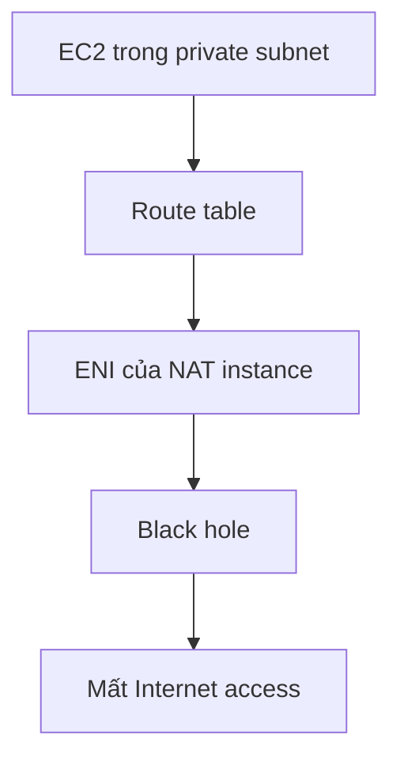

# 327. NAT Gateways Hands On

## 🎯 Giới thiệu
Bài thực hành này cho thấy cách khôi phục quyền truy cập Internet cho `EC2` trong `private subnet` bằng `NAT Gateway`, sau khi `NAT instance` bị stop/terminate khiến route cũ trở thành `black hole`.

## 1. Vấn đề ban đầu với NAT instance
- `EC2` trong `private subnet` không còn truy cập Internet.
- Lệnh như `curl google.com` không hoạt động.
- Khi refresh `private route table`, route cũ trỏ tới `ENI` đã trở thành `black hole`.
- `Black hole` nghĩa là route đó không còn active vì `NAT instance` đã bị stop.
- Bài học rút ra: `NAT Gateway` phù hợp hơn `NAT instance` vì là managed service.

## 2. Tạo NAT Gateway
- Tạo `NAT Gateway` với tên `DemoNATGW`.
- Chọn `subnet` là `PublicSubnetA`.
- `Connectivity type` được đặt là `public`.
- Cần allocate một `Elastic IP` cho `NAT Gateway`.
- Sau khi tạo, `NAT Gateway` sẽ ở trạng thái `pending` trước khi trở thành `active`.

## 3. Cập nhật route table và kiểm tra kết nối
- Mở `private route table` và chỉnh sửa routes.
- Xóa route `black hole` không còn dùng nữa.
- Thay vào đó, route Internet traffic được gửi tới `NAT Gateway` `DemoNATGW`.
- Sau khi `NAT Gateway` active:
  - `curl google.com` hoạt động.
  - `ping google.com` hoạt động.
- `EC2` trong `private subnet` có thể truy cập Internet mà không cần public.
- Có thể dùng để chạy `sudo yum update` cho hệ điều hành mà vẫn giữ instance private.

## 📊 Bảng tóm tắt
| Tiêu chí | Mô tả |
|----------|------|
| Vấn đề | `NAT instance` bị stop/terminate khiến route thành `black hole` |
| Giải pháp | Tạo `NAT Gateway` để thay thế |
| Cấu hình chính | `PublicSubnetA`, `public` connectivity, `Elastic IP` |
| Thay đổi route table | Chuyển Internet traffic từ `ENI` sang `NAT Gateway` |
| Kết quả | `EC2` trong `private subnet` truy cập Internet được |
| Điểm nhấn | `NAT Gateway` là managed service, ít phải cấu hình hơn |
| HA | Có thể tạo thêm `NAT Gateway` ở AZ khác để tăng khả năng chịu lỗi |

## 💡 Mẹo ghi nhớ cho kỳ thi AWS
- `private subnet` muốn ra Internet thì thường cần `NAT Gateway`.
- `black hole` trong route table là dấu hiệu route không còn hợp lệ.
- `NAT Gateway` phải nằm trong `public subnet` và cần `Elastic IP`.
- `EC2` private vẫn có thể cập nhật package mà không cần public IP.
- Muốn `high availability` hơn, cần nhiều `NAT Gateway` ở nhiều `Availability Zone`.

## ✅ Kết luận
- `NAT Gateway` giúp `EC2` trong `private subnet` ra Internet an toàn hơn so với `NAT instance`.
- Cốt lõi của cấu hình là: tạo `NAT Gateway`, gán `Elastic IP`, rồi sửa `route table` để traffic đi qua nó.
- Nếu cần độ sẵn sàng cao, hãy triển khai nhiều `NAT Gateway` theo các `Availability Zone` khác nhau.
