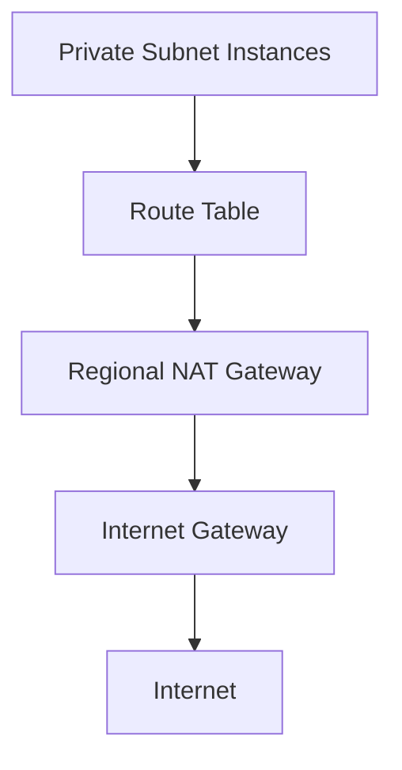

# 328. Regional NAT Gateway

## 🎯 Giới thiệu
Regional NAT Gateway (RNAT) là một kiểu NAT gateway mới, **highly available** và được gắn trực tiếp với **VPC**.  
Thay vì phải tạo NAT gateway trong từng **public subnet** như trước, giờ chỉ cần tạo ở cấp **VPC** và kết nối ra **Internet gateway** thông qua **route table**.

## 1. Cách hoạt động của Regional NAT Gateway
- Tạo NAT gateway ở **VPC level**.
- Dùng **route table** để chỉ định traffic đi Internet sẽ đi qua **Internet gateway**.
- Private subnet được route trực tiếp vào NAT gateway.
- Instances trong **private subnet** có thể truy cập Internet thông qua NAT gateway này.

## 2. Những thay đổi so với NAT gateway cũ
- Trước đây phải tạo NAT gateway trong **mỗi public subnet**.
- Với RNAT, chỉ cần **một NAT gateway trung tâm per VPC**.
- Không cần duy trì **public subnet** chỉ để host NAT gateway.
- Giảm rủi ro có tài nguyên được tạo nhầm trong public subnet.

## 3. Lợi ích trong kiến trúc
- **Shared across all AZs** trong VPC.
- Không cần deploy NAT gateway riêng cho từng **AZ**.
- Khi thêm một **AZ** mới và một private subnet mới, NAT gateway sẽ **scale** theo.
- Đơn giản hóa solution architecture bằng cách dùng một NAT gateway trung tâm cho toàn VPC.

## 📊 Bảng tóm tắt
| Tiêu chí | Mô tả |
|----------|------|
| Tên | Regional NAT Gateway (RNAT) |
| Phạm vi | Gắn trực tiếp với **VPC** |
| Tính sẵn sàng | **Highly available** |
| Cách kết nối | Qua **route table** tới **Internet gateway** |
| Áp dụng cho | **Private subnet** instances cần Internet access |
| Lợi ích chính | Không cần NAT gateway per AZ, không cần public subnet để host NAT |
| Mở rộng | Tự động scale khi thêm AZ / private subnet |

## 💡 Mẹo ghi nhớ cho kỳ thi AWS
- RNAT = **one NAT gateway per VPC**, không phải per AZ.
- Muốn private subnet đi Internet thì nhớ: **private subnet -> route table -> NAT gateway -> Internet gateway**.
- Điểm nhấn dễ ra thi: **không cần public subnet để host NAT gateway**.
- Khi đề bài nói về kiến trúc đơn giản hơn, dùng ít tài nguyên hơn, và shared across AZs, hãy nghĩ đến **Regional NAT Gateway**.

## ✅ Kết luận
Regional NAT Gateway giúp đơn giản hóa kiến trúc mạng trong VPC bằng cách dùng **một NAT gateway trung tâm**, chia sẻ cho toàn bộ **AZs**, và cho phép **private subnet** truy cập Internet thông qua **route table** và **Internet gateway**.
