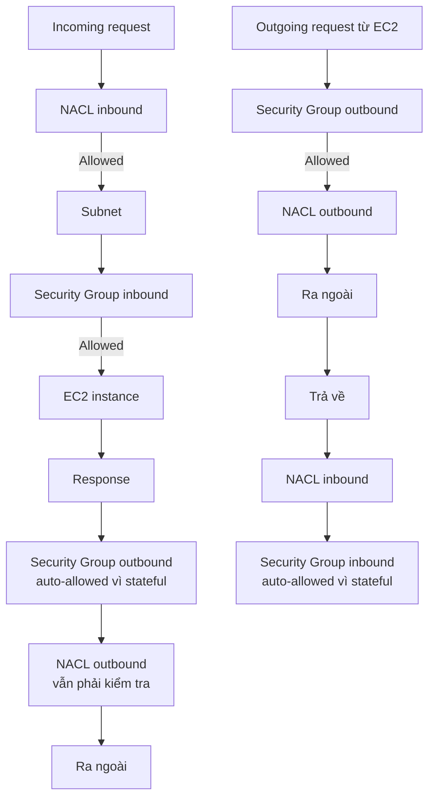

# 329. NACL & Security Groups

## 🎯 Giới thiệu
- Bài này giải thích sự khác nhau giữa **Security Group** và **Network ACL (NACL)** trong AWS.
- Cả hai đều là lớp kiểm soát traffic, nhưng:
  - **Security Group** gắn ở **instance level** cho EC2.
  - **NACL** hoạt động ở **subnet level**.
- Điểm cốt lõi cần nhớ khi ôn thi:
  - **Security Group = stateful**
  - **NACL = stateless**

## 1. 🚦 Luồng xử lý traffic qua NACL và Security Group
- Với một request đi vào EC2:
  - Traffic đi qua **NACL inbound rules** trước.
  - Nếu được cho phép, traffic mới đi vào subnet và qua **Security Group inbound rules**.
- Với một response trả về:
  - Vì **Security Group stateful**, traffic trả về được tự động cho phép ở chiều outbound.
  - Vì **NACL stateless**, traffic outbound vẫn phải được kiểm tra lại theo rule outbound.

- Với request đi ra từ EC2:
  - Đầu tiên là **Security Group outbound rules**.
  - Sau đó mới tới **NACL outbound rules**.
  - Khi traffic quay về:
    - **NACL inbound rules** được kiểm tra.
    - **Security Group inbound** không cần xét lại theo cách stateful thông thường đã cho phép luồng trả về.

## 2. 🛡️ Đặc điểm của NACL
- **NACL** giống như firewall kiểm soát traffic **đến và đi khỏi subnet**.
- Mỗi subnet có **một NACL**.
- Subnet mới sẽ được gán **default NACL**.
- Rule của NACL:
  - Có số thứ tự từ **1 đến 32,000**.
  - Số nhỏ hơn có **ưu tiên cao hơn**.
  - **First rule match wins**.
- Nếu không có rule nào khớp:
  - Rule cuối cùng là `*` sẽ **deny** request.
- AWS khuyến nghị tạo rule theo bước **100** để dễ chèn rule mới ở giữa.
- NACL mới tạo mặc định sẽ **deny everything**.
- Use case nổi bật của NACL:
  - **Block một IP cụ thể ở subnet level**.

### Default NACL
- **Default NACL** rất mở:
  - Cho phép **all inbound**
  - Cho phép **all outbound**
- Khi default NACL được associate với subnet:
  - Nó sẽ cho phép mọi traffic vào/ra của subnet đó.
- Theo nội dung bài giảng:
  - Không nên sửa default NACL.
  - Nếu cần tùy biến, hãy tạo **custom NACL**.

## 3. 🔗 Ephemeral Ports và tác động đến NACL
- Khi client và server giao tiếp:
  - Có **IP address** và **port**.
  - Server thường dùng port cố định như:
    - HTTP: `80`
    - HTTPS: `443`
    - SSH: `22`
- Client cũng cần một port để nhận response:
  - Đây là **ephemeral port**.
  - Port này chỉ tồn tại trong thời gian của kết nối.
- Port range phụ thuộc OS:
  - **Windows 10**: `49152 - 65535`
  - **Linux**: `32768 - 60999`

### Ví dụ client kết nối database
- Nếu client từ web subnet kết nối DB subnet:
  - Web NACL phải cho phép **outbound TCP 3306** tới DB subnet CIDR.
  - DB NACL phải cho phép **inbound TCP 3306** từ web subnet CIDR.
- Khi DB trả response về client:
  - Phải cho phép traffic qua **ephemeral port**.
  - DB NACL cần cho phép **outbound TCP trên dải ephemeral port** tới web subnet CIDR.
  - Web NACL cần cho phép **inbound TCP trên dải ephemeral port** từ DB subnet CIDR.
- Nếu có nhiều subnet và nhiều NACL:
  - Mỗi tổ hợp kết nối theo CIDR đều phải được phép trong rule.
  - Cần cập nhật rule cẩn thận để traffic đi được giữa các subnet.

## 📊 Bảng tóm tắt
| Tiêu chí | Mô tả |
|----------|------|
| Vị trí áp dụng | **Security Group** ở instance level, **NACL** ở subnet level |
| Kiểu rule | Security Group chỉ **allow**, NACL có cả **allow** và **deny** |
| Trạng thái | Security Group **stateful**, NACL **stateless** |
| Traffic return | Security Group tự cho phép traffic trả về, NACL phải kiểm tra lại inbound/outbound |
| Thứ tự xử lý | Security Group xét rule để quyết định cho phép; NACL xét theo **priority number**, **first match wins** |
| Phạm vi áp dụng | Security Group cho **EC2 instance**; NACL cho **toàn bộ EC2 trong subnet** |
| Default behavior | Default NACL cho phép **all inbound/outbound**; NACL mới tạo mặc định deny |
| Use case nổi bật | NACL dùng tốt để **block một IP cụ thể** ở subnet level |
| Điểm thi quan trọng | **Ephemeral ports** rất quan trọng khi cấu hình NACL giữa các subnet |

## 💡 Mẹo ghi nhớ cho kỳ thi AWS
- **SG = Stateful = Simplify return traffic**: traffic quay về không cần xét lại như NACL.
- **NACL = Stateless = Need both directions**: muốn kết nối thông suốt thì phải nhớ cả inbound và outbound.
- **Security Group = instance**, **NACL = subnet**.
- **NACL có deny**, Security Group thì **không có deny** trong bài giảng này.
- Khi gặp bài có kết nối giữa subnet, hãy nghĩ ngay đến:
  - **CIDR**
  - **port cố định**
  - **ephemeral port**
- Nếu đề bài nhắc **default NACL**, hãy nhớ nó cho phép **everything in and out**.

## ✅ Kết luận
- **Security Group** và **NACL** đều kiểm soát traffic, nhưng nằm ở hai lớp khác nhau.
- **Security Group** là lớp bảo vệ ở **EC2 instance**, hoạt động **stateful**.
- **NACL** là lớp bảo vệ ở **subnet**, hoạt động **stateless**, có thể **allow/deny**, và xử lý theo **priority + first match**.
- Khi thiết kế rule, đặc biệt là kết nối giữa các subnet, cần luôn tính đến **ephemeral ports** để traffic phản hồi không bị chặn.
