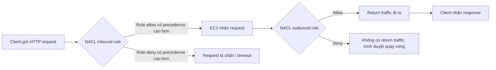
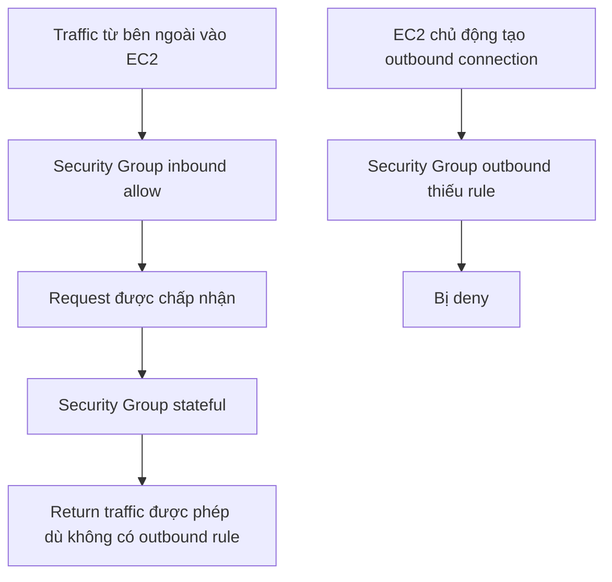

# 330. NACL & Security Groups Hands On

## 🎯 Giới thiệu
Bài thực hành này minh họa trực tiếp sự khác nhau giữa **Network ACL (NACL)** và **Security Group** trong VPC:

- **Default NACL** được gắn với các subnet mới tạo.
- **NACL** có **inbound rules** và **outbound rules**, và hoạt động như một **firewall** ở cấp subnet.
- **Security Group** được dùng cho EC2 instance và có tính **stateful**, trong khi **NACL** là **stateless**.
- Demo dùng **Bastion host / EC2 instance**, bật **HTTPD**, và truy cập trang `hello world` qua HTTP để quan sát hành vi mạng.

## 1. Default NACL và thiết lập ban đầu ⚙️
- VPC đang dùng **default NACL**.
- Default NACL:
  - Được associate với các subnet.
  - Cho phép **all traffic** ở cả **inbound** và **outbound**.
  - Rule deny ở cuối không có tác dụng vì rule allow đã match trước.
- Trên EC2 instance:
  - Cài `HTTPD`.
  - Enable và start web server.
  - Ghi `hello world` vào `/var/www/html/index.html`.
- Trên **Security Group** của Bastion host:
  - Thêm inbound rule cho **HTTP** từ **anywhere**.
- Sau đó truy cập public IP của instance và thấy `hello world`.

## 2. Rule number trong NACL: thứ tự quyết định kết quả 🧩
- Khi thêm một inbound rule:
  - **Rule number 80**
  - Type: **HTTP**
  - Source: **anywhere**
  - Action: **deny**
- Vì rule này có **precedence** cao hơn rule allow phía sau, HTTP bị chặn.
- Kết quả:
  - Reload trang bị **infinite loading** do request bị timeout.
  - NACL đã chặn HTTP request như một firewall.
- Khi đổi deny rule sang:
  - **Rule number 140**
- Lúc này:
  - Rule allow ở **100** được áp dụng trước.
  - Rule deny ở **140** đứng sau nên không chặn traffic đó nữa.
- Kết quả:
  - Trang HTTP lại truy cập được bình thường.

## 3. NACL stateless vs Security Group stateful 🔁
- Khi sửa **outbound rules** của NACL:
  - Đổi rule allow thành **deny**.
- Lúc này:
  - Inbound request có thể vào.
  - Nhưng **return traffic** không được phép ra.
- Kết quả:
  - Trang lại bị **infinite loading**.
- Điểm quan trọng:
  - Điều này vẫn đúng **ngay cả khi Security Group của EC2 cho phép port 80**.
  - Nghĩa là **NACL và Security Group phải cùng đúng** thì traffic mới đi qua.
- Sau đó, khi quay lại trạng thái cho phép:
  - HTTP từ anywhere được allow.
- Với **Security Group**:
  - Nếu inbound HTTP được phép và traffic được **initiate từ bên ngoài**, thì **return traffic** vẫn được phép dù không có outbound rule.
  - Đây là do **Security Group là stateful**.
- Nếu EC2 chủ động tạo kết nối ra ngoài:
  - Ví dụ kết nối tới Google
  - Và không có outbound rule phù hợp
  - Thì sẽ bị từ chối.

## 📊 Bảng tóm tắt
| Tiêu chí | Mô tả |
|----------|------|
| Default NACL | Gắn với subnet mới tạo, allow all inbound/outbound |
| NACL rules | Có inbound và outbound rules, xét theo thứ tự rule number |
| Rule precedence | Rule number nhỏ hơn được xét trước; deny/allow phụ thuộc thứ tự |
| NACL behavior | **Stateless**: inbound và outbound phải được cho phép rõ ràng |
| Security Group behavior | **Stateful**: request vào được phép thì return traffic cũng được phép |
| Demo HTTP | Cài HTTPD, thêm HTTP inbound cho Security Group, truy cập `hello world` |
| Lỗi thường gặp | Security Group đúng nhưng NACL chặn vẫn gây timeout |

## 💡 Mẹo ghi nhớ cho kỳ thi AWS
- **NACL = Stateless**: phải nghĩ riêng cho cả **inbound** và **outbound**.
- **Security Group = Stateful**: chỉ cần allow chiều vào, return traffic vẫn được trả về.
- **Rule number trong NACL rất quan trọng**: rule nhỏ hơn có ưu tiên cao hơn.
- Khi troubleshooting network:
  - Đừng chỉ kiểm tra **Security Group**.
  - Hãy luôn kiểm tra thêm **NACL**.
- Default NACL thường cho phép tất cả traffic, nhưng khi sửa rule thì cần chú ý thứ tự và hướng traffic.

## ✅ Kết luận
Bài thực hành cho thấy rõ:

- **NACL** kiểm soát traffic ở cấp subnet, có thứ tự rule và là **stateless**.
- **Security Group** kiểm soát traffic ở cấp instance và là **stateful**.
- Một kết nối chỉ hoạt động khi **cả NACL lẫn Security Group** đều cho phép đúng luồng traffic.
- Đây là điểm rất quan trọng khi làm bài thi AWS và khi debug lỗi mạng trong thực tế.
