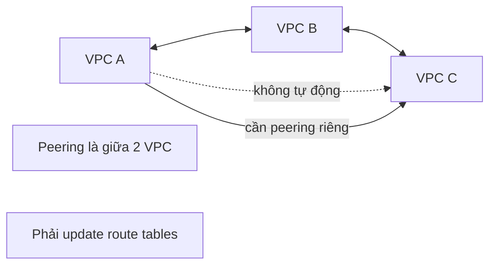

# 331. VPC Peering

## 🎯 Giới thiệu
- **VPC Peering** cho phép kết nối các VPC thông qua **AWS network** để chúng hoạt động như thể ở cùng một network.
- Có thể dùng giữa:
  - các **VPC khác region**
  - các **VPC khác account**
  - hoặc ngay trong **cùng account**
- Mục tiêu là để các tài nguyên trong các VPC có thể **communicate** với nhau.

## 1. Khái niệm chính
- **VPC Peering** là kết nối giữa **hai VPC**.
- Khi đã peered, hai VPC có thể giao tiếp với nhau qua AWS network.
- Đây là cách kết nối phù hợp khi bạn muốn mở rộng liên lạc giữa các VPC ở nhiều **account** hoặc **region** khác nhau.

## 2. Quy tắc quan trọng
- **CIDR của các VPC không được overlap**.
- Nếu các CIDR chồng lấn nhau, các VPC **không thể communicate**.
- VPC peering **không transitive**:
  - Nếu A peered với B, và B peered với C, thì **A vẫn không tự động communicate với C**.
  - Muốn A và C giao tiếp, phải tạo **peering connection riêng** giữa A và C.
- Sau khi peering, phải **update route tables** trong các subnet của từng VPC để traffic đi đúng.

## 3. Phạm vi và Security Group
- VPC peering có thể diễn ra:
  - trong **cùng account**
  - **cross-account**
  - **cross-region**
- Với **Security Groups**:
  - có thể **reference security group khác** trong **peered VPC**
  - điều này áp dụng cho **cross-account** trong **same region**
- Cách này mạnh hơn việc chỉ dùng **CIDR/IP** làm source.

## 📊 Bảng tóm tắt
| Tiêu chí | Mô tả |
|----------|------|
| Mục đích | Kết nối các VPC để chúng hoạt động như cùng một network |
| Phạm vi | Cùng account, cross-account, cross-region |
| Số lượng | Kết nối giữa **2 VPC** |
| Tính chất | **Không transitive** |
| Điều kiện CIDR | CIDR không được overlap |
| Cấu hình bổ sung | Phải update **route tables** |
| Security Group | Có thể reference Security Group trong peered VPC |

## 💡 Mẹo ghi nhớ cho kỳ thi AWS
- Nhớ 3 ý khóa:
  - **2 VPC**
  - **No transitive**
  - **Update route tables**
- Nếu thấy sơ đồ A-B-C, đừng suy luận A sẽ tự nói chuyện được với C chỉ vì B là cầu nối.
- Khi nhắc đến **peered VPC**, nhớ ngay đến khả năng **reference Security Group** thay vì chỉ dùng **CIDR/IP**.

## ✅ Kết luận
- **VPC Peering** là cách kết nối trực tiếp giữa các VPC để giao tiếp qua AWS network.
- Điểm cần nhớ nhất cho thi AWS là:
  - CIDR không được overlap
  - peering **không transitive**
  - phải cấu hình **route tables**
  - có thể dùng **Security Group reference** trong một số trường hợp phù hợp
