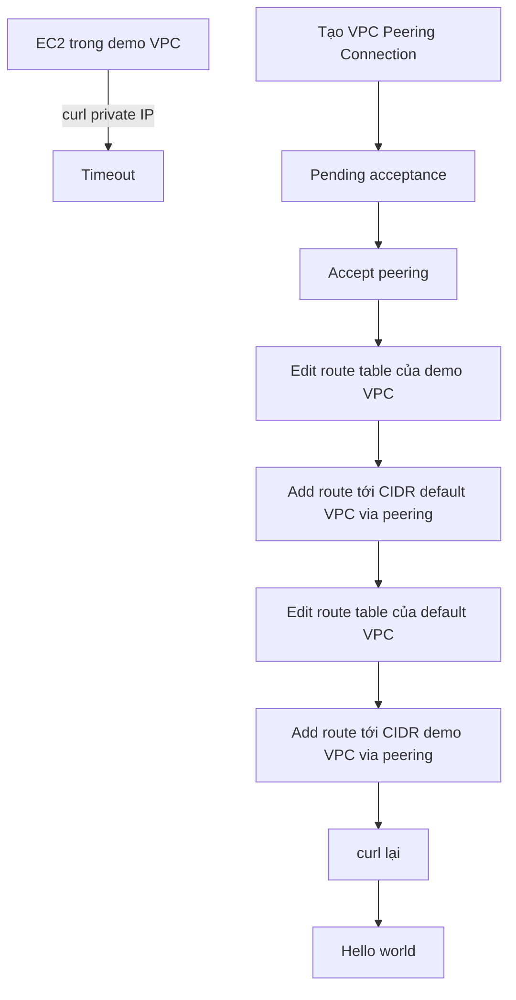

# 332. VPC Peering Hands On

## 🎯 Giới thiệu
Bài này demo cách **peering 2 VPC** để các EC2 instance ở hai VPC có thể giao tiếp với nhau.

Mục tiêu chính:
- Chứng minh 2 VPC ban đầu **không kết nối**
- Tạo **VPC Peering Connection**
- Cập nhật **route tables** để traffic đi được hai chiều
- Kiểm tra lại bằng `curl` để xác nhận kết nối hoạt động

## 1. Kiểm tra 2 VPC đang tách biệt 🔒
- Tạo một EC2 instance trong **default VPC**
- Giữ nguyên instance đã có trong **demo VPC** (BastionHost)
- So sánh **private IPv4**:
  - default VPC instance: `172.31.36.159`
  - demo VPC instance: `10.0.0.72`
- Vì private IP thuộc hai dải khác nhau nên có thể thấy 2 VPC đang ở trạng thái **isolated**
- Khi `curl` từ instance trong default VPC sang instance trong demo VPC thì bị **timeout**

## 2. Tạo và accept VPC Peering Connection 🤝
- Vào **VPC console** và tạo **peering connection**
- Đặt tên: `demo peering connection`
- Chọn:
  - **Requester VPC**: demo VPC
  - **Acceptor VPC**: default VPC
- Điều kiện quan trọng:
  - **CIDR của 2 VPC không được overlap**
- Sau khi tạo, peering connection ở trạng thái **pending acceptance**
- Vì cả 2 VPC đều thuộc cùng account trong demo nên có thể **accept** ngay
- Sau khi accept, vẫn chưa dùng được ngay vì cần **route tables**

## 3. Cập nhật Route Tables và kiểm tra lại 🚦
- Dù đã có VPC peering, vẫn phải thêm route vào **route tables**
- Cần cấu hình **2 chiều**:
  - Route từ **demo VPC** tới **CIDR của default VPC** qua peering connection
  - Route từ **default VPC** tới **CIDR của demo VPC** qua peering connection
- Các bước thực hiện:
  - Mở **public route table** của demo VPC
  - Thêm route:
    - **Destination**: CIDR của default VPC
    - **Target**: `demo peering connection`
  - Mở **main route table** của default VPC
  - Thêm route:
    - **Destination**: `10.0.0.0/16`
    - **Target**: `demo peering connection`
- Sau khi lưu cả 2 route:
  - `curl` lại từ instance trong default VPC sang instance trong demo VPC
  - Kết quả trả về **hello world**
- Kết luận: **VPC peering connection đã hoạt động**

## 📊 Bảng tóm tắt
| Tiêu chí | Mô tả |
|----------|------|
| Mục tiêu | Kết nối 2 VPC bằng `VPC Peering Connection` |
| Dấu hiệu ban đầu | `curl` từ một VPC sang VPC khác bị `timeout` |
| Điều kiện tạo peering | **CIDR không overlap** |
| Trạng thái sau tạo | `pending acceptance` |
| Việc bắt buộc sau khi accept | Cập nhật **route tables** |
| Yêu cầu routing | Phải có route **hai chiều** |
| Kết quả cuối | `curl` trả về `hello world` |

## 💡 Mẹo ghi nhớ cho kỳ thi AWS
- `VPC Peering` **không tự động mở đường đi** giữa 2 VPC
- Tạo peering xong vẫn phải sửa **route table**
- Muốn giao tiếp thành công thì cần **route hai chiều**
- Nếu `curl` bị `timeout`, hãy nghĩ ngay đến:
  - chưa accept peering
  - chưa thêm route
  - route chưa đúng CIDR
- Một điểm quan trọng trong bài: **CIDR của 2 VPC không được overlap**

## ✅ Kết luận
- 2 VPC ban đầu **không liên thông**
- Sau khi tạo và **accept VPC Peering Connection**
- Đồng thời cập nhật **route tables** ở cả hai VPC
- EC2 instance đã có thể giao tiếp qua private IP và nhận được phản hồi `hello world`
