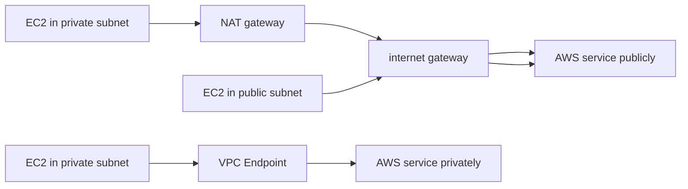

# 333. VPC Endpoints

## 🎯 Giới thiệu
- **VPC endpoints** cho phép tài nguyên trong VPC truy cập các AWS services một cách **private**, không phải đi qua **public internet**.
- Mục tiêu chính:
  - Giảm phụ thuộc vào **NAT gateway** và **internet gateway**
  - Giảm số bước mạng trung gian
  - Tăng tính đơn giản và tối ưu cho network architecture
- Theo transcript, các dịch vụ như **DynamoDB**, **CloudWatch**, **Amazon S3**, **Amazon SNS** có thể được truy cập theo hướng private bằng VPC endpoints.
- VPC endpoints được hỗ trợ bởi **AWS PrivateLink**.

## 1. Vì sao cần VPC Endpoints
- Nếu không dùng VPC endpoints, EC2 trong **private subnet** có thể phải đi qua:
  - **NAT gateway** -> **internet gateway** -> service AWS
- EC2 trong **public subnet** có thể đi trực tiếp qua **internet gateway** -> service AWS
- Cách này:
  - Có thể phát sinh **chi phí** do NAT gateway
  - Có nhiều hop hơn
  - Không tối ưu về mặt hiệu quả
- Với VPC endpoints:
  - EC2 đi thẳng từ VPC tới service AWS qua **private AWS network**
  - Network không rời khỏi AWS
  - Không cần internet gateway hoặc NAT gateway cho luồng truy cập đó

### Mermaid: luồng truy cập

## 2. Hai loại VPC Endpoints
### Interface Endpoint
- Được **powered by PrivateLink**
- Provision một **ENI** trong VPC
  - ENI này có **private IP address**
  - Là điểm vào private để truy cập AWS service
- Cần gắn **security group**
- Hỗ trợ **most AWS services if not all**
- Có **cost**:
  - Theo **hour**
  - Theo **gigabyte data processed**

### Gateway Endpoint
- Không dùng IP address
- Không dùng security group
- Là một **target trong route table**
- Chỉ dùng cho:
  - **Amazon S3**
  - **DynamoDB**
- Ưu điểm:
  - **Free**
  - **Scale automatically**
- Điểm cần nhớ:
  - Gateway Endpoint = chỉnh **route table**
  - Chỉ S3 và DynamoDB

## 3. Chọn loại nào và lưu ý thi AWS
- Với **Amazon S3** hoặc **DynamoDB**:
  - **Gateway Endpoint** thường là lựa chọn ưu tiên trong exam
  - Lý do:
    - Chỉ cần sửa **route table**
    - **Free**
    - Scale tốt hơn
- **Interface Endpoint** có thể phù hợp hơn khi:
  - Cần private access từ **on-premises**
  - Cần kết nối từ **another VPC**
- Nếu gặp sự cố:
  - Kiểm tra **DNS settings resolution**
  - Kiểm tra **route tables**

## 📊 Bảng tóm tắt
| Tiêu chí | Mô tả |
|----------|------|
| Mục đích | Truy cập AWS services privately, không qua public internet |
| Công nghệ nền | **AWS PrivateLink** |
| Interface Endpoint | Dùng **ENI**, cần **security group**, có phí, hỗ trợ nhiều AWS services |
| Gateway Endpoint | Dùng **route table target**, không dùng IP/security group, miễn phí |
| Dịch vụ hỗ trợ bởi Gateway | Chỉ **Amazon S3** và **DynamoDB** |
| Khi nào ưu tiên | Gateway thường ưu tiên cho S3/DynamoDB trong kỳ thi |
| Khi cần đặc biệt | Interface có thể phù hợp cho **on-premises** hoặc **another VPC** |
| Troubleshooting | Kiểm tra **DNS resolution** và **route tables** |

## 💡 Mẹo ghi nhớ cho kỳ thi AWS
- **Interface = ENI + Security Group + Cost**
- **Gateway = Route Table + Free + S3/DynamoDB**
- Nhớ câu: **“S3 và DynamoDB thì nghĩ đến Gateway Endpoint trước”**
- Nếu đề bài nhấn mạnh:
  - **private access**
  - **không đi qua internet**
  - **giảm chi phí**
  - **không muốn dùng NAT gateway**
  thì hãy nghĩ đến **VPC endpoints**
- Nếu đề bài nhắc tới **on-premises** hoặc **another VPC**, cân nhắc **Interface Endpoint**

## ✅ Kết luận
- **VPC endpoints** là cách truy cập AWS services theo hướng **private** trong VPC.
- Có 2 loại:
  - **Interface Endpoint** cho nhiều service, dùng ENI, có phí
  - **Gateway Endpoint** cho **S3** và **DynamoDB**, miễn phí, cấu hình qua route table
- Trong exam, với **S3/DynamoDB**, thường ưu tiên **Gateway Endpoint**.
