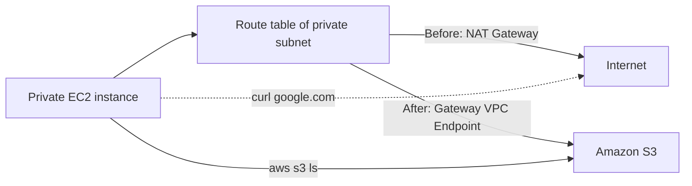

# 334. VPC Endpoints Hands On

## 🎯 Giới thiệu
Bài hands-on này minh họa cách dùng **VPC Endpoints** để cho **private EC2 instance** truy cập **Amazon S3** mà không cần đi ra Internet.

Mục tiêu chính:
- Thử truy cập `S3` và `google.com` trước khi và sau khi chặn Internet.
- Gắn `IAM Role` cho EC2 để có quyền đọc S3.
- Tạo **VPC Endpoint** và quan sát route được thêm vào **route table**.
- Kiểm tra lại kết quả truy cập S3 qua endpoint.

## 1. Chuẩn bị EC2 và IAM Role
- Dùng **bastion host** để SSH vào **private EC2 instance**.
- Ban đầu, instance private chưa có **IAM role**.
- Tạo role cho **EC2 instances** với policy:
  - **Amazon S3 Read Only Access**
- Gắn role vào instance, sau đó có thể chạy:
  - `aws s3 ls`
- Kết quả:
  - Liệt kê được các S3 buckets của account.

## 2. Chặn Internet và tạo VPC Endpoint
- Xác nhận instance đang có Internet:
  - `curl google.com` hoạt động
- Vào **route table** của private subnet và xóa route đi qua **NAT Gateway**.
- Sau khi xóa route:
  - `aws s3 ls` không còn hoạt động
  - `curl google.com` cũng không hoạt động

### Các loại endpoint được nhắc đến
- **Interface Endpoint**
  - Chọn VPC
  - Bật **DNS name**
  - Chọn subnet/AZ để triển khai
  - Gắn **Security Group**
- **Gateway Endpoint**
  - Dùng cho **Amazon S3**
  - Chọn VPC
  - Cập nhật **route table** để traffic từ private subnet đi thẳng tới endpoint

Trong ví dụ này, endpoint được tạo là **Gateway Endpoint cho S3** và được gắn vào **private route table**.

## 3. Kiểm tra kết quả và lưu ý CLI Region
- Sau khi tạo endpoint, route trong private route table được tự động thêm và không thể xóa thủ công vì nó liên kết với endpoint.
- Khi SSH lại vào private instance:
  - `curl google.com` vẫn không hoạt động
  - `aws s3 ls` ban đầu cũng không hoạt động do vấn đề **CLI region**
- Cần chỉ rõ region đúng khi chạy lệnh:
  - `aws s3 ls --region eu-central-1`
- Sau đó:
  - Traffic được redirect qua **VPC Endpoint**
  - Vẫn liệt kê được S3 buckets dù instance không có Internet access

## 📊 Bảng tóm tắt
| Tiêu chí | Mô tả |
|----------|------|
| Mục tiêu | Truy cập `Amazon S3` từ private EC2 mà không cần Internet |
| IAM | Gắn **IAM Role** cho EC2 với **Amazon S3 Read Only Access** |
| Kiểm tra trước | `aws s3 ls` và `curl google.com` đều hoạt động khi còn NAT |
| Chặn Internet | Xóa route đi qua **NAT Gateway** trong private route table |
| Loại endpoint dùng trong ví dụ | **Gateway Endpoint** cho `S3` |
| Cơ chế hoạt động | Thêm route trực tiếp từ private route table tới endpoint |
| Lưu ý khi test | Chỉ định đúng `region` trong AWS CLI |
| Kết quả cuối | Truy cập `S3` thành công dù instance không ra Internet |

## 💡 Mẹo ghi nhớ cho kỳ thi AWS
- **S3** thường gắn với **Gateway Endpoint**.
- **Interface Endpoint** thường cần:
  - chọn `VPC`
  - chọn `subnet/AZ`
  - gắn `Security Group`
  - bật `DNS`
- **Gateway Endpoint** sẽ cập nhật **route table**.
- Nếu private instance không có Internet nhưng vẫn cần vào `S3`, hãy nghĩ tới **VPC Endpoint**.
- Khi test bằng AWS CLI, nhớ kiểm tra **region** nếu kết quả không như mong đợi.

## ✅ Kết luận
VPC Endpoints cho phép private instance truy cập dịch vụ AWS một cách riêng tư. Trong hands-on này, sau khi chặn Internet bằng cách bỏ route qua NAT Gateway, **Gateway Endpoint cho S3** được thêm vào private route table để instance vẫn đọc được S3 buckets mà không cần Internet.
