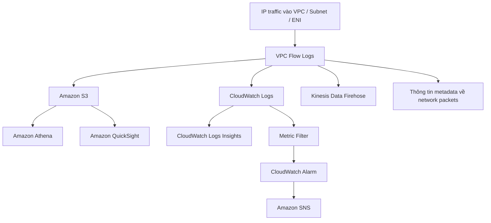

# 335. VPC Flow Logs

## 🎯 Giới thiệu
VPC Flow Logs dùng để ghi lại thông tin từ IP traffic đi vào các interfaces trong AWS.  
Chúng rất hữu ích để:
- Monitor và troubleshoot connectivity issues trong VPC
- Phân tích usage patterns
- Phát hiện managed behavior, port scans, và hoạt động bất thường

## 1. Phạm vi và nơi lưu Flow Logs
VPC Flow Logs có thể được tạo ở 3 mức:
- **VPC level**
- **Subnet level**
- **Elastic Network Interface (ENI) level**

Flow Logs có thể áp dụng cho cả AWS managed interfaces như:
- ELB
- RDS
- ElastiCache
- Redshift
- Workspaces
- NAT Gateway
- Transit Gateway

Dữ liệu Flow Logs có thể được gửi tới:
- **Amazon S3**
- **CloudWatch Logs**
- **Kinesis Data Firehose**

## 2. Nội dung Flow Logs và cách đọc
Flow Logs chứa metadata về network packets, gồm các trường như:
- version
- account ID
- interface ID
- source address
- destination address
- source port
- destination port
- protocol
- packets
- start
- action
- log status

Các trường quan trọng để phân tích:
- **source address / destination address**: xác định IP có vấn đề
- **source port / destination port**: xác định port có vấn đề
- **action**: `accept` hoặc `reject`
  - giúp biết request thành công hay thất bại ở **SG** hoặc **NACL**

## 3. Dùng Flow Logs để troubleshoot và phân tích
### Troubleshoot SG và NACL
- **NACL** là **stateless**
- **Security Group** là **stateful**

Suy luận từ Flow Logs:
- **Inbound reject**:
  - có thể do **NACL** hoặc **Security Group**
- **Inbound accept + outbound reject**:
  - chỉ ra **NACL issue**
  - vì Security Group stateful nên outbound sẽ được cho phép nếu inbound đã accept
- **Outbound reject**:
  - có thể do **NACL** hoặc **Security Group**
- **Outbound accept + inbound reject**:
  - chỉ ra **NACL issue**

### Phân tích và cảnh báo
Có thể dùng Flow Logs để:
- tìm **top 10 IP addresses** gây nhiều network traffic bằng **CloudWatch Contributor Insights**
- tạo **metric filter** trong CloudWatch Logs để theo dõi SSH hoặc RDP
- nếu thấy SSH/RDP tăng bất thường, có thể:
  - tạo **CloudWatch Alarm**
  - gửi cảnh báo vào **Amazon SNS**
- lưu Flow Logs vào **S3**
  - phân tích bằng **Amazon Athena** với SQL
  - trực quan hóa bằng **Amazon QuickSight**

## 📊 Bảng tóm tắt
| Tiêu chí | Mô tả |
|----------|------|
| Mục đích | Monitor, troubleshoot connectivity issues, phân tích traffic |
| Phạm vi | VPC, Subnet, ENI |
| Đối tượng áp dụng | Cả VPC traffic và AWS managed interfaces |
| Destinations | S3, CloudWatch Logs, Kinesis Data Firehose |
| Trường quan trọng | source/destination address, source/destination port, action |
| Ý nghĩa `action` | `accept` hoặc `reject` |
| Query / phân tích | Athena trên S3, CloudWatch Logs Insights |
| Troubleshoot | Dùng `action` để suy ra vấn đề từ SG hoặc NACL |
| Tích hợp cảnh báo | Metric Filter, CloudWatch Alarm, SNS |
| Quyền cần thiết | IAM service role với `logs:CreateLogGroup`, `logs:CreateLogStream`, `logs:PutLogEvents` |

## 💡 Mẹo ghi nhớ cho kỳ thi AWS
- Nhớ 3 mức của Flow Logs: **VPC / Subnet / ENI**
- Nhớ 3 nơi đích chính: **S3 / CloudWatch Logs / Kinesis Data Firehose**
- Nhớ từ khóa quan trọng nhất để debug là **`action`**
- Nếu thấy **inbound accept + outbound reject**, nghĩ ngay đến **NACL issue**
- Nếu cần phân tích SQL trên log, chọn **Athena on S3**
- Nếu cần phân tích streaming, chọn **CloudWatch Logs Insights**
- Muốn alert khi có SSH/RDP bất thường:
  - **Metric Filter** -> **CloudWatch Alarm** -> **SNS**

## ✅ Kết luận
VPC Flow Logs là công cụ quan trọng để quan sát traffic ở mức VPC, Subnet, và ENI.  
Chúng giúp phát hiện IP bất thường, phân tích hành vi mạng, troubleshoot **SG/NACL**, và tích hợp với **S3**, **CloudWatch Logs**, **Athena**, **QuickSight**, và **SNS** để giám sát và cảnh báo hiệu quả.
