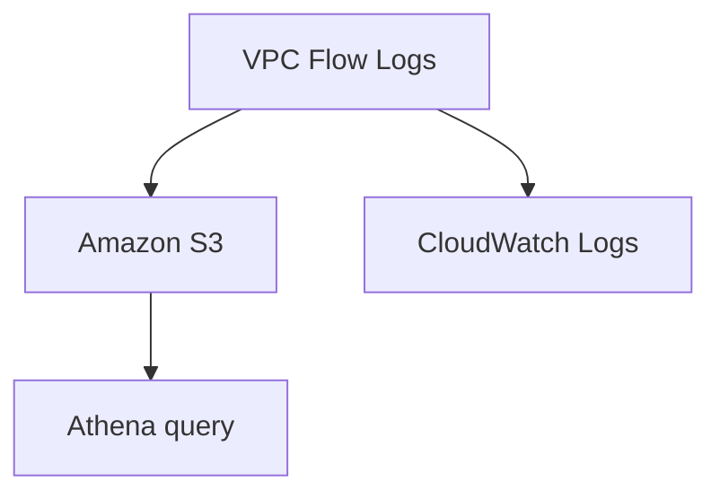
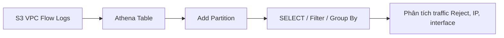

# 336. VPC Flow Logs Hands On + Athena

## 🎯 Giới thiệu
- Bài này thực hành tạo `VPC Flow Logs` cho một `demo VPC`.
- Mục tiêu là xem log đi về `Amazon S3` và `CloudWatch Logs`, sau đó dùng `Athena` để truy vấn log trong S3.
- Có thể dùng để:
  - debug traffic bị `Reject`
  - quan sát traffic thực tế vào `EC2`
  - phân tích dữ liệu lớn theo kiểu batch bằng `Athena`

## 1. Tạo VPC Flow Logs và chọn destination
- Khi tạo flow log, có thể chọn filter:
  - `Accept`
  - `Reject`
  - `All`
- `Reject` hữu ích khi cần debug vì sao traffic không đi qua được.
- `Maximum aggregation interval`:
  - `1 minute` tạo nhiều record hơn, nhanh hơn cho demo
  - `10 minutes` thường hợp lý hơn để giảm số lượng record và chi phí
- Destination có thể là:
  - `CloudWatch Logs`
  - `Amazon S3`
  - `Kinesis Data Firehose`
- Trong demo:
  - Flow log thứ nhất gửi vào `Amazon S3`
  - Flow log thứ hai gửi vào `CloudWatch Logs`

### Flow tổng quan

## 2. Flow log vào S3 và CloudWatch Logs
- Với `Amazon S3`:
  - tạo bucket cùng region với VPC
  - lấy `bucket ARN`
  - khi tạo flow log, AWS tự tạo `resource-based policy` và gắn vào bucket để `VPC service` có thể ghi dữ liệu
- Với `CloudWatch Logs`:
  - cần tạo `IAM role`
  - trust policy cho phép `vpc-flow-logs.amazonaws.com` assume role
  - permission dùng `CloudWatch Logs full access`
  - tạo `log group` riêng, ví dụ `VPCFlowLogs`
  - có thể đặt `retention` là `1 day`
- Kết quả:
  - S3 sẽ xuất hiện các object `AWSLogs`
  - CloudWatch Logs có các `log stream` tương ứng với `eni` trong account
- Quan sát log:
  - log cho thấy traffic vào `EC2 instance`
  - nhiều request bị `Reject`, có thể là scan hoặc truy cập không mong muốn
  - nếu thực hiện activity hợp lệ, có thể thấy cả `Accept`

## 3. Query VPC Flow Logs bằng Athena
- `Athena` được dùng để phân tích log trong `S3` theo kiểu query.
- Trước tiên cần cấu hình `query result location` trong một bucket S3 riêng.
- Quy trình thực hiện:
  - tạo bucket S3 cho kết quả Athena
  - set `S3://...` làm nơi lưu query result
  - tạo table từ dữ liệu VPC Flow Logs
  - khai báo đúng đường dẫn log trong S3
  - chạy `ALTER TABLE` để thêm `partition`
  - query các bản ghi cần thiết
- Demo truy vấn:
  - lọc tất cả traffic `Reject`
  - nhận được nhiều kết quả
  - có thể phân tích tiếp theo `IP address`, `interface id`, hoặc các tiêu chí khác
- Ghi chú:
  - việc thêm partition khá thủ công
  - `Glue` có thể hỗ trợ tự động hóa phần này

### Flow Athena

## 📊 Bảng tóm tắt
| Tiêu chí | Mô tả |
|----------|------|
| Nguồn log | `VPC Flow Logs` từ `demo VPC` |
| Filter | `Accept`, `Reject`, hoặc `All` |
| Aggregation interval | `1 minute` hoặc `10 minutes` |
| Destination | `S3`, `CloudWatch Logs`, hoặc `Kinesis Data Firehose` |
| S3 setup | Cần `bucket ARN`, AWS tự gắn `bucket policy` |
| CloudWatch setup | Cần `IAM role` + `log group` |
| Mục đích CloudWatch Logs | Theo dõi nhanh, gần real-time, nhất là traffic `Reject` |
| Mục đích S3 + Athena | Phân tích lớn, truy vấn lịch sử bằng SQL |
| Athena prerequisite | Cần `query result location` trong S3 |
| Partition | Cần thêm partition để query dữ liệu đúng |
| Dữ liệu quan sát | `eni`, `source address`, `protocol`, `action` |
| Kết quả demo | Query được các dòng `Reject` trong Athena |

## 💡 Mẹo ghi nhớ cho kỳ thi AWS
- `CloudWatch Logs` phù hợp khi cần quan sát nhanh và gần real-time.
- `S3 + Athena` phù hợp khi cần phân tích dữ liệu lớn, truy vấn linh hoạt.
- `Reject` thường là filter hữu ích nhất khi debug traffic không đi qua.
- Muốn ghi log vào `CloudWatch Logs` thì phải có `IAM role` và `log group`.
- Muốn ghi log vào `S3` thì cần `bucket ARN` và bucket policy phù hợp.
- `Athena` cần `query result location` trước khi chạy truy vấn.
- `Partition` rất quan trọng khi query dữ liệu log theo ngày hoặc theo phần đường dẫn.

## ✅ Kết luận
- Bài thực hành cho thấy cách tạo `VPC Flow Logs` và đẩy log ra `S3` hoặc `CloudWatch Logs`.
- `CloudWatch Logs` giúp theo dõi traffic nhanh, đặc biệt là các request `Reject`.
- `S3` kết hợp với `Athena` cho phép truy vấn và phân tích log ở quy mô lớn.
- Sau khi demo xong, cần xóa các flow logs để tránh phát sinh chi phí không cần thiết.
