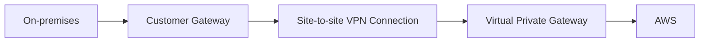

# 338. Site to Site VPN, Virtual Private Gateway & Customer Gateway Hands On

## 🎯 Giới thiệu
Bài này nói về cách thiết lập **site-to-site VPN connection** giữa **on-premises** và **AWS**.

Trọng tâm ôn thi:
- **Customer Gateway**: phía **on-premises**
- **Virtual Private Gateway**: phía **AWS**
- **Site-to-site VPN connection**: dùng để kết nối hai đầu này lại với nhau

## 1. Customer Gateway
- Đây là thành phần bạn tạo ở phía **on-premises**.
- Khi tạo, transcript nhắc đến các thông tin:
  - Tên của gateway
  - **BGP ASN** cho gateway device
  - **IP address** của external interface của customer gateway device
  - **Certificate ARN** để AWS có thể kết nối an toàn tới VPN device on-premises
- Một số phần như **BGP ASN** được nói là nâng cao và không cần nhớ sâu cho phần hands-on.

## 2. Virtual Private Gateway
- Sau đó bạn tạo **Virtual Private Gateway** ở phía **AWS**.
- Khi tạo, bạn cũng dùng một **ASN number**.
- Đây là đầu mối phía AWS để kết nối với on-premises.

## 3. Site-to-Site VPN Connection
- Sau khi có cả hai đầu, bạn tạo **site-to-site VPN connection** bằng cách chọn:
  - Loại: **Virtual private gateway**
  - **Virtual Private Gateway** đã tạo trước đó
  - **Customer Gateway** đã tạo trước đó
- Transcript có nhắc thêm các tùy chọn về:
  - routing
  - IPv4
  - tunneling
- Các phần này được xem là **out of scope** trong hands-on.

## 📊 Bảng tóm tắt
| Tiêu chí | Mô tả |
|----------|------|
| Mục tiêu | Tạo kết nối **site-to-site VPN** giữa **on-premises** và **AWS** |
| Thành phần phía on-premises | **Customer Gateway** |
| Thành phần phía AWS | **Virtual Private Gateway** |
| Bước kết nối | Tạo **VPN Connection** để nối hai gateway |
| Thông tin cấu hình đáng nhớ | **BGP ASN**, IP external interface, **Certificate ARN** |
| Phạm vi cần nhớ cho exam | Quy trình: **Customer Gateway -> Virtual Private Gateway -> VPN Connection** |

## 💡 Mẹo ghi nhớ cho kỳ thi AWS
- Nhớ thứ tự: **on-premises trước, AWS sau, rồi mới connect**.
- Cụm dễ nhớ:
  - **Customer Gateway** = phía khách hàng / on-premises
  - **Virtual Private Gateway** = phía AWS
  - **VPN Connection** = cầu nối giữa hai bên
- Nếu câu hỏi hỏi về thiết lập **site-to-site VPN**, đáp án cốt lõi là:
  - tạo **Customer Gateway**
  - tạo **Virtual Private Gateway**
  - tạo **site-to-site VPN connection** để nối chúng lại

## ✅ Kết luận
Bài hands-on này tập trung vào quy trình tạo **site-to-site VPN connection** trong AWS. Điều quan trọng nhất để ôn thi là hiểu rõ vai trò của **Customer Gateway** ở on-premises, **Virtual Private Gateway** ở AWS, và bước cuối là tạo **VPN Connection** để liên kết hai bên.
