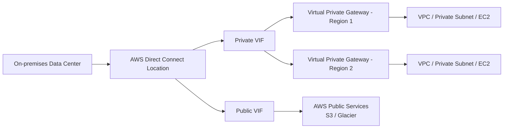

# 339. Direct Connect & Direct Connect Gateway

## 🎯 Giới thiệu
- **AWS Direct Connect (DX)** là kết nối **private dedicated** từ mạng on-premises vào **VPC**.
- Trong exam, Direct Connect thường được viết tắt là **DX**.
- Mục tiêu chính:
  - Kết nối trực tiếp từ **corporate data center** đến AWS
  - Tránh đi qua **public internet**
  - Tăng tính ổn định cho kết nối mạng
- DX hỗ trợ:
  - **IPv4**
  - **IPv6**

## 1. Direct Connect là gì và dùng khi nào?
- Direct Connect tạo một đường kết nối riêng từ remote network vào AWS.
- Cần thiết lập:
  - **AWS Direct Connect location**
  - **virtual private gateway** ở phía VPC để kết nối với on-premises data center
- Use cases chính:
  - **Increased bandwidth throughput** khi làm việc với **large data sets**
  - **Lower cost** vì dùng private connection
  - **Consistent network experience** hơn so với public internet
  - Hữu ích cho ứng dụng có **real-time data feeds**
  - Phù hợp với **hybrid environments**

## 2. Luồng kết nối, VIF và Direct Connect Gateway
- Có 2 kiểu truy cập qua DX:
  - **Private VIF**: truy cập **private resources** trong VPC, ví dụ **EC2 instances**
  - **Public VIF**: truy cập **public services** trong AWS, ví dụ **Amazon S3** hoặc **Amazon Glacier**
- Với **Private VIF**:
  - Kết nối đi vào **virtual private gateway**
  - Sau đó vào **private subnet** chứa EC2
- Với **Public VIF**:
  - Đi theo cùng đường vật lý nhưng **không** vào virtual private gateway
  - Kết nối trực tiếp vào AWS public services
- Nếu muốn kết nối tới **one or more VPCs in different regions**, phải dùng **Direct Connect gateway**
  - Private VIF sẽ nối tới **Direct Connect gateway**
  - Gateway này sau đó kết nối tới nhiều **virtual private gateway** ở các region khác nhau

## 3. Loại kết nối, encryption và resiliency
- Có 2 loại connection:
  - **Dedicated connection**
    - Từ **1 Gbps** đến **400 Gbps**
    - Có **physical ethernet port** dedicated cho customer
    - Request được gửi tới AWS, sau đó hoàn tất bởi **AWS Direct partner**
  - **Hosted connection**
    - Từ **50 Mbps** đến **25 Gbps**
    - Request qua **AWS Direct Connect partners**
    - Capacity có thể **add/remove on demand**
- Lưu ý quan trọng cho exam:
  - Thiết lập DX thường mất **hơn 1 tháng**
  - Nếu câu hỏi yêu cầu chuyển dữ liệu trong **1 tuần**, thì **không nên chọn Direct Connect** nếu chưa có sẵn kết nối
- Về bảo mật:
  - **Direct Connect không có encryption**
  - Data in transit **không được mã hóa**
  - Nếu cần encryption, có thể kết hợp **Direct Connect + VPN**
  - Khi đó traffic giữa data center và AWS sẽ được **IPsec encrypted**
- Về **resiliency**:
  - **High resiliency**
    - Dùng **multiple Direct Connects**
    - Có backup nếu một location gặp sự cố
    - Phù hợp cho **critical workloads**
  - **Maximum resiliency**
    - Dùng **two Direct Connect locations**
    - Mỗi location có **two independent connections**
    - Tổng thể là **separate connections terminating on separate devices in more than one location**

## 📊 Bảng tóm tắt
| Tiêu chí | Mô tả |
|----------|------|
| Mục đích | Kết nối private từ on-premises vào AWS/VPC |
| Tên viết tắt | **DX** |
| Kết nối tới | **Private VIF**, **Public VIF** |
| Private VIF | Vào **virtual private gateway** để truy cập private resources như **EC2** |
| Public VIF | Truy cập public services như **S3**, **Glacier** |
| Direct Connect gateway | Dùng khi muốn kết nối nhiều **VPC** ở nhiều **region** |
| Tốc độ kết nối | **Dedicated connection**: 1 Gbps đến 400 Gbps; **Hosted connection**: 50 Mbps đến 25 Gbps |
| Thời gian triển khai | Thường **hơn 1 tháng** |
| Encryption | **Không mã hóa sẵn**; có thể kết hợp **VPN** để dùng **IPsec** |
| Resiliency | Có **high resiliency** và **maximum resiliency** |

## 💡 Mẹo ghi nhớ cho kỳ thi AWS
- **DX = private connection**, không đi qua public internet.
- Nhớ phân biệt:
  - **Private VIF** = vào **VPC private resources**
  - **Public VIF** = vào **AWS public services**
- Nếu đề bài hỏi **multi-region / multiple VPCs**, nghĩ ngay đến **Direct Connect gateway**.
- Nếu câu hỏi có mốc thời gian ngắn như **1 tuần**, cẩn thận vì DX thường mất **hơn 1 tháng** để thiết lập.
- Nếu đề bài hỏi về **encryption**, nhớ:
  - DX **không mã hóa**
  - Có thể đặt **VPN on top of Direct Connect**
- Nếu đề bài hỏi về độ sẵn sàng:
  - **High resiliency** = nhiều DX
  - **Maximum resiliency** = nhiều location + nhiều kết nối độc lập

## ✅ Kết luận
- **AWS Direct Connect** là giải pháp kết nối private, ổn định và phù hợp cho hybrid connectivity.
- **Direct Connect gateway** mở rộng khả năng kết nối tới nhiều **VPC** ở nhiều **region**.
- Khi ôn thi, cần đặc biệt nhớ các điểm: **Private/Public VIF, lack of encryption, setup time, and resiliency models**.
