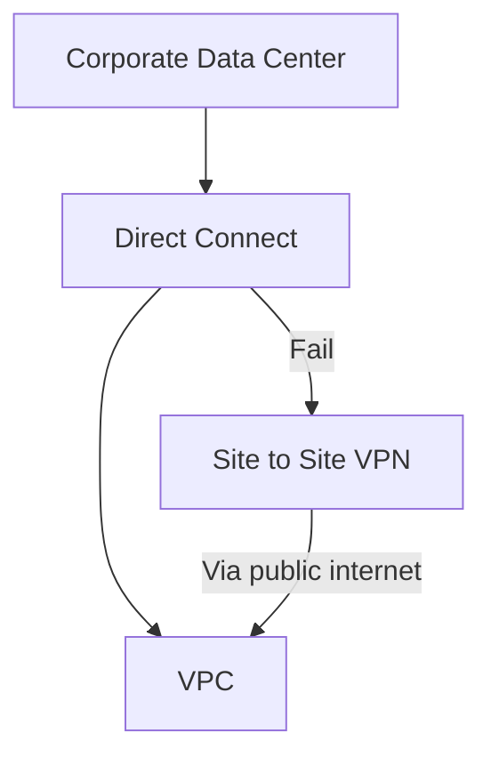

# 340. Direct Connect + Site to Site VPN

## 🎯 Giới thiệu
Bài này nói về một kiến trúc AWS có thể xuất hiện trong exam: kết nối **corporate data center** với **VPC** bằng **Direct Connect** làm đường truyền chính, và dùng **site to site VPN** làm đường dự phòng khi kết nối chính gặp sự cố.

## 1. Kiến trúc kết nối chính
- **Corporate data center** được nối vào **VPC** qua **Direct Connect**.
- Đây là **primary connection**.
- **Direct Connect** được mô tả là:
  - **Expensive**
  - Có thể gặp sự cố, nên không nên phụ thuộc hoàn toàn nếu cần đảm bảo khả năng truy cập vào VPC.

## 2. Phương án dự phòng
- Nếu muốn có đường dự phòng, có thể thiết lập **site to site VPN**.
- **Site to site VPN** sẽ là **backup connection**.
- Khi **primary connection** fail, hệ thống sẽ chuyển sang VPN.
- Lúc này kết nối đi qua **public internet**.

## 3. Ý nghĩa trong exam
- Đây là một kiến trúc cần nhận diện trong đề thi.
- Điểm cần nhớ:
  - **Direct Connect** là đường chính.
  - **Site to site VPN** là đường backup.
  - Khi Direct Connect gặp vấn đề, VPN có thể “kích hoạt” để giữ kết nối tới VPC.
- Mục tiêu là tránh tình trạng **không có kết nối vào VPC**.

## 📊 Bảng tóm tắt
| Tiêu chí | Mô tả |
|----------|------|
| Mục tiêu | Kết nối corporate data center với VPC |
| Đường chính | **Direct Connect** |
| Đường dự phòng | **Site to site VPN** |
| Cơ chế failover | Khi primary connection fail thì VPN thay thế |
| Kênh truyền của backup | **Public internet** |
| Ghi nhớ cho exam | Nhận diện mô hình **Direct Connect + VPN backup** |

## 💡 Mẹo ghi nhớ cho kỳ thi AWS
- Nhớ công thức: **Direct Connect = primary**, **VPN = backup**.
- Nếu đề bài nói về:
  - kết nối từ **on-premises / corporate data center** vào **VPC**
  - cần **backup path**
  - muốn tránh gián đoạn khi Direct Connect lỗi  
  thì hãy nghĩ ngay tới **site to site VPN** làm dự phòng.
- Từ khóa cần nhận diện: **primary connection**, **backup connection**, **public internet**, **failover**.

## ✅ Kết luận
Kiến trúc trong bài rất ngắn gọn: dùng **Direct Connect** làm kết nối chính giữa **corporate data center** và **VPC**, đồng thời cấu hình **site to site VPN** làm đường dự phòng để đảm bảo vẫn có kết nối khi đường chính gặp sự cố.
