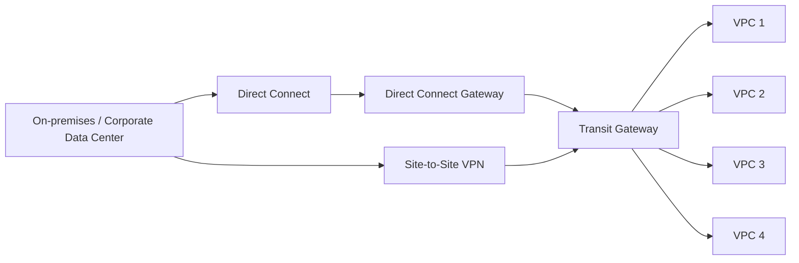

# 341. Transit Gateway

## 🎯 Giới thiệu
Transit Gateway là dịch vụ AWS dùng để **đơn giản hóa network topology** khi bạn có nhiều VPC, nhiều kết nối **site-to-site VPN**, **Direct Connect**, hoặc kết nối với on-premises.

- Thay vì phải peer từng VPC với nhau, Transit Gateway tạo mô hình **hub-and-spoke / star** ở trung tâm.
- Các VPC được kết nối **transitively** qua Transit Gateway, nên không cần VPC peering từng cặp.
- Dịch vụ này giúp giải quyết bài toán mạng phức tạp và mở rộng tốt hơn khi số lượng kết nối tăng lên.

## 1. Mô hình kết nối với Transit Gateway 🕸️
Transit Gateway đặt ở trung tâm và kết nối nhiều thành phần khác nhau:

- Nhiều VPC có thể kết nối qua cùng một Transit Gateway.
- Direct Connect Gateway có thể kết nối vào Transit Gateway.
- Customer Gateway và VPN connection cũng có thể kết nối vào Transit Gateway.
- Nhờ đó, một kết nối trung tâm có thể cho phép truy cập tới nhiều VPC.

Các ý quan trọng cần nhớ:
- Transit Gateway là **regional resource**.
- Có thể hoạt động **cross-region**.
- Có thể chia sẻ qua nhiều account bằng **Resource Access Manager (RAM)**.
- Có thể **peer transit gateways across region**.

## 2. Kiểm soát định tuyến và bảo mật định tuyến 🔐
Để quyết định “ai được nói chuyện với ai”, bạn cần tạo **route tables** cho Transit Gateway.

- Route tables giúp giới hạn VPC nào được phép giao tiếp với VPC khác.
- Cũng kiểm soát connection nào được truy cập lẫn nhau.
- Nhờ vậy, bạn có **full control over routing** trong Transit Gateway.
- Đây là cơ chế quan trọng để tăng **network security**.

Một điểm cần nhớ cho kỳ thi:
- Transit Gateway là **dịch vụ duy nhất trong AWS hỗ trợ IP multicast**.

## 3. ECMP, băng thông VPN và chia sẻ Direct Connect 🚀
Transit Gateway còn được dùng để tăng băng thông cho **site-to-site VPN** bằng **ECMP**.

- **ECMP** = **Equal-Cost Multi-Path routing**
- Đây là chiến lược định tuyến cho phép chuyển packet qua nhiều best path.
- Khi dùng Transit Gateway, bạn có thể tạo **multiple site-to-site VPN connections** để tăng throughput.
- Một site-to-site VPN connection có thể đạt **2.5 Gbps** nhờ ECMP.
- Bạn có thể thêm nhiều VPN connection vào Transit Gateway để **double hoặc triple throughput**.
- So với VPN vào **Virtual Private Gateway** trực tiếp vào VPC:
  - Chỉ có **1 connection vào 1 VPC**
  - Giới hạn **1.25 Gbps maximum throughput**
- Với Transit Gateway:
  - Một VPN có thể kết nối tới **nhiều VPC** vì các VPC đều liên thông qua Transit Gateway.
  - Hai tunnel của VPN có thể được dùng đồng thời với ECMP.

Ngoài ra, Transit Gateway còn giúp:
- **Chia sẻ Direct Connect connection giữa nhiều account**
- Kết nối Direct Connect location vào **Direct Connect Gateway**
- Sau đó nối **Direct Connect Gateway** vào **Transit Gateway**
- Từ đó chia sẻ kết nối Direct Connect cho nhiều VPC và nhiều account

Lưu ý:
- Việc tối ưu throughput này có **thêm chi phí** vì phải trả theo **GB dữ liệu đi qua Transit Gateway**.

## 📊 Bảng tóm tắt
| Tiêu chí | Mô tả |
|----------|------|
| Mục đích | Giảm độ phức tạp mạng AWS khi có nhiều VPC, VPN, Direct Connect |
| Mô hình | Hub-and-spoke / star, Transit Gateway ở trung tâm |
| Kết nối hỗ trợ | VPC, site-to-site VPN, Direct Connect Gateway, on-premises |
| Phạm vi | Regional resource, có thể cross-region |
| Chia sẻ | Dùng **RAM** để share giữa accounts |
| Kiểm soát | **Route tables** để quyết định ai được nói chuyện với ai |
| Tính năng đặc biệt | Dịch vụ AWS duy nhất hỗ trợ **IP multicast** |
| Tăng băng thông | Dùng **ECMP** với multiple site-to-site VPN connections |
| Direct Connect | Có thể share Direct Connect giữa multiple accounts |
| Lưu ý thi | VPN vào TGW: **2.5 Gbps**; VPN vào VGW: **1.25 Gbps** |

## 💡 Mẹo ghi nhớ cho kỳ thi AWS
- **Transit Gateway = trung tâm kết nối nhiều mạng**.
- Khi thấy bài toán **nhiều VPC + VPN + Direct Connect**, nghĩ ngay đến **Transit Gateway**.
- Khi đề bài nhắc **IP multicast**, đáp án là **Transit Gateway**.
- Khi muốn **tăng bandwidth VPN bằng ECMP**, cũng là **Transit Gateway**.
- Khi cần **share Direct Connect hoặc Transit Gateway across accounts**, nhớ đến:
  - **Transit Gateway**
  - **Resource Access Manager (RAM)**
- Nhớ mốc throughput trong transcript:
  - **VPN vào Virtual Private Gateway: 1.25 Gbps**
  - **VPN vào Transit Gateway với ECMP: 2.5 Gbps**

## ✅ Kết luận
Transit Gateway là dịch vụ giúp AWS đơn giản hóa kiến trúc mạng phức tạp bằng cách đặt một trung tâm kết nối cho nhiều VPC, VPN và Direct Connect. Nó cho phép kiểm soát routing bằng route tables, hỗ trợ cross-region và chia sẻ giữa accounts, đồng thời là lựa chọn quan trọng khi đề thi hỏi về **IP multicast**, **ECMP**, hoặc **tăng throughput VPN**.
